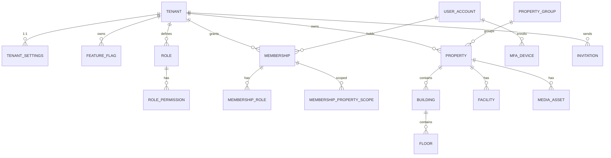
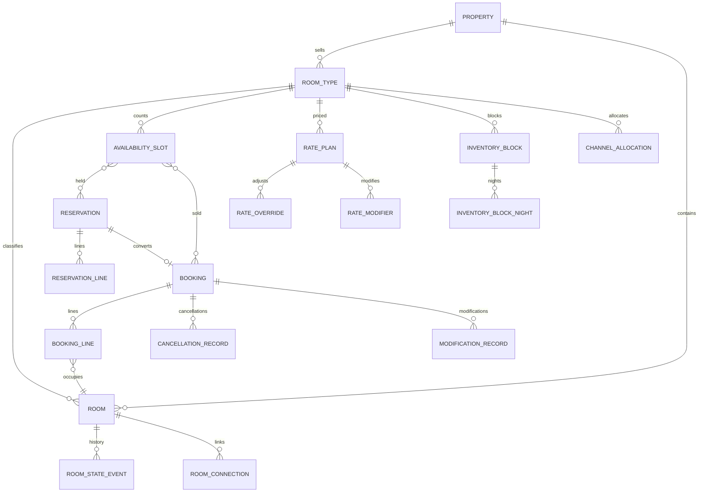
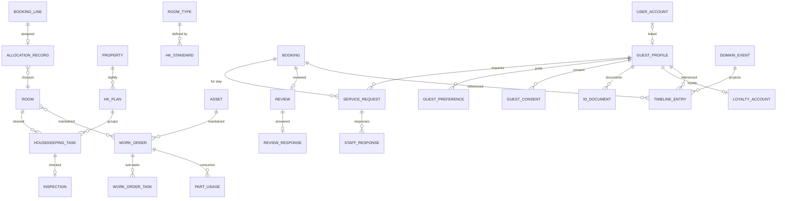
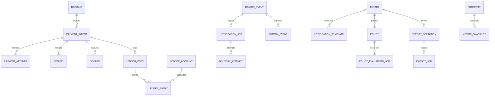

# Hospitality Management Platform — Database Design Specification (DDS)

| Field | Value |
|---|---|
| **Status** | v1.0 — for implementation reference |
| **Version** | 1.0 |
| **Date** | 2026-08-05 |
| **Authoring team** | Principal Database Architect · Staff Django Engineer · PostgreSQL Expert · Domain-Driven Design Expert |
| **Input** | SDD v0.3 (decisions DR-01…DR-12 are constraints) · DMS v1.0 (aggregates, invariants, ownership) |
| **Scope** | **Relational database design only.** No Django ORM models, no application code. |

This spec resolves DMS Risk #1 (Availability/Inventory single ownership) by presenting **one merged table set** for the sellability aggregate; it carries DMS risks #9, #11, #12, #13 as explicit schema decisions.

---

## Part A — Cross-Cutting Foundations

### A.1 Naming & common columns

- Table names: `snake_case`, plural. Foreign-key columns: `{singular_table}_id`.
- **Every table carries `created_at TIMESTAMPTZ NOT NULL DEFAULT now()`** and, where mutable, `updated_at TIMESTAMPTZ`. Server clock; app clock used only for business dates.
- **Every tenant-scoped table carries `tenant_id BIGINT NOT NULL`** (see A.2). The three platform-scoped tables (`tenant`, `user_account`, platform tables) are exempt.
- Primary keys: surrogate `id BIGINT GENERATED ALWAYS AS IDENTITY`. Exception: **partitioned tables** — the partition key must be part of the PK and every unique index (Postgres rule). Partitioned tables use composite PKs containing the partition key.
- **Money:** `BIGINT` integer minor units + `currency CHAR(3)`, never float (SDD §10.5, DMS Risk #13). Check `currency ~ '^[A-Z]{3}$'`.
- **Enums:** `TEXT` + `CHECK` constraint, **not** native `ENUM` — CHECK constraints evolve in-place and don't lock tables for `ALTER TYPE`.
- **Business dates:** `DATE` in property timezone (SDD R2). Timestamps: `TIMESTAMPTZ`.
- `created_by` / `updated_by` → `user_account.id` (`BIGINT NULL`, `SET NULL` on user deactivation) on tables where the actor matters.
- `version BIGINT NOT NULL DEFAULT 0` on optimistic-locked aggregates (A.6).

### A.2 Row-level tenancy (DR-01)

- Row-level isolation: shared DB/schema, `tenant_id` on every tenant-scoped row.
- **Context resolution:** middleware sets `set_config('app.tenant_id', :tid, true)` in the session; the effective tenant always derives from the principal, never from the payload.
- **RLS as defense-in-depth** (primary = app-layer queryset scoping):
  ```sql
  ALTER TABLE <table> ENABLE ROW LEVEL SECURITY;
  ALTER TABLE <table> FORCE ROW LEVEL SECURITY;   -- protects every code path incl. raw SQL
  CREATE POLICY tenant_isolation ON <table>
    USING (tenant_id = current_setting('app.tenant_id')::bigint)
    WITH CHECK (tenant_id = current_setting('app.tenant_id')::bigint);
  ```
- RLS is applied to **all** tenant-scoped tables, including `ledger_*`, `timeline_entry`, `metric_snapshot`, `audit_log` (DMS Risk #11). RLS policies propagate to partitions automatically.
- Foreign keys between tenant-scoped tables may omit a redundant `tenant_id` column where the tenant is derivable (e.g., `building.property_id` → tenant via `property`), **but** every table still carries its own `tenant_id` for RLS filtering and joins that don't traverse the parent. This is the pragmatic hybrid: one `tenant_id` per row, per RLS; composite FK not mandated.
- **Composite-uniqueness rule:** natural keys are unique **within a tenant**: `UNIQUE (tenant_id, <natural key>)` or a partial unique index where soft-delete is used.

### A.3 PK & FK policy

- PK: surrogate `id` unless the table is partitioned.
- FK actions: **default `ON DELETE RESTRICT`**. CASCADE only where the child is genuinely part of the parent's life (e.g., `mfa_device`, `role_permission`).
- Operational/immutable tables (events, ledger, audit, state history) are **never deleted** — no FK cascades into them.

### A.4 Audit strategy

Two layers:
1. **Column-level:** `created_by`/`updated_by`/`created_at`/`updated_at` on mutable tables.
2. **Append-only `audit_log`** (Part B §22): one row per workflow transition / policy decision / sensitive mutation, written **in the same transaction**. Contains before/after JSONB, actor, reason. Append-only, partitioned, RLS-scoped, cannot be edited by the audited actor.
- Domain events and state-history tables (`domain_event`, `room_state_event`, `ledger_entry`) are *themselves* audit-grade append-only logs.

### A.5 Soft-delete strategy

| Table class | Strategy |
|---|---|
| **Transactional/operational** (booking, payment, reservation, task, work order, events, ledger, audit) | **Never deleted.** Status columns / append-only. Hard delete forbidden. |
| **Configuration/reference** (property, room, room_type, rate_plan, role, hk_standard, service_type, asset, template) | Soft delete: `status` (retired) **or** `deleted_at TIMESTAMPTZ NULL`; queries filter `deleted_at IS NULL`; **partial unique indexes** `WHERE deleted_at IS NULL` preserve natural-key uniqueness after "deletion". |
| **Identity/guest** | Soft: `status`/`deactivated_at`; GDPR erasure is a sanctioned **anonymize + `erased_at`** process, never `DELETE`. |

### A.6 Locking strategy

**Pessimistic (row lock `SELECT … FOR UPDATE`) — high-contention, correctness-critical:**
- `availability_slot` — every consume/release (the anti-oversell core).
- `payment_intent` — capture/refund/void.
- `reservation` — `convert()` (atomic handoff).
- `booking` / `booking_line` — check-in, cancel, modify.
- `room` — state-machine transitions (occupied/OOO/OOS).
- `inventory_block` — pick-up/confirm.
- `ledger` post balance validation (short lock on `ledger_post`).

**Optimistic (`version` column) — low-contention config edits:**
- `rate_plan`, `rate_override` (rate editors), `guest_preference`, `hk_standard`, `tenant_settings`, `room_type` attributes, `property` config, `service_type`.
- Optimistic = `UPDATE … SET version = version+1 WHERE id = ? AND version = ?`; zero rows → 409 to the caller.

**Lock-order discipline:** all multi-row locks acquire in `(tenant_id, id)` order to prevent deadlocks.

### A.7 Tables requiring transactions (critical composite transactions)

| # | Transaction | Tables involved |
|---|---|---|
| T1 | **Reservation convert → Booking confirm** (all-or-nothing, DR-08) | `reservation`, `reservation_line`, `booking`, `booking_line`, `availability_slot` (consume), `domain_event` |
| T2 | Direct payment capture at confirm | + `payment_intent`, `payment_attempt`, `ledger_post`, `ledger_entry` |
| T3 | Availability consume/release/hold | `availability_slot` (+ `inventory_block` for blocks) |
| T4 | Payment capture / refund + ledger post | `payment_intent`, `refund`, `ledger_post`, `ledger_entry`, `domain_event` |
| T5 | Booking cancel (penalty + refund trigger + inventory release) | `booking`, `booking_line`, `cancellation_record`, `availability_slot`, `payment_intent`, `refund`, `domain_event` |
| T6 | Check-in (allocation + room state + occupant pointer) | `allocation_record`, `room`, `booking_line`, `domain_event` |
| T7 | Check-out (room state + settle + review solicitation) | `room`, `booking_line`, `review`, `domain_event` |
| T8 | HK defect → work order + room OOS | `housekeeping_task`, `inspection`, `work_order`, `room` |
| T9 | Work-order P1/P2 → room OOO | `work_order`, `room` |
| T10 | No-show processing (v2) | `booking`, `payment_intent`, `refund`, `availability_slot`, `domain_event` |
| T11 | Tenant provisioning | `tenant`, `tenant_settings`, `membership`, `role` (seeding) |
| T12 | Inventory block confirm/release/pick-up | `inventory_block`, `inventory_block_night`, `availability_slot` |
| T13 | Night-audit snapshot commit (idempotent) | `metric_snapshot`, `domain_event` |
| T14 | Policy version publish | `policy` (new version row), `audit_log` |

### A.8 Partitioning plan

Declarative `PARTITION BY RANGE` on **date**, monthly or yearly per table. All partitioned tables get a composite PK containing the partition key.

| Table | Partition key | Granularity | Retention |
|---|---|---|---|
| `availability_slot` | `business_date` | monthly | **Drop beyond horizon** (only the sellable window matters; drop = free) |
| `domain_event` | `occurred_at` | monthly | Archive ≥ 90 days (projection rebuild window) |
| `outbox_event` | `created_at` | monthly | Purge after delivery + grace |
| `audit_log` | `occurred_at` | monthly | Retention policy (e.g., 24 mo hot, then cold) |
| `ledger_post` / `ledger_entry` | `posted_at` | monthly | Legal retention (≥ 7 yr) — detach to cold, keep queryable |
| `room_state_event` | `occurred_at` | monthly | Archive ≥ 2 yr |
| `timeline_entry` | `occurred_at` | monthly | Archive ≥ 1 yr (warehouse keeps the long tail) |
| `metric_snapshot` | `business_date` | yearly | Indefinite (append-only history) |

Partition management is a scheduled job (`CREATE TABLE … PARTITION OF … FOR VALUES FROM … TO …`); `DETACH PARTITION` + move to cold storage for archival.

### A.9 PostgreSQL features used (explicit)

- **RLS** with `FORCE` (DR-01, DMS Risk #11) — including on partitioned parents.
- **Declarative partitioning** by range (A.8) with partition pruning.
- **Generated columns** — `availability_slot.remaining` computed and indexable.
- **Partial indexes** — status-filtered hot paths; natural-key uniques on soft-deleted rows.
- **Covering indexes** (`INCLUDE`) — hot read lists.
- **`EXCLUDE USING gist`** (with `btree_gist`) — non-overlapping `daterange`/`tstzrange` for rate overrides, channel allocations, policy windows.
- **`CITEXT`** — case-insensitive email identity.
- **`JSONB` + GIN** — attributes, preferences, snapshots, settings; GIN `@>` for admin filters.
- **`pg_trgm` GIN** — room-code/property-name/booking-ref fuzzy admin search.
- **PostGIS `geography(Point,4326)` + GiST** — property location, "near airport" queries (SDD §8 GEO).
- **`BIGINT` identity** — no 32-bit serial exhaustion.
- **`pgcrypto`** — `gen_random_bytes` for invite tokens (only hashes stored).
- **Advisory locks** (`pg_advisory_xact_lock`) — per-property serialized bulk ops (rate upload); never for capacity.

---

## Part B — Tables by Bounded Context

> Table inventory: **62 tables** across 22 contexts. Format per table:
> **PK** · **FK** · **UQ** · **CHK** · **IDX** · **PART** · **LOCK** · **DEL** · **AUDIT** · **NOTES** (incl. query patterns/perf).

---

### §1 Identity & Access (`accounts`)

**`user_account`** — platform-global person who can authenticate (no `tenant_id`).
- **PK** `id`
- **UQ** `email` (`CITEXT`)
- **CHK** `status IN ('active','locked','deactivated')`; `failed_attempts >= 0`
- **FK** — (global; not tenant-scoped)
- **IDX** `(status)` partial `WHERE status <> 'deactivated'`; `(created_at)`
- **PART** — · **LOCK** optimistic (`version`)
- **DEL** soft: `deactivated_at` (never `DELETE`) · **AUDIT** `audit_log` on status/mfa change
- **NOTES** email unique platform-wide (invariant #1). Auth hot path: single-row fetch by email → composite covers.

**`mfa_device`** — TOTP/WebAuthn credential.
- **PK** `id` · **FK** `user_account_id` → `user_account` **ON DELETE CASCADE**
- **UQ** `(user_account_id, device_type, name)` · **CHK** `verified_at IS NOT NULL OR removed_at IS NULL`
- **IDX** `(user_account_id)` · **DEL** soft: `removed_at` · **AUDIT** `user.mfa_enabled` event
- **NOTES** stores encrypted secret material only; no plaintext.

**`role`** — tenant-scoped RBAC role.
- **PK** `id` · **FK** `tenant_id` → `tenant` RESTRICT
- **UQ** `(tenant_id, name)` · **CHK** `status IN ('draft','published','retired')`
- **IDX** `(tenant_id, status)` · **LOCK** optimistic (`version`)
- **DEL** soft: `status='retired'` (memberships keep the role ref) · **AUDIT** on publish/retire

**`role_permission`** — role → permission code (RBAC as data).
- **PK** `(role_id, permission_code)` · **FK** `role_id` → `role` CASCADE
- **IDX** `(permission_code)` · **NOTES** permission codes validated against a registry at app layer; join for authorization cached in Redis (N+1 guard, Part D).

**`membership`** — user ↔ tenant grant.
- **PK** `id` · **FK** `tenant_id` RESTRICT, `user_account_id` RESTRICT
- **UQ** **partial** `(tenant_id, user_account_id) WHERE status = 'active'` (invariant #6)
- **CHK** `status IN ('pending','active','revoked')`
- **IDX** `(user_account_id, status)`, `(tenant_id, status)` · **LOCK** optimistic
- **DEL** soft: `status='revoked'`, `revoked_at` · **AUDIT** on grant/revoke (sensitive grants need 2nd approval)

**`membership_role`** — membership → roles.
- **PK** `(membership_id, role_id)` · **FK** both CASCADE · **IDX** `(role_id)`

**`membership_property_scope`** — membership → properties.
- **PK** `(membership_id, property_id)` · **FK** `membership_id` CASCADE, `property_id` RESTRICT · **IDX** `(property_id)`

**`invitation`** — pending invite.
- **PK** `id` · **FK** `tenant_id` RESTRICT, `invited_by_user_id` → `user_account` `SET NULL`
- **UQ** `token_hash` · **CHK** `status IN ('pending','accepted','expired','revoked')`; `expires_at > created_at`
- **IDX** `(tenant_id, status, expires_at)` partial for the expiry sweep · **DEL** soft: status · **AUDIT** `user.invited`
- **NOTES** only `token_hash` stored; `target_roles`/scope as JSONB or join tables.

---

### §2 Tenancy (`tenants`)

**`tenant`** — tenant root (platform-scoped, **no `tenant_id`**).
- **PK** `id` · **UQ** `code` · **CHK** `status IN ('prospective','active','suspended','decommissioned')`; `base_currency ~ '^[A-Z]{3}$'`
- **IDX** `(status)` · **DEL** soft: status; decommission records `decommissioned_at` · **AUDIT** lifecycle events
- **NOTES** base currency immutable once first transaction exists (invariant #2).

**`tenant_settings`** — 1:1 mutable config.
- **PK** `tenant_id` = FK → `tenant` RESTRICT
- **IDX** — (PK covers) · **LOCK** optimistic (`version`) · **DEL** — · **AUDIT** `tenant.settings_changed`
- **NOTES** JSONB `settings`; hot path — cache in Redis, invalidate on event.

**`feature_flag`** — per-tenant capability toggle.
- **PK** `(tenant_id, flag_key)` · **FK** `tenant_id` RESTRICT · **CHK** flags validated against registry (app)
- **IDX** — · **DEL** soft `deleted_at` · **AUDIT** on change

---

### §3 Property (`properties`)

**`property`** — operational unit.
- **PK** `id` · **FK** `tenant_id` RESTRICT, `property_group_id` → `property_group` `SET NULL`
- **UQ** `(tenant_id, code)`
- **CHK** `status IN ('draft','active','deactivated')`; `check_in_time`/`check_out_time` are `TIME`
- **IDX** `(tenant_id, status)`, **GiST** `(geo_location)` (PostGIS) · **LOCK** optimistic
- **DEL** soft: `deactivated_at` · **AUDIT** on config change
- **NOTES** `geo_location geography(Point,4326)`, `currency CHAR(3)`, `timezone TEXT`. "Near airport" → `ST_DWithin` + GiST.

**`property_group`** — Maria's multi-property container.
- **PK** `id` · **FK** `tenant_id` RESTRICT · **UQ** `(tenant_id, name)` · **DEL** soft `deleted_at` · **IDX** `(tenant_id)`

**`building`**
- **PK** `id` · **FK** `tenant_id` RESTRICT, `property_id` → `property` RESTRICT · **UQ** `(property_id, code)` · **IDX** `(property_id)` · **DEL** soft

**`floor`**
- **PK** `id` · **FK** `tenant_id` RESTRICT, `building_id` RESTRICT · **UQ** `(building_id, name)` · **IDX** `(building_id)` · **DEL** soft

**`facility`** — amenity instance (feeds Search facets).
- **PK** `id` · **FK** `tenant_id`, `property_id` RESTRICT · **UQ** `(property_id, facility_type, name)` · **IDX** `(property_id)` · **DEL** soft

**`media_asset`**
- **PK** `id` · **FK** `tenant_id`, `property_id` RESTRICT · **UQ** `object_key` · **IDX** `(property_id, kind)` · **DEL** soft · **NOTES** stores object-storage key + metadata, never binary.

---

### §4 Room (`rooms`) — owns the room state machine

**`room_type`** — sellable catalog product (DR-05).
- **PK** `id` · **FK** `tenant_id`, `property_id` RESTRICT
- **UQ** `(property_id, code)` · **CHK** `occupancy_adults >= 1`; `status IN ('active','retired')`
- **IDX** `(property_id, status)`, **GIN** `(base_amenities)` · **LOCK** optimistic · **DEL** soft: `status='retired'`
- **NOTES** `base_amenities JSONB`, `hk_standard_id` ref (app-level). Retirement emits `room.type_retired`.

**`room`** — physical room.
- **PK** `id` · **FK** `tenant_id`, `property_id`, `room_type_id` RESTRICT, `building_id`/`floor_id` `SET NULL`, `current_booking_line_id` → `booking_line` `SET NULL`
- **UQ** `(property_id, room_code)` · **CHK** `operational_state IN ('vacant_clean','vacant_dirty','occupied_clean','occupied_dirty','out_of_service','out_of_order')`
- **IDX** **partial** `(room_type_id, id) WHERE operational_state='vacant_clean'` (allocation candidate hot path); `(building_id)`; `(floor_id)`; **GIN** `(attributes)` for admin filters · **LOCK** **pessimistic** on state transitions · **DEL** soft `deleted_at`; state history never deleted
- **AUDIT** every transition → `room_state_event` + `audit_log`
- **NOTES** `attributes JSONB` (view, accessible, connecting, quiet, floor-class). `current_booking_line_id` is a **denormalized occupant pointer** updated inside the check-in/out transaction (Part D).

**`room_state_event`** — append-only transition history (audit-grade).
- **PK** `(occurred_at, id)` · **FK** `room_id` RESTRICT · **CHK** `from_state <> to_state`
- **IDX** `(room_id, occurred_at DESC)` · **PART** RANGE `occurred_at` (monthly) · **DEL** immutable
- **NOTES** partition pruning on history reads; archive ≥ 2 yr.

**`room_connection`** — symmetric connecting-room link.
- **PK** `id` · **FK** `room_id_a`/`room_id_b` → `room` RESTRICT
- **UQ** `(room_id_a, room_id_b)` · **CHK** `room_id_a < room_id_b` (store pair once) · **IDX** `(room_id_a)`, `(room_id_b)`

---

### §5 Search (`search`) — external index, no domain tables

- **No source-of-truth tables.** The OpenSearch projection reads `property`, `room_type`, `rate_plan` via events.
- Projection cursor: **`projection_state`** (§22) with `projection_name='search'`.
- `search_index_writer`/`reader` are external-client concerns, not DB tables.

---

### §6 + §7 Availability & Inventory (`availability`/`inventory` — **merged per DMS Risk #1**)

> One aggregate, one table set. `InventoryService` operations and `AvailabilityService` reads share these tables.

**`availability_slot`** — the anti-oversell row.
- **PK** `(business_date, id)` — partition key in PK (Postgres rule)
- **FK** `tenant_id` RESTRICT, `property_id` RESTRICT, `room_type_id` RESTRICT
- **UQ** `(tenant_id, property_id, room_type_id, channel, business_date)`
- **CHK** `total_units >= 0 AND sold >= 0 AND reserved >= 0 AND blocked >= 0 AND out_of_service >= 0 AND (sold + reserved + blocked + out_of_service) <= total_units`
- **GEN** `remaining INT GENERATED ALWAYS AS (total_units - sold - reserved - blocked - out_of_service) STORED`
- **IDX** **partial** `(tenant_id, property_id, room_type_id, business_date) WHERE remaining > 0` (search/filter hot path); `(room_type_id, business_date)` · **PART** RANGE `business_date` (monthly)
- **LOCK** **pessimistic** — every consume/release is `SELECT … FOR UPDATE` on the window, then conditional `UPDATE … WHERE <invariant>` (R1, A.6)
- **DEL** immutable + **drop partitions beyond horizon** (retention = sellable window)
- **NOTES** write path is a **repository atomic-conditional-update**, never app retries. Cache keyed per slot is performance-only; DB is truth (DR-05).

**`inventory_block`** — group/block hold.
- **PK** `id` · **FK** `tenant_id`, `property_id`, `room_type_id` RESTRICT
- **UQ** `(property_id, name)` · **CHK** `quantity > 0`; `status IN ('draft','confirmed','released','picked_up')`; `end_date >= start_date`
- **IDX** `(property_id, room_type_id, start_date, end_date)`, **GIST EXCLUDE** `(room_type_id WITH =, daterange(start_date, end_date, '[]') WITH &&)` (no overlapping blocks per room-type) · **LOCK** pessimistic (pick-up) · **DEL** soft: status · **AUDIT** on confirm/release

**`inventory_block_night`** — materialized per-night capacity claim (reconciliation).
- **PK** `(block_id, business_date)` · **FK** `block_id` CASCADE, `room_type_id` RESTRICT
- **CHK** `business_date BETWEEN (SELECT start_date FROM inventory_block WHERE id=block_id) AND (SELECT end_date FROM inventory_block WHERE id=block_id)` — enforced by app; **IDX** `(business_date)`
- **NOTES** enables "how much is blocked on date X" without scanning blocks; pick-up converts rows to sold atomically.

**`channel_allocation`** — per-channel capacity rule (v1: `direct` only).
- **PK** `id` · **FK** `tenant_id`, `property_id`, `room_type_id` RESTRICT
- **CHK** `mode IN ('fixed','percentage','pool')`; `value > 0`; `oversell_policy IN ('none','limited')`
- **UQ** partial / **GIST EXCLUDE** `(room_type_id WITH =, daterange(start_date, end_date, '[]') WITH &&)` · **IDX** `(property_id, room_type_id)` · **DEL** soft
- **NOTES** the DR-03 seam: OTA/channel manager plugs in here in v3.

---

### §8 Pricing (`pricing`) — DR-06

**`rate_plan`** — sellable product definition.
- **PK** `id` · **FK** `tenant_id`, `property_id`, `room_type_id` RESTRICT
- **UQ** `(property_id, code)` · **CHK** `base_rate_minor_units >= 0`; `status IN ('draft','active','retired')`; `sellable BOOLEAN`
- **IDX** `(property_id, status)`, `(room_type_id, status)` · **LOCK** optimistic (`version`) · **DEL** soft: `status='retired'`
- **NOTES** `currency CHAR(3)`, `policy_refs JSONB` (cancellation/deposit policy ids — refs, not content).

**`rate_override`** — per-date-range price adjustment.
- **PK** `id` · **FK** `rate_plan_id` RESTRICT · **CHK** `adjustment_minor_units <> 0`; `adjustment_type IN ('absolute','percent')`; `active BOOLEAN`
- **GIST EXCLUDE** `(rate_plan_id WITH =, daterange(start_date, end_date, '[]') WITH &&)` — one rule per plan per window · **IDX** `(rate_plan_id, start_date)` · **LOCK** optimistic · **DEL** soft
- **NOTES** effective-override resolution: single query with range containment.

**`rate_modifier`** — calendar/segment modifier as data (R3).
- **PK** `id` · **FK** `rate_plan_id` RESTRICT · **CHK** `modifier_type IN ('season','weekend','holiday','long_stay','corporate')`; `active BOOLEAN`
- **IDX** `(rate_plan_id, modifier_type)` · **DEL** soft · **NOTES** `config JSONB` (e.g., `{"weekday":[1,6], "adjustment_pct":15}`).

---

### §9 Reservation (`reservations`)

**`reservation`** — pre-payment commercial intent.
- **PK** `id` · **FK** `tenant_id`, `property_id` RESTRICT, `guest_profile_id` `SET NULL`, `converted_booking_id` `SET NULL`
- **UQ** `(tenant_id, reservation_ref)` · **CHK** `status IN ('draft','held','awaiting_payment','converted','expired','cancelled')`; `hold_expiry_at > created_at`
- **IDX** **partial** `(property_id, status, hold_expiry_at) WHERE status IN ('held','awaiting_payment')` (Celery sweep); `(guest_profile_id)`; `(created_at)`
- **LOCK** **pessimistic** on `convert()`/`expire()` · **DEL** immutable (status) · **AUDIT** lifecycle events
- **NOTES** `price_snapshot JSONB` (PriceBreakdown), `policy_version JSONB` — captured at quote (DMS invariant #5). `hold_expiry_at` is the DB-authoritative copy; Redis TTL is the cache (R5).

**`reservation_line`**
- **PK** `id` · **FK** `reservation_id` RESTRICT, `room_type_id` RESTRICT
- **UQ** `(reservation_id, line_no)` · **CHK** `departure_date > arrival_date` · **IDX** `(reservation_id)` · **DEL** immutable
- **NOTES** per-line `price_snapshot JSONB`.

---

### §10 Booking (`bookings`)

**`booking`** — confirmed agreement, aggregate root.
- **PK** `id` · **FK** `tenant_id`, `property_id` RESTRICT, `reservation_id` `SET NULL`, `guest_profile_id` `SET NULL`
- **UQ** `(tenant_id, booking_ref)` · **CHK** `currency ~ '^[A-Z]{3}$'`; `total_minor_units >= 0`; `aggregate_status IN ('inquiry','quote','pending_payment','confirmed','checked_in','in_house','checked_out','completed','cancelled','no_show','early_departure')`
- **IDX** `(property_id, arrival_date, aggregate_status)`; `(guest_profile_id)`; `(created_at)`; **GIN** `(guest_snapshot)` for guest-history lookup; `(booking_ref)` via UQ
- **LOCK** **pessimistic** on modify/cancel/check-in · **DEL** immutable · **AUDIT** transitions
- **NOTES** **`aggregate_status` is a stored *derived* projection** of per-line states (DMS Risk #12): written in the same transaction as line changes, verified by a nightly drift check. `arrival_date`/`departure_date` denormalized from lines for lists. `price_snapshot`/`policy_version`/`guest_snapshot JSONB` immutable after confirm (invariants #4/#6/#8).

**`booking_line`**
- **PK** `id` · **FK** `tenant_id`, `booking_id` RESTRICT, `room_type_id` RESTRICT, `room_id` `SET NULL` (assigned at check-in)
- **UQ** `(booking_id, line_no)` · **CHK** `departure_date > arrival_date`; `status IN ('inquiry','quote','pending_payment','confirmed','checked_in','in_house','checked_out','completed','cancelled','no_show')`
- **IDX** `(booking_id)`; **partial** `(room_id) WHERE room_id IS NOT NULL AND status NOT IN ('cancelled','completed')` (occupancy lookup); **partial** `(arrival_date, status) WHERE status IN ('confirmed','checked_in')` (arrivals today) · **LOCK** pessimistic · **DEL** immutable

**`cancellation_record`**
- **PK** `id` · **FK** `booking_id` RESTRICT, `booking_line_id` `SET NULL`, `refund_id` `SET NULL`
- **CHK** `penalty_minor_units >= 0` · **IDX** `(booking_id)`, `(cancelled_at)` · **DEL** append-only · **AUDIT** policy version + penalty pinned here (DMS Risk #14)

**`modification_record`**
- **PK** `id` · **FK** `booking_id` RESTRICT · **IDX** `(booking_id)` · **DEL** append-only · **NOTES** `change JSONB` delta + `version_from`/`version_to`.

---

### §11 Payments & Ledger (`payments`) — DR-08, idempotency

**`payment_intent`**
- **PK** `id` · **FK** `tenant_id`, `property_id`, `booking_id` RESTRICT
- **UQ** `(tenant_id, scope, idempotency_key)` (partial where not null) · **CHK** `amount_minor_units >= 0`; `status IN ('authorization_required','authorized','captured','settled','refunded','voided','disputed')`
- **IDX** `(booking_id)`; `(status, psp_ref)`; `(authorization_expires_at)` partial for expiry sweep · **LOCK** **pessimistic** on capture/refund/void · **DEL** immutable
- **NOTES** `psp_ref`, `provider`, `authorization_expires_at`; card data never stored (SAQ-A). Money ops idempotent (invariant #1).

**`payment_attempt`**
- **PK** `id` · **FK** `payment_intent_id` RESTRICT · **CHK** `status IN ('attempted','succeeded','failed')`
- **IDX** `(payment_intent_id)`; **UQ** `(provider_ref)` (partial) · **NOTES** grows with every PSP interaction — archive ≥ 2 yr.

**`refund`**
- **PK** `id` · **FK** `payment_intent_id` RESTRICT · **UQ** `(tenant_id, idempotency_key)` · **CHK** `amount_minor_units > 0`; `status IN ('pending','applied','settled')`
- **IDX** `(payment_intent_id)`, `(status)` · **LOCK** pessimistic · **DEL** immutable

**`dispute`**
- **PK** `id` · **FK** `payment_intent_id` RESTRICT · **CHK** `amount_minor_units > 0`; `status IN ('opened','won','lost','refunded')` · **IDX** `(payment_intent_id)` · **DEL** immutable

**`ledger_account`** — light double-entry chart of accounts (per tenant/property).
- **PK** `id` · **FK** `tenant_id` RESTRICT, `property_id` `SET NULL` (platform accounts)
- **UQ** `(tenant_id, property_id, code)` (partial) · **CHK** `account_type IN ('revenue','liability','asset','tax','fee')`; `normal_balance IN ('debit','credit')`
- **DEL** soft · **NOTES** pre-seeded defaults at provisioning (T11); extension allowed.

**`ledger_post`** — a balanced posting batch (one business event → one balanced post).
- **PK** `(posted_at, id)` · **FK** `tenant_id`, `property_id` RESTRICT, `source_booking_id`/`source_payment_intent_id` `SET NULL`
- **CHK** `status IN ('posted','reconciled','disputed')`; `entry_count > 0`
- **IDX** `(property_id, posted_at)`, `(source_payment_intent_id)` · **PART** RANGE `posted_at` (monthly)
- **UQ** `(tenant_id, source_event_id)` — **idempotent with the source domain event** (DMS Risk #9)
- **DEL** immutable (legal retention ≥ 7 yr, cold after) · **LOCK** short on insert (balance check)
- **NOTES** "balance = 0" enforced by app in the same transaction + nightly reconciliation vs PSP (R6).

**`ledger_entry`** — one side of a post.
- **PK** `(posted_at, id)` · **FK** `ledger_post_id` RESTRICT, `account_id` RESTRICT
- **CHK** `(debit_minor_units > 0)::int + (credit_minor_units > 0)::int = 1` (exactly one side); both `>= 0`; `currency ~ '^[A-Z]{3}$'`
- **IDX** `(ledger_post_id)`, `(account_id, posted_at)` · **PART** RANGE `posted_at` (monthly) · **DEL** immutable

---

### §12 Allocation (`allocation`) — DR-11

**`allocation_record`** — the durable "why this room?" decision.
- **PK** `id` · **FK** `tenant_id`, `property_id`, `booking_line_id` RESTRICT, `room_id` RESTRICT, `chosen_by_user_id` `SET NULL`
- **UQ** `(booking_line_id)` — one current decision per line · **CHK** `override BOOLEAN`
- **IDX** `(room_id, created_at DESC)`; `(booking_line_id)` (via UQ) · **LOCK** — created in the check-in transaction (T6)
- **DEL** immutable · **AUDIT** inputs (`criteria JSONB`), scores (`scores JSONB`), `reason`, override + `override_reason` — replayable (FR-ALL-02).

---

### §13 Housekeeping (`housekeeping`)

**`hk_standard`** — checklist definition (owned here; applicability rule owned by Policy).
- **PK** `id` · **FK** `tenant_id`, `property_id` `SET NULL` (shared) · **UQ** `(tenant_id, name)` (partial)
- **CHK** `status IN ('draft','published','retired')` · **LOCK** optimistic · **DEL** soft
- **NOTES** `items JSONB` (checklist), `version`. Referenced by tasks; *which* standard applies is asked via Policy (DR-10).

**`hk_plan`** — nightly generated plan header.
- **PK** `id` · **FK** `tenant_id`, `property_id` RESTRICT · **UQ** `(property_id, business_date)` · **CHK** `status IN ('generated','assigned','verified','reopened')` · **IDX** `(property_id, business_date)` · **DEL** soft: status

**`housekeeping_task`**
- **PK** `id` · **FK** `tenant_id`, `property_id`, `room_id` RESTRICT, `hk_standard_id` `SET NULL`, `hk_plan_id` `SET NULL`, `assignee_user_id` `SET NULL`
- **UQ** `(room_id, business_date, task_kind)` — no duplicate task of same kind per room/day · **CHK** `status IN ('planned','assigned','in_progress','quality_check','verified','defect')`; `task_kind IN ('departure','daily','defect','deep_clean')`
- **IDX** `(assignee_user_id, status, business_date)` (housekeeper view); `(property_id, business_date)`; `(room_id, business_date)` · **LOCK** optimistic (assignment races are low-frequency; room state is the pessimistic one) · **DEL** soft: status
- **NOTES** defect path emits `hk.defect_reported`; room readiness only via `inspected` (invariant #1).

**`inspection`**
- **PK** `id` · **FK** `housekeeping_task_id` **UQ**, `inspector_user_id` `SET NULL`
- **CHK** `result IN ('pass','fail')` · **IDX** — · **DEL** immutable

---

### §14 Maintenance (`maintenance`) — v2 module, contract in v1

**`work_order`**
- **PK** `id` · **FK** `tenant_id`, `property_id`, `room_id` `SET NULL`, `asset_id` `SET NULL`, `assignee_user_id` `SET NULL`
- **CHK** `priority IN ('P1','P2','P3','P4')`; `status IN ('reported','triaged','scheduled','in_progress','on_hold','resolved','verified','closed')`
- **IDX** **partial** `(property_id, status, priority) WHERE status NOT IN ('closed')` (board); **partial** `(sla_due_at, status) WHERE status NOT IN ('closed','verified')` (SLA monitor); `(room_id)`; `(assignee_user_id, status)` · **LOCK** optimistic · **DEL** soft: status
- **AUDIT** P1/P2 room-OOO linkage via events; `sla_due_at` **derived from `priority` + `triaged_at`** (never stored as a drifting deadline).

**`work_order_task`**
- **PK** `id` · **FK** `work_order_id` CASCADE · **CHK** `status IN ('open','done')` · **IDX** `(work_order_id)` · **DEL** soft

**`part_usage`**
- **PK** `id` · **FK** `work_order_id` CASCADE · **CHK** `quantity > 0`; `unit_cost_minor_units >= 0` · **IDX** `(work_order_id)`, `(part_sku)` · **DEL** immutable

**`asset`**
- **PK** `id` · **FK** `tenant_id`, `property_id` RESTRICT · **UQ** `(property_id, code)` · **CHK** `status IN ('installed','retired')` · **IDX** `(property_id)` · **DEL** soft · **NOTES** `preventive_schedule JSONB`.

---

### §15 Guest Services (`guestservices`) — v2

**`service_request`**
- **PK** `id` · **FK** `tenant_id`, `property_id`, `booking_id` RESTRICT, `guest_profile_id` `SET NULL`, `service_type_id` RESTRICT, `assignee_user_id` `SET NULL`
- **CHK** `status IN ('submitted','acknowledged','in_progress','escalated','resolved','closed')`; `priority IN ('low','normal','high')`
- **IDX** **partial** `(property_id, status, sla_due_at) WHERE status NOT IN ('resolved','closed')` (SLA board); `(booking_id)`; `(guest_profile_id)` · **LOCK** optimistic · **DEL** soft: status

**`staff_response`**
- **PK** `id` · **FK** `service_request_id` CASCADE, `author_user_id` RESTRICT · **IDX** `(service_request_id)` · **DEL** immutable

**`service_type`** — extendable catalog.
- **PK** `id` · **FK** `tenant_id`, `property_id` `SET NULL` · **UQ** `(tenant_id, property_id, name)` (partial) · **CHK** `active BOOLEAN` · **DEL** soft

---

### §16 Guest Profile (`guests`)

**`guest_profile`**
- **PK** `id` · **FK** `tenant_id` RESTRICT, `user_account_id` `SET NULL`, `merged_into_id` `SET NULL` (self-ref)
- **UQ** **partial** `(tenant_id, primary_email) WHERE erased_at IS NULL AND merged_into_id IS NULL`; **partial** `(tenant_id, primary_phone) WHERE …` · **CHK** `status IN ('active','merged','closed')`
- **IDX** `(tenant_id, primary_email)` (`CITEXT`), `(tenant_id, primary_phone)` (resolution hot path); **GIN** `(name)` · **LOCK** optimistic · **DEL** **anonymize + `erased_at`** (GDPR), never `DELETE`
- **NOTES** `primary_email CITEXT`, `primary_phone`, `name JSONB`, `language`, `erasure_ref`. Merges human-reviewed (invariant #2).

**`guest_preference`**
- **PK** `id` · **FK** `guest_profile_id` CASCADE · **UQ** `(guest_profile_id, category)` · **IDX** `(guest_profile_id)` · **LOCK** optimistic · **DEL** — · **NOTES** `value JSONB` (room/lang/accessibility/amenity).

**`guest_consent`** — append-only lawful-basis history.
- **PK** `id` · **FK** `guest_profile_id` RESTRICT · **UQ** `(guest_profile_id, purpose, granted_at)` · **CHK** `purpose IN ('marketing','processing')`; `basis TEXT NOT NULL`
- **IDX** `(guest_profile_id, purpose, withdrawn_at)` · **DEL** immutable — current state = latest row (never a mutable boolean).

**`id_document`**
- **PK** `id` · **FK** `guest_profile_id` CASCADE · **UQ** `(guest_profile_id, doc_type, ref_hash)` · **CHK** `status IN ('current','expired','removed')` · **IDX** `(guest_profile_id)` · **DEL** soft · **NOTES** only `ref_hash`, never raw document numbers.

**`loyalty_account`** (v2)
- **PK** `id` · **FK** `guest_profile_id` RESTRICT · **UQ** `(guest_profile_id)` · **CHK** `points_balance >= 0` · **LOCK** pessimistic (point mutations) · **DEL** soft

---

### §17 Reviews (`reviews`)

**`review`**
- **PK** `id` · **FK** `tenant_id`, `property_id`, `booking_id` RESTRICT, `guest_profile_id` RESTRICT
- **UQ** `(booking_id)` — one review per stay · **CHK** `rating BETWEEN 1 AND 5`; `status IN ('solicited','submitted','moderated','published','withheld')`
- **IDX** **partial** `(property_id, published_at) WHERE status='published'` (display); `(guest_profile_id)` · **LOCK** optimistic · **DEL** soft: status
- **NOTES** `dimension_ratings JSONB` (cleanliness/location/value/staff), `narrative TEXT`.

**`review_response`**
- **PK** `id` · **FK** `review_id` **UQ**, `author_user_id` RESTRICT · **CHK** `published BOOLEAN` · **DEL** soft · **NOTES** one published response per review (invariant #4).

---

### §18 Timeline (`timeline`) — projection, idempotent consumer

**`timeline_entry`**
- **PK** `(occurred_at, id)` · **FK** `tenant_id`, `source_event_id` → `domain_event` `SET NULL`, `booking_id`/`booking_line_id`/`room_id`/`guest_profile_id` all `SET NULL`
- **UQ** `(tenant_id, source_event_id)` — **idempotency: one entry per source event** (invariant #1)
- **IDX** `(booking_id, occurred_at DESC)`, `(guest_profile_id, occurred_at DESC)`, `(room_id, occurred_at DESC)` · **PART** RANGE `occurred_at` (monthly) · **DEL** immutable
- **NOTES** `event_type`, `summary`, `payload JSONB`. Partition pruning makes per-stay reads cheap.

---

### §19 Notifications (`notifications`) — DR-08

**`notification_job`**
- **PK** `id` · **FK** `tenant_id`, `source_event_id` → `domain_event` `SET NULL`, `recipient_user_id`/`recipient_guest_id` `SET NULL`
- **CHK** exactly one recipient: `(recipient_user_id IS NOT NULL)::int + (recipient_guest_id IS NOT NULL)::int = 1`; `status IN ('pending','delivering','delivered','failed','dead_lettered')`
- **IDX** **partial** `(status, created_at) WHERE status IN ('pending','delivering')` (relay queue); **partial** `(status, updated_at) WHERE status='dead_lettered'`; `(tenant_id, created_at)` · **LOCK** optimistic · **DEL** immutable
- **NOTES** per-channel `channel`, `retry_count`, `last_error`.

**`delivery_attempt`**
- **PK** `id` · **FK** `notification_job_id` CASCADE · **CHK** `status IN ('attempted','succeeded','failed')` · **IDX** `(notification_job_id)`, `(provider_ref)` · **DEL** immutable · **NOTES** grows fast — archive ≥ 90 d.

**`notification_template`**
- **PK** `id` · **FK** `tenant_id` RESTRICT · **UQ** `(tenant_id, type, channel, locale)` · **CHK** `status IN ('draft','published','retired')` · **LOCK** optimistic · **DEL** soft · **NOTES** `subject`/`body`; content data, never embedded in consumers.

**`channel_preference`**
- **PK** `id` · **FK** `tenant_id`, `recipient_user_id`/`recipient_guest_id` `SET NULL` (exactly-one CHK as above)
- **UQ** `(tenant_id, recipient_user_id, channel)` (partial) / `(tenant_id, recipient_guest_id, channel)` (partial) · **CHK** `suppressed BOOLEAN`; quiet hours `start_time < end_time` · **IDX** per-recipient · **DEL** soft

---

### §20 Reporting (`reporting`)

**`report_definition`**
- **PK** `id` · **FK** `tenant_id` RESTRICT · **UQ** `(tenant_id, name)` (partial) · **CHK** `status IN ('draft','published','retired')` · **IDX** `(tenant_id)` · **LOCK** optimistic · **DEL** soft · **NOTES** `config JSONB` (metrics/filters/period).

**`metric_snapshot`** — committed nightly totals.
- **PK** `(business_date, id)` · **FK** `tenant_id`, `property_id` RESTRICT
- **UQ** `(property_id, business_date)` — **idempotent night audit** (invariant #1) · **CHK** `metrics JSONB` (occupancy/ADR/RevPAR), values `>= 0`
- **IDX** `(tenant_id, business_date)`, `(property_id, business_date DESC)` · **PART** RANGE `business_date` (yearly) · **LOCK** optimistic · **DEL** immutable
- **NOTES** warehouse/OLAP copy is separate (A.8/SDD §15); snapshot is the committed floor truth.

**`export_job`**
- **PK** `id` · **FK** `tenant_id`, `report_definition_id` `SET NULL` · **CHK** `status IN ('requested','ready','delivered','expired','failed')`; `format IN ('csv','pdf')` · **IDX** `(tenant_id, status, created_at)` · **DEL** soft: status · **NOTES** `artifact_key` → object storage.

---

### §21 Policy Engine (`policies`) — DR-10

> Versioned, tenant-configurable data — append-only versions, no general rules engine.

**`policy`** — a policy type's versioned definition.
- **PK** `id` · **FK** `tenant_id`, `property_id` `SET NULL` (property-scoped policies)
- **UQ** `(tenant_id, policy_type, version)` · **CHK** `policy_type IN ('cancellation','refund','deposit','check_in','check_out','cleaning','pricing')`; `status IN ('draft','published','retired')`
- **IDX** `(tenant_id, policy_type, status)` partial (active lookup) · **LOCK** — versions append, never mutate · **DEL** immutable (versions) · **AUDIT** every publish (who/when)
- **NOTES** **version pinning:** bookings reference the `policy.id` (version) in force at creation — never the current one (FR-PLC-03, DMS Risk #14). `rules JSONB` holds the declarative rule. Retiring a version never rewrites bookings.

**`policy_evaluation_log`** — every policy *decision* answered (auditability, §5 SDD).
- **PK** `(evaluated_at, id)` · **FK** `tenant_id`, `policy_id` RESTRICT · **IDX** `(policy_id, evaluated_at)`; `(tenant_id, evaluated_at)` · **PART** RANGE `evaluated_at` (monthly) · **DEL** immutable · **NOTES** `context JSONB`, `answer JSONB`, `ref_entity_type/id`. Retention 12 mo hot.

---

### §22 Shared Kernel infrastructure (`shared`)

**`domain_event`** — durable event log (outbox's long-term store; projection rebuild source).
- **PK** `(occurred_at, id)` · **FK** `tenant_id` RESTRICT
- **UQ** `(tenant_id, event_id_uuid)` · **CHK** `event_type TEXT NOT NULL`, `event_version INT NOT NULL`, `status IN ('published','archived')`
- **IDX** `(aggregate_type, aggregate_id, occurred_at)`; `(event_type, occurred_at)`; `(tenant_id, occurred_at)` · **PART** RANGE `occurred_at` (monthly) · **DEL** immutable
- **NOTES** `payload JSONB`; **event schema versioning from day one** (R19). Archive ≥ 90 d (projection rebuild window). This is the catalog projections rebuild from.

**`outbox_event`** — transactional outbox (written in the same DB txn as the state change, DR-08).
- **PK** `(created_at, id)` · **FK** `tenant_id` RESTRICT
- **IDX** **partial** `(status, created_at) WHERE status='pending'` (relay scan); **partial** `(status, updated_at) WHERE status='dead_lettered'` · **PART** RANGE `created_at` (monthly) · **DEL** purge after delivered + grace
- **NOTES** `event_type`, `payload JSONB`, `status ('pending','published','dead_lettered')`, `attempts`, `last_error`. Relay promotes published rows into `domain_event` (append), then marks.

**`idempotency_record`**
- **PK** `id` · **FK** `tenant_id` RESTRICT · **UQ** `(tenant_id, scope, idempotency_key)`
- **IDX** `(expires_at)` partial · **PART** RANGE `created_at` (monthly) · **DEL** purge on expiry · **NOTES** `request_hash`, `response JSONB`, `status` — replay returns the stored result (FR-PAY-05).

**`audit_log`**
- **PK** `(occurred_at, id)` · **FK** `tenant_id` RESTRICT, `actor_id` `SET NULL`
- **IDX** `(entity_type, entity_id, occurred_at DESC)`, `(actor_id, occurred_at DESC)`, `(tenant_id, occurred_at DESC)` · **PART** RANGE `occurred_at` (monthly) · **DEL** immutable, retention policy
- **NOTES** `action`, `before/after JSONB`, `reason`, `request_id`. Written in the same transaction as the audited change; cannot be edited by the audited actor.

**`projection_state`** — checkpoint for idempotent projection consumers.
- **PK** `projection_name` · **UQ** — (PK) · **IDX** — · **DEL** —
- **NOTES** `last_event_id`, `last_processed_at`, `status`, `last_error`. Used by search/timeline/reporting ETL to resume exactly-once.

---

## Part C — Entity-Relationship Diagrams

> Cross-block FKs exist (e.g., `payment_intent.booking_id`); each block is one bounded-context cluster for readability. The FK columns in Part B are authoritative. Cardinalities follow the DMS aggregate relationships.

### C.1 Platform & Identity



### C.2 Sales, Booking & Sellability



### C.3 Operations, Guest & Timeline



### C.4 Financial, Notification, Policy & Reporting



---

## Part D — Query Patterns, Performance & Operations

### D.1 N+1 query risks (and mitigations)

| Risk | Where | Mitigation |
|---|---|---|
| **Booking detail:** booking → lines → room → room_type | staff booking view | Single joined read (selectors), not per-line ORM; line rows are small. |
| **Permission resolution** per request (membership → roles → permissions → scopes) | every authenticated call | Cache resolved permission set in Redis keyed `user:tenant`; invalidate on `membership.*` events. Never N role queries. |
| **Availability window** per night | quote/booking | One range query over the partition for the whole window, not per-day lookups. Generated `remaining` + partial index. |
| **Allocation candidates** per room-type | check-in hot path | One selector query: `room` partial index `(room_type_id) WHERE vacant_clean` + join building/floor attributes in the same statement. |
| **Housekeeper task list** tasks → rooms | mobile view | Batch prefetch rooms + standards in one query; `IN` fetch, no per-row hits. |
| **Timeline assembly** entries → refs | receptionist view | One partition-scoped query per stay with the refs included; payload JSONB carries display fields (denormalized summary). |
| **Payment attempts** per intent | finance view | Paginated; covering index on `(payment_intent_id, attempted_at DESC)`. |
| **Policy answer** per transition | every workflow transition | Cache active policy version id per (tenant, type) in Redis; evaluation log write is async. |
| **Notification relay** jobs → templates | high volume | Resolve template via `(tenant, type, channel, locale)` unique lookup with a small cache; batch. |

### D.2 Indexing recommendations

- All FKs on high-cardinality join columns get indexes — but **don't index FKs blindly**: `booking_line.room_id` is a **partial** index, not full, because most rows are historical.
- Partial indexes for status-dominated queries (sweeps, boards, arrivals/departures) — full index on a mostly-one-status column is waste.
- Covering indexes (`INCLUDE`) for the top read lists: booking list with totals, housekeeper list, SLAs.
- GIN on `room.attributes`, `property` amenities, `guest_profile.name` (admin search only — discovery lives in OpenSearch).
- `pg_trgm` GIN on `room.room_code`, `property.name`, `booking.booking_ref` for fuzzy admin lookup.
- GiST on `property.geo_location` for `ST_DWithin` proximity queries.
- `EXCLUDE USING gist` (btree_gist) for **non-overlapping windows**: `rate_override`, `channel_allocation`, `inventory_block`.
- Keep the **read cache (Redis) keyed per slot** but treat it as performance-only; the partial `remaining > 0` index is the correctness backstop.

### D.3 Denormalization opportunities (deliberate)

| Denormalized column | Owner | Why / how kept correct |
|---|---|---|
| `room.current_booking_line_id` | Room | Occupant pointer for "who's in room 101"; updated **in the same transaction** as check-in/out (T6/T7). Never derived at query time. |
| `booking.aggregate_status`, `booking.arrival_date`, `departure_date` | Booking | Fast property-day lists; written in the same txn as line changes; nightly drift check (DMS Risk #12). |
| `availability_slot.remaining` (generated) | Availability | Computed column, indexable, cannot drift (DR-05). |
| `booking.guest_snapshot`, `price_snapshot`, `policy_version` (JSONB) | Booking | Immutable commercial facts; profile/rate/policy changes never rewrite history. |
| `timeline_entry.payload` summary | Timeline | Display data carried in the entry so the receptionist view needs no per-event joins. |
| `inventory_block_night` | Inventory | Pre-materialized per-night block claims; no range scans to answer "what's blocked on date X". |

### D.4 PostgreSQL features to use (summary)

RLS (FORCE) · declarative range partitioning · generated stored columns · partial + covering indexes · `EXCLUDE USING gist` with `btree_gist` · `CITEXT` · `JSONB` + GIN · `pg_trgm` · PostGIS `geography` + GiST · `BIGINT` identity · advisory locks for per-property bulk ops · `pgcrypto` token hashing · `READ COMMITTED` + explicit row locks (never `SERIALIZABLE` as a crutch).

### D.5 Tables that grow fastest (with v1 volume model)

| Table | Growth driver | v1 estimate (1,000 properties) | Mitigation |
|---|---|---|---|
| `availability_slot` | room-type × day × channel | ~14.6 M rows/yr (10 room-types × 730 d × 2 ch × 1 k props) | monthly partitions, drop beyond horizon |
| `domain_event` / `outbox_event` | every business event | 10–30 M rows/yr | monthly partitions, archive ≥ 90 d |
| `audit_log` | every transition + policy decision | 20–40 M rows/yr | monthly partitions, retention |
| `ledger_post` / `ledger_entry` | every money event | 5–15 M rows/yr | monthly partitions, legal cold archive |
| `timeline_entry` | per-stay events | 3–8 M rows/yr | monthly partitions, archive ≥ 1 yr |
| `room_state_event` | room transitions | 2–5 M rows/yr | monthly partitions, archive ≥ 2 yr |
| `delivery_attempt` / `payment_attempt` | per send / PSP call | high variance | archive ≥ 90 d / 2 yr |

**Volume assumption** (SDD App. C): ≤ ~10 k bookings/day platform-wide; **availability slots, not bookings, are the scaling unit** — hence slot partitioning is the first partition designed.

### D.6 Archival strategy

1. **Detach + move:** old partitions are `DETACH PARTITION`, dumped/`COPY` to cold object storage (encrypted), then dropped from the hot cluster. Warehouse keeps the long tail for reporting.
2. **Tiers:**
   - `availability_slot`: no archive — drop beyond the sellable horizon (rebuildable and pointless to keep).
   - Events (`domain_event`): ≥ 90 d hot (projection rebuild window), then archive; full rebuild also possible from OLTP.
   - `ledger_*`: legal retention (≥ 7 yr) — **detach to cold but keep queryable** via a cold-restore runbook.
   - `audit_log`, `timeline_entry`, `room_state_event`: hot 12–24 mo, then cold.
3. **GDPR erasure:** `guest_profile` anonymized + `erased_at`; consent retained as proof; `guest_snapshot` on bookings kept but PII scrubbed to a hash where lawful; warehouse anonymized after retention.
4. **Projection rebuild** (`search`, `timeline`, `reporting`) replays `domain_event`/OLTP; `projection_state` resumes exactly-once.

### D.7 Backup considerations

- **PITR:** continuous WAL archiving + **pgBackRest**; weekly full + daily differential + 15-min WAL — meets RPO ≤ 15 min / RTO ≤ 1 h (SDD §5).
- **Restore drills are part of the definition of done** — untested backups are not backups (SDD Recovery).
- Synchronous **standby in the write region** (DR-04); read replicas per region; tenant data pinned to a region (DR-02).
- Partitioned tables are backed up with their parents; `DETACH`/archive must coordinate with the backup schedule.
- Backups encrypted at rest and cross-region for DR; `pg_dump` logical only for schema migrations, never the DR path.
- Reconcile **backup coverage vs. partition drops**: a freshly-dropped partition is gone from new backups — the archival COPY is the insurance.

---

## Part E — Database Design Risks & Decisions

| # | Risk / decision | Resolution in this spec |
|---|---|---|
| D1 | **RLS on partitioned + append-only tables** (DMS Risk #11) | RLS `FORCE` on all tenant-scoped tables incl. ledger/audit/timeline/snapshot; policies propagate to partitions. Cross-tenant query tests in CI. |
| D2 | **Availability/Inventory split** (DMS Risk #1) | **One merged table set** (§6+7): `AvailabilityService` and `InventoryService` share `availability_slot`. Two apps permitted only if `inventory` calls `availability` services exclusively (CI-enforced). |
| D3 | **Derived `booking.aggregate_status` can drift** (DMS Risk #12) | Stored but written in the same txn as line changes + nightly drift check; invariant tests for partial check-in/out. |
| D4 | **Ledger balance integrity** (DMS Risk #9) | `ledger_post.source_event_id` unique ⇒ idempotent with the source event; balance check inside the posting transaction; nightly PSP reconciliation. Optional trigger as defense-in-depth. |
| D5 | **Partition-key-in-PK constraint** | Partitioned tables use composite PKs (`business_date/occurred_at/posted_at, id`) and composite uniques including the key. Surrogate `id` stays the app-level reference. |
| D6 | **CHECK vs. ENUM** | CHECK constraints everywhere; native ENUM rejected for in-place evolution. |
| D7 | **Money as BIGINT minor units** | Never float; currency column + `CHAR(3)` regex check; cross-currency mixing blocked at app layer (DMS Risk #13). |
| D8 | **Sequence exhaustion** | `BIGINT GENERATED ALWAYS AS IDENTITY` — no 32-bit `serial` anywhere. |
| D9 | **Deadlocks from lock ordering** | All multi-row locks in `(tenant_id, id)` order; documented for T1–T14. |
| D10 | **Vacuum bloat on append-only tables** | Aggressive autovacuum on partition parents; partition drops double as maintenance windows. |
| D11 | **Policy version pinning** | `policy.id` (a version) is what bookings reference — never the "current" row (DMS Risk #14). |
| D12 | **GDPR erasure vs. referential integrity** | Anonymize + `erased_at`, keep rows for FKs; never `DELETE` across the ledger/booking web. |

---

*End of Database Design Specification v1.0. Authoritative references: SDD v0.3 (DR/FR/§), DMS v1.0 (aggregates/invariants/risks). No Django ORM models are implied by table definitions — tables are the contract the repository layer will implement against.*
