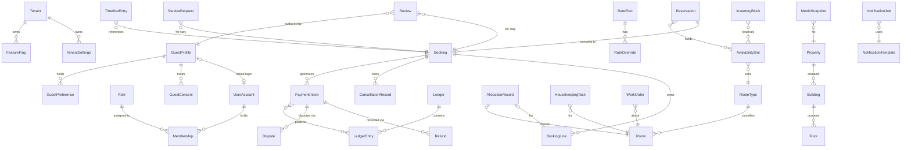
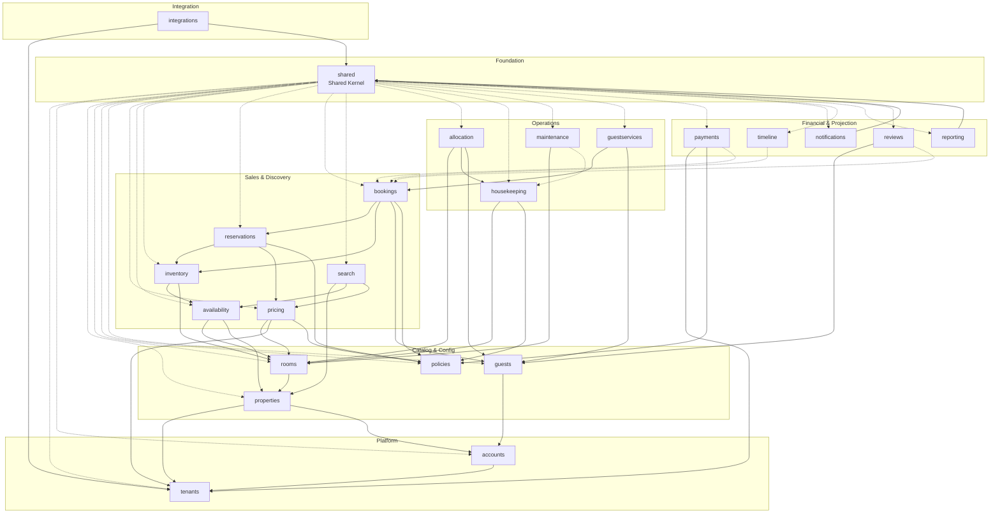

# Hospitality Management Platform — Domain Model Specification (DMS)

| Field | Value |
|---|---|
| **Status** | v1.0 — for implementation reference |
| **Version** | 1.0 |
| **Date** | 2026-08-05 |
| **Authoring team** | Staff Software Architect (Booking.com) · Principal Django Engineer · Domain-Driven Design Expert · Database Architect · Enterprise Software Engineer |
| **Input** | Software Design Document v0.3 (`docs/software-design-document.md`) — decisions DR-01 … DR-12 are constraints |
| **Scope** | **Business domain only.** No Django models, database tables, SQL, serializers, views, or APIs. |

---

## How to read this document

- Each **bounded context** gets one section with ten facets: Aggregate Roots, Entities, Value Objects, Domain Services, Domain Events, Repositories, Business Invariants, Cross-Domain Relationships, Ownership Boundaries, Implementation Notes.
- **Aggregate** = a transactional consistency boundary. One aggregate = one unit of load/save. An aggregate root is the only entry point for changing the aggregate; entities inside it are reachable only through the root.
- **Ownership** in the entity tables refers to the aggregate that owns the entity.
- The final part contains the three required diagrams and the **design risks / inconsistencies** found while mapping the SDD to a domain model — including one structural issue (Availability vs. Inventory) that we recommend resolving before implementation.

---

## 1. Identity & Access

**App:** `accounts` · **Super-domain:** Identity

### Aggregate Roots

| Aggregate | Why it exists |
|---|---|
| `UserAccount` | A person who can authenticate. Identity and lifecycle (active/locked/deactivated) are independent of any tenant — the same account can hold memberships in many tenants. |
| `Role` | Tenant-defined role with a permission set (RBAC as data). Referenced by memberships; versioned so permission changes are auditable. |
| `Membership` | The fact "user X belongs to tenant T with roles R and property scopes P." Separate lifecycle (granted/revoked) from user and role. |
| `Invitation` | A pending invite (email + target roles + property scope + expiry). Its own lifecycle (pending → accepted/expired/revoked); a membership is created only after acceptance. |

### Entities

| Entity | Responsibility | Lifecycle | Ownership | Relationships |
|---|---|---|---|---|
| `UserAccount` (root) | Authenticate; own credentials, MFA devices, status | created → active → locked/deactivated | itself | 0..1 `GuestProfile` (optional link) · many `Membership` |
| `MfaDevice` | Second-factor verification | enrolled → removed | `UserAccount` | belongs to a `UserAccount` |
| `Role` (root) | Define a named permission set | created → published → retired | itself | referenced by `Membership` |
| `Membership` (root) | Grant user access to a tenant with roles + property scope | pending → active → revoked | itself | one `UserAccount` · one `Tenant` · N `Role` |
| `Invitation` (root) | Carry a pending invite | pending → accepted/expired/revoked | itself | one `Tenant` · target roles · email |

### Value Objects
- `Email` — validated, normalized (lowercase). Value object: no identity; equality by value; self-validating.
- `PhoneNumber` — E.164 normalized. Value object: validation + comparison; formatting is presentation.
- `Permission` (e.g., `booking.cancel`) — a capability code. Value object: immutable, comparable, no lifecycle.
- `PropertyScope` — the set of property ids + action level granted. Value object: combination is the value.
- `PasswordPolicy` — password rules (length, entropy, expiry). Value object: shared config, no identity.
- `AuditStamp` (createdBy/at, updatedBy/at) — from Shared Kernel; value object.

### Domain Services
| Service | Responsibility |
|---|---|
| `AuthService` | Verify credentials, enforce lockout, issue an authenticated principal; coordinate MFA. Does not own credentials — `UserAccount` does. |
| `MfaService` | Enroll/verify TOTP or WebAuthn devices. |
| `MembershipService` | Grant/revoke access, re-scope properties, enforce "second approval" for sensitive grants. |
| `InvitationService` | Create, resend, expire, and redeem invitations; create `Membership` on redemption. |

### Domain Events
| Event | Producer | Consumers | Payload | Why it exists |
|---|---|---|---|---|
| `user.invited` | Invitation | Notifications, Audit | invitationId, email, tenantId, roles, expiresAt | Trigger the invitation email; audit the attempt. |
| `membership.granted` | Membership | Notifications, Audit, Reporting | userId, tenantId, roles, propertyScopes | Welcome/onboarding; provisioning of UI access. |
| `membership.revoked` | Membership | Notifications, Audit, Search? | userId, tenantId, propertyScopes | Terminate access; alert the owner. |
| `user.deactivated` | UserAccount | Notifications, Audit | userId, reason | Security: notify owner, record the event. |
| `user.mfa_enabled` | UserAccount | Audit | userId | Compliance/security record. |

### Repositories
- `UserAccountRepository` — find by email/principal, save account status changes.
- `MembershipRepository` — find memberships by user and by tenant, enforce "one active membership per user-tenant pair."
- `RoleRepository` — find roles by tenant, publish/retire.
- `InvitationRepository` — find by token, expire by policy.

### Business Invariants
1. **Email is unique platform-wide** — one account, many memberships. *Why:* a user must not create duplicate identities per tenant; enables cross-property guest recognition and SSO later.
2. **A staff user must have at least one active membership to reach tenant data.** *Why:* RBAC is meaningless without a membership; every endpoint asserts membership (§16 of SDD).
3. **A user cannot be hard-deleted while referenced by a booking or ledger.** *Why:* audit and guest history reference the actor; deactivation (soft) preserves history (GDPR erasure is a separate, sanctioned process).
4. **Sensitive grants (tenant_owner, finance) require second approval.** *Why:* insider-threat control (§14 SDD).
5. **Invitations expire.** *Why:* unexpired invites are a standing credential risk.
6. **One active membership per (user, tenant).** *Why:* conflicting simultaneous roles create ambiguous authorization.

### Cross-Domain Relationships
- Provides the **authorization context** (principal → membership → roles → property scope) consumed by every other context. This is a read dependency, resolved at request start.
- Links optionally to `GuestProfile` (a guest who creates an account) — the link is 0..1, owned by Identity, reference only.
- Consumes `Tenant` (memberships belong to a tenant).
- Emits events for Notifications and Audit — never receives commands from other contexts.

### Ownership Boundaries
- **Owns:** accounts, credentials, MFA, roles, memberships, invitations, authorization facts.
- **Does not own:** guest commercial profile, consent, preferences (Guest Profile); tenant settings (Tenancy); password storage details are an implementation concern of this context.

### Implementation Notes
- The Django app is `accounts`. Model the four aggregates as four independent module roots (`models/` package) — do not hang `Membership` off `UserAccount` as a child collection; they have different consistency needs.
- Authentication middleware resolves the principal once per request and exposes a typed principal (tenant + roles + property scopes) to service layers — nothing else re-queries identity per call.
- The workflow substrate has no state machine here yet; account status can use the substrate if it gains approval workflows. Do not add one preemptively.

---

## 2. Tenancy

**App:** `tenants` · **Super-domain:** Identity

### Aggregate Roots

| Aggregate | Why it exists |
|---|---|
| `Tenant` | The boundary of all tenant-scoped data and the unit of provisioning/suspension/decommission. Its lifecycle is the transaction boundary for "go live" and "shut down." |

### Entities

| Entity | Responsibility | Lifecycle | Ownership | Relationships |
|---|---|---|---|---|
| `Tenant` (root) | Identity of the customer; currency/timezone defaults; lifecycle | prospective → active → suspended → decommissioned | itself | 1..N `Property` · N `Membership` · N `RatePlan` · N `Policy` |
| `TenantSettings` | Currency, default timezone, locale, branding, operational defaults | changed over time (versioned) | `Tenant` | 1:1 with `Tenant` |
| `FeatureFlag` | Per-tenant capability toggle (gradual rollout) | on/off; lifecycle | `Tenant` | belongs to `Tenant` |

### Value Objects
- `TenantId`, `Branding` (name, logo ref, colors), `Locale`, `TimeZoneId`, `Currency` (from Shared Kernel) — value objects: no lifecycle, compared by value, used across contexts.
- `ProvisioningState` — a status value, not an entity.

### Domain Services
| Service | Responsibility |
|---|---|
| `TenantService` | Provision (create tenant + settings + owner + defaults), suspend, activate, decommission (GDPR export before deletion). |
| `FeatureFlagService` | Toggle flags, gate rollouts per tenant. |

### Domain Events
| Event | Producer | Consumers | Payload | Why it exists |
|---|---|---|---|---|
| `tenant.provisioned` | TenantService | Properties, Policies, Integrations, Reporting | tenantId, currency, timezone, ownerUserId | Kick off default seeding (rate plans, policies, PSP connection, HK standards). |
| `tenant.suspended` | TenantService | All contexts (context) | tenantId, reason | Block writes; degrade gracefully. |
| `tenant.activated` | TenantService | All contexts | tenantId | Resume service. |
| `tenant.decommissioned` | TenantService | Reporting, Audit | tenantId, exportedRef | Final record; blocks new writes. |
| `tenant.settings_changed` | Tenant | Search (branding), Reporting | tenantId, changedKeys | Re-project branding/display config. |

### Repositories
- `TenantRepository` — find by id/domain, save lifecycle changes.
- `FeatureFlagRepository` — per-tenant flag lookup (hot path).
- `TenantSettingsRepository` — read/write settings with versioning.

### Business Invariants
1. **A tenant must have an owner user before activation.** *Why:* an orphaned tenant cannot be administered (§9.4 onboarding).
2. **Base currency is immutable once the first transaction exists.** *Why:* changing currency retroactively corrupts money history (R7); FX is reporting-only.
3. **Decommission requires a completed GDPR export and blocks all new writes.** *Why:* legal requirement; prevents resurrection of deleted data.
4. **Every tenant-scoped row in every context carries `tenant_id`** (DR-01). *Why:* hard isolation.
5. **Feature flags are validated against a known registry** (no freeform flags). *Why:* prevents accidental cross-tenant behavior drift and typo'd flags.

### Cross-Domain Relationships
- Foundation for **tenant context**: resolved by the gateway/middleware and threaded through every request. All other contexts depend on it (the SDD's coupling rule: apps may import `tenants`).
- Emits `tenant.provisioned` to seed other contexts (Policies, Pricing, Integrations). Does not call them directly for seeding — event-driven (DR-08).

### Ownership Boundaries
- **Owns:** tenant identity, lifecycle, settings, feature flags.
- **Does not own:** policy content (Policy Engine), rate plans (Pricing), PSP connections (Integrations), users (Identity), guest data.

### Implementation Notes
- App: `tenants`. `TenantSettings` is a child aggregate entity, but read in nearly every request — cache it and invalidate on `tenant.settings_changed`.
- Provisioning is a **domain service orchestration**, not a view; it is idempotent (retry-safe) per FR-TEN-01.
- The middleware sets the tenant context once; contexts read it from the context, never from client payloads.

---

## 3. Property

**App:** `properties` · **Super-domain:** Property

### Aggregate Roots

| Aggregate | Why it exists |
|---|---|
| `Property` | The operational unit (hotel/hostel/apartment/resort) with configuration, hierarchy, and media. Its config changes are the transaction boundary; rooms/availability reference it. |
| `PropertyGroup` | Optional organization above properties (Maria's 3 properties). Separate lifecycle from any single property — a group can exist before and after its properties. |

### Entities

| Entity | Responsibility | Lifecycle | Ownership | Relationships |
|---|---|---|---|---|
| `Property` (root) | Type, address, currency, timezone, check-in/out times, housekeeping standard ref, branding, status | draft → active → deactivated | itself | 1 `Tenant` · 1..N `Building` · N `RoomType`/`Room` · N `Facility` |
| `PropertyGroup` (root) | Group properties for ownership/management | created → archived | itself | 0..N `Property` |
| `Building` | Physical building of a property | added/retired | `Property` | 1 `Property` · 0..N `Floor` |
| `Floor` | Level within a building | added/retired | `Property` | 1 `Building` · 0..N `Room` |
| `Facility` | Amenity instance (pool, gym, wifi zone) | catalogued/removed | `Property` | 1 `Property` |
| `MediaAsset` | Photo/document (object-storage ref) | uploaded → published/removed | `Property` | 1 `Property` |

### Value Objects
- `Address`, `GeoLocation`, `Currency`, `TimeZoneId`, `ContactInfo` (phone/email), `CheckInOutTimes` (pair of `TimeOfDay`) — from Shared Kernel. Value objects: no identity; a property's address is the value, not an entity.
- `PropertyType` (hotel/hostel/apartment/resort) — enum value.

### Domain Services
| Service | Responsibility |
|---|---|
| `PropertyService` | Create/configure property, manage hierarchy (buildings/floors), change status. |
| `PropertyOnboardingService` | Coordinate onboarding: property → bulk room import hook → availability initialization (via events) → go live. |

### Domain Events
| Event | Producer | Consumers | Payload | Why it exists |
|---|---|---|---|---|
| `property.onboarded` | PropertyService | Availability (init grid), Search (index), Reporting | propertyId, tenantId, roomTypeIds, currency, timezone | Initialize the availability horizon and the search index for a new property. |
| `property.configured` | Property | Search (reindex), Reporting | propertyId, changedKeys | Re-project after config change. |
| `property.deactivated` | Property | Search (deindex), Availability (stop selling) | propertyId, reason | Remove from discovery and sales. |

### Repositories
- `PropertyRepository` — find by tenant/property, save config.
- `PropertyGroupRepository` — group membership queries.
- `FacilityRepository`, `MediaAssetRepository` — catalog lookups.

### Business Invariants
1. **A property belongs to exactly one tenant.** *Why:* the isolation boundary (DR-01).
2. **A property must have at least one room-type before it can be sold.** *Why:* availability is defined per room-type; nothing to sell otherwise.
3. **Currency and timezone are set before the availability horizon initializes.** *Why:* the grid is date/currency-sensitive; late changes corrupt history (R2).
4. **Deactivation is soft and blocks new reservations; existing confirmed bookings are honored.** *Why:* contractual continuity with booked guests.
5. **Within a tenant, a property is addressable by a stable id and (optionally) a code.** *Why:* integrations and bulk operations reference it unambiguously.

### Cross-Domain Relationships
- Feeds **Room** (physical rooms hang off buildings/floors), **Availability** (grid init), **Search** (index), **Reporting**.
- Communicates by **events** to Availability/Search/Reporting; Room is a child-like reference (rooms reference the property id) but Room owns its own state.
- Property config (currency/timezone) is read by Booking/Pricing for money and date correctness.

### Ownership Boundaries
- **Owns:** property identity, hierarchy, facilities, media, operational config.
- **Does not own:** physical room state (Room), sellable counts (Availability), rates (Pricing), housekeeping standards (Housekeeping/Policy).

### Implementation Notes
- App: `properties`. Keep `Building`/`Floor` shallow (id + name + parent ref) — they are organizational nodes, not behavior.
- `PropertyGroup` is its own aggregate because Maria's multi-property view (v2) reads it; do not fold it into `Property`.
- Media assets reference object storage; the domain stores refs + metadata, never binaries.

---

## 4. Room

**App:** `rooms` · **Super-domain:** Property · **Owns the room operational state machine (§9.3 SDD)**

### Aggregate Roots

| Aggregate | Why it exists |
|---|---|
| `RoomType` | The *sellable catalog product* (Deluxe King, occupancy, base attributes). Availability sells room-types, not rooms (DR-05) — so the room-type is its own aggregate with its own lifecycle (active/retired). |
| `Room` | A physical room. Owns the operational state machine (Vacant/Occupied × Clean/Dirty + OOO/OOS). State integrity is the consistency boundary — no other context may flip a room's state directly. |

### Entities

| Entity | Responsibility | Lifecycle | Ownership | Relationships |
|---|---|---|---|---|
| `RoomType` (root) | Sellable product: name, occupancy, size, amenities template, housekeeping standard ref | created → active → retired | itself | 0..N `Room` · referenced by `AvailabilitySlot`, `RatePlan`, `BookingLine` |
| `Room` (root) | Physical room: code, room-type, building/floor, attributes, operational state | created → active → out-of-service → retired | itself | 1 `RoomType` · 1 `Property` · building/floor refs |
| `RoomStateEvent` | Append-only record of every state transition | unbounded | `Room` | belongs to `Room` |

### Value Objects
- `RoomCode` — unique within property. Value object: identity is (tenant, property, code); equality by value.
- `RoomAttributeSet` (view, accessible, connecting flag, quiet, floor preference class) — value object; a room's attribute combination is the value.
- `RoomOperationalState` — enum value (VC/VD/OC/OD/OOS/OOO) plus the ephemeral `Cleaning`/`Inspected` task states live on the housekeeping task, not the room (SDD §9.3).
- `ConnectingRoomsLink` — a value/reference pair marking two rooms as connecting (symmetric).

### Domain Services
| Service | Responsibility |
|---|---|
| `RoomService` | Create/retire rooms and room-types; configure attributes. |
| `RoomStateMachine` (via the shared `WorkflowRunner`) | Apply **guarded** transitions (e.g., VD → VacantClean must pass Cleaning → Inspected). The single arbiter of room state. |
| `RoomQuery` (selector) | Answer "which physical rooms of type T are Vacant Clean and not OOO/OOS" for the Allocation Engine. |

### Domain Events
| Event | Producer | Consumers | Payload | Why it exists |
|---|---|---|---|---|
| `room.state_changed` | RoomStateMachine | Availability (out-of-service units), Search (reindex), Reporting, Timeline | roomId, from, to, reason, actor | Room state feeds sellable units, the index, and the timeline. |
| `room.type_retired` | RoomType | Availability, Search | roomTypeId, propertyId | Stop selling a room-type cleanly. |

### Repositories
- `RoomRepository` — find by property/floor, candidate query for allocation (with state predicates), save state.
- `RoomTypeRepository` — by property, by code, retire.
- `RoomStateEventRepository` — append-only state history.

### Business Invariants
1. **A room cannot be allocated unless `Vacant Clean`** (or an explicitly approved override). *Why:* a dirty or OOO room is a guest-experience and safety failure (FR-ROOM-03).
2. **A room cannot be sold while `OOO` or `OOS`.** *Why:* availability reads room state; the two must never diverge (SDD §11.1).
3. **`VD → VacantClean` must pass through Cleaning → Inspected.** *Why:* the core readiness rule; the workflow enforces it (§10.3 SDD).
4. **A room cannot be in `OOO` and `OOS` simultaneously.** *Why:* they are distinct reasons for being down (maintenance vs. quality); double-flagging confuses reporting and allocation.
5. **Room code is unique within (tenant, property).** *Why:* staff and integrations reference rooms by code.
6. **An occupied room can go `OOO` (emergency) but `OOS` only when vacant.** *Why:* OOS implies removing from service for cleaning/quality, which requires the room empty.
7. **State transitions are append-only and audited.** *Why:* "why is this room not ready?" must be answerable (R20).

### Cross-Domain Relationships
- Room state **feeds Availability** (out-of-service units) — via `room.state_changed` events (SDD §11.1).
- **Allocation reads** candidate rooms through `RoomQuery` (a selector) — never table access (coupling rule #1).
- **Housekeeping** requests state transitions (cleaning done → inspected); **Maintenance** requests OOO; **Booking/Allocation** request Occupied. All requests go through `RoomStateMachine` — no context mutates room state directly.
- Room-type is referenced by Availability, Pricing, and Booking (sell/pricing/booking are per room-type).

### Ownership Boundaries
- **Owns:** room-types, physical rooms, operational state machine, state history.
- **Does not own:** capacity counts (Availability), price (Pricing), physical assignment decision (Allocation), cleaning tasks (Housekeeping). Each *requests* state changes; Room arbitrates.

### Implementation Notes
- App: `rooms`. The state machine is the heart — declare it in `workflows/` per DR-07; never allow `queryset.update(state=…)` outside the machine.
- The Allocation Engine needs a high-performance candidate query; expose it as a **selector** with the state predicates, not as raw ORM from another app.
- Room and RoomType are separate aggregates: changing a room-type's attributes must not require rewriting each room.

---

## 5. Search

**App:** `search` · **Super-domain:** Discovery · **CQRS read side — no write aggregates**

### Aggregate Roots
**None.** Search is a projection over an index (OpenSearch). It owns no transactional state and no invariants in the write sense. Honest DDD: not every bounded context has rich aggregates; this one is a query side (DR-12).

### Entities (read models / indexed documents)
| Read model | Responsibility | Lifecycle | Ownership | Relationships |
|---|---|---|---|---|
| `PropertyIndexDocument` | Faceted discovery of a property (location, amenities, price band, geo) | rebuilt from events | Search | 1 `Property` (source) |
| `RoomTypeIndexDocument` | Faceted discovery of a room-type (attributes, view, pet-friendly) | rebuilt from events | Search | 1 `RoomType` (source) |

### Value Objects
- `SearchQuery` (dates, guests, location, amenities, price band, proximity) — value object: an immutable query description.
- `GeoFilter` (near airport / around point, radius) — value object.
- `FacetValue` (amenity, view, pet-friendly) — value object.

### Domain Services
| Service | Responsibility |
|---|---|
| `SearchService` | Run the pipeline: candidate discovery from the index → **Availability filter** → **Pricing** → sort → results (SDD §11.5). |
| `SearchIndexingService` | Rebuild/update the index from domain events; full reindex for recovery. |

### Domain Events
Search **consumes** events; it produces none that other contexts act on (an internal `search.index_updated` may exist for observability only).
| Event (consumed) | From | Purpose |
|---|---|---|
| `property.onboarded` / `property.configured` / `property.deactivated` | Property | Index / update / deindex |
| `room.type_retired` / `room.state_changed` (attributes only) | Room | Reindex attributes (never availability) |
| `rate.changed` | Pricing | Refresh price bands in facets |

### Repositories
- `SearchIndexReader` — faceted candidate queries (returns ids, never availability truth).
- `SearchIndexWriter` — document writes/rebuilds.

### Business Invariants
1. **Search never answers availability and never stores sold counts.** *Why:* the index is eventually consistent by design; any availability number there would be stale truth and reopen overselling (DR-12).
2. **The index is fully rebuildable from events.** *Why:* projections must be disposable (SDD §15).
3. **Results are always re-validated against Availability and priced by Pricing before presentation.** *Why:* correctness of sellability and price never comes from the index.

### Cross-Domain Relationships
- Calls **AvailabilityService** (filter candidates to sellable nights) and **PricingService** (price the stay) — read-only, in-process, per the allowed dependency set.
- Consumes Property/Room/Pricing events for indexing.
- Never writes to any other context.

### Ownership Boundaries
- **Owns:** the index, facets, relevance ranking.
- **Does not own:** sellability truth (Availability), price (Pricing), room attributes (Room — it mirrors them).

### Implementation Notes
- App: `search`. Treat the index as disposable: full-reindex must be a runbook operation.
- Personalization (v2) re-ranks results using Guest Profile data — read through a selector, not the profile's tables.
- Keep facet definitions in one place (a catalog in this context) so Property/Room attribute changes map to facets predictably.

---

## 6. Availability

**App:** `availability` · **Super-domain:** Inventory · **Owns the sellability truth**

> **Known design issue:** the SDD splits "Availability" (slots) from "Inventory" (capacity operations). In the domain model these share one aggregate and one transaction boundary. See the recommendation in §6 "Ownership Boundaries" and the consolidated risk item in the Risks section.

### Aggregate Roots

| Aggregate | Why it exists |
|---|---|
| `AvailabilitySlot` | The atomic unit of sellability: `(tenant, property, room-type, business-date, channel) → counters`. It is the row that must never oversell; per-slot integrity is the transaction boundary. |

A booking touches N slots (one per night). The aggregate is **per slot**; the domain service enforces cross-slot consistency for a window by locking the whole window in one transaction. Rationale: a per-room-type "calendar" aggregate would lock an entire year of rows for every booking — wrong granularity.

### Entities

| Entity | Responsibility | Lifecycle | Ownership | Relationships |
|---|---|---|---|---|
| `AvailabilitySlot` (root) | Track `total, sold, reserved, blocked, out_of_service` per (room-type, date, channel) | created with the horizon → retired | itself | 1 `RoomType` · refs `Reservation`/`Booking` for holds/sold |
| `AvailabilityWindow` | A date-range view of slots for a room-type — a **transactional unit** operated on atomically | per operation | (value/query) | N `AvailabilitySlot` |

### Value Objects
- `Channel` (direct/ota/group) — value object; the channel dimension exists now for DR-03.
- `DateRange`, `StayPeriod` — shared value objects used to compute the window.
- `RemainingCount` — derived value: `total − sold − reserved − blocked − out_of_service` (never stored as a counter that can drift).

### Domain Services
| Service | Responsibility |
|---|---|
| `AvailabilityService` | Answer "is a window sellable, and how many units remain per night?" (read path, cached). |
| `AvailabilityConsumeService` | **Atomic** reserve/sell/release/restore of a window (row-locked, conditional). This is the invariant-enforcement point for "never negative." |

### Domain Events
| Event | Producer | Consumers | Payload | Why it exists |
|---|---|---|---|---|
| `availability.changed` | AvailabilityConsumeService | Cache invalidation, Reporting | tenantId, propertyId, roomTypeId, dateRange, delta | Keep the read cache coherent; reflect sellability changes in reporting. (Internal/observability; not in the cross-domain business catalog.) |

### Repositories
- `AvailabilitySlotRepository` — find window (range query), **atomic conditional update** (`UPDATE … WHERE remaining ≥ demand`), upsert on horizon init, row-lock for windows.

### Business Invariants
1. **`sold + reserved + blocked + out_of_service ≤ total` at all times (remaining ≥ 0).** *Why:* the anti-overselling rule; enforced at the DB row, not by app retries (R1).
2. **Consume and release are atomic and idempotent per reservation/booking.** *Why:* a retried hold or a replayed payment must not double-decrement.
3. **A released hold restores exactly the capacity it consumed.** *Why:* holds must be reversible without drift.
4. **Slots exist only within the configured horizon.** *Why:* finite grid, bounded storage, clear cut-off semantics.
5. **Room OOO/OOS always decrements `out_of_service` before the room can be sold again.** *Why:* a room taken out of service must immediately stop selling (FR-ROOM-03).

### Cross-Domain Relationships
- **Reads** room state (via `room.state_changed` events) to maintain `out_of_service`.
- **Serves** Reservation/Booking (consume/release), Search (filter), Pricing (which nights are sellable), Reporting.
- All slot mutation requests flow through this context's services; other contexts never touch slot rows.

### Ownership Boundaries
- **Owns:** slot counters, sellability truth, atomic capacity math.
- **Does not own:** the *decision* to consume (Reservation/Booking), the physical room (Room), the rate (Pricing).
- **Recommendation (see Risks #1):** the SDD's "Inventory Engine" capacity operations should be implemented **inside this context** (or Availability folded into Inventory) so that the slot aggregate has a single owner. Keeping them as two apps is acceptable only if `inventory` calls Availability's services exclusively and never its tables.

### Implementation Notes
- App: `availability` (or the merged `availability`+`inventory` app — see Risks). The atomic conditional update is a **repository capability** (predicate-based decrement), not business logic in a view.
- The read cache (Redis, keyed per slot) is invalidated by `availability.changed`; the cache is a performance layer, the DB is truth.
- Partition the slot table by date up front (§15 SDD).

---

## 7. Inventory

**App:** `inventory` · **Super-domain:** Inventory

### Aggregate Roots

| Aggregate | Why it exists |
|---|---|
| `InventoryBlock` | A group/block hold: room-type × date-range × quantity, without individual reservations (weddings, tour groups). Its own lifecycle (draft → confirmed → released/picked-up) and independent of any single booking. |
| `ChannelAllocation` | Per-channel capacity rule (fixed/percentage, oversell policy) for a room-type/date range. Present now for DR-03; v1 has only `direct`. |

### Entities

| Entity | Responsibility | Lifecycle | Ownership | Relationships |
|---|---|---|---|---|
| `InventoryBlock` (root) | Reserve capacity for a group without booking rows | draft → confirmed → released/picked-up | itself | N `AvailabilitySlot` (reserved) · later N `Booking` (pick-up) |
| `ChannelAllocation` (root) | Define how capacity is split/guaranteed per channel | configured/disabled | itself | N `RoomType` · N `Channel` |

### Value Objects
- `AllocationMode` (fixed units / percentage / pool), `BlockStatus`, `OversellPolicy` (none/limited) — value objects.

### Domain Services
| Service | Responsibility |
|---|---|
| `InventoryService` | The capacity **operations** over `AvailabilitySlot`: `consume`, `release`, `hold`, `restore`. Per Risks #1, these must be implemented over the Availability aggregate, never as free-floating table writes. |
| `BlockService` | Create/confirm/release blocks; pick-up to bookings (v2). |

### Domain Events
| Event | Producer | Consumers | Payload | Why it exists |
|---|---|---|---|---|
| `block.confirmed` | BlockService | Availability (reserved), Reporting | blockId, roomTypeId, dateRange, quantity | Lock capacity for the group. |
| `block.released` | BlockService | Availability (restore), Reporting | blockId, roomTypeId, dateRange, quantity | Free capacity. |
| `block.picked_up` | BlockService | Booking | blockId, bookingId | Tie group pick-up to the booking. |

### Repositories
- `InventoryBlockRepository` — find by property/date-range, save lifecycle.
- `ChannelAllocationRepository` — read allocation rules.

### Business Invariants
1. **Blocks and channel allocations are additive to the same slot counters** — a block reserves, an allocation caps. *Why:* both consume the shared pool; overselling must consider both.
2. **Capacity is only changed through the Availability aggregate** (per Risks #1). *Why:* one owner of sellability truth.
3. **Pick-up converts a block's reservation into sold units atomically.** *Why:* a group room must not be double-sold during pick-up.
4. **Channel allocations are validated against the room pool** (sum of allocations cannot exceed physical capacity). *Why:* DR-03 parity later requires a sane pool.

### Cross-Domain Relationships
- Depends on **Availability** (slot operations) and **Room** (room-types).
- Block/Allocation events feed Availability and Reporting.
- In v3, Channel Allocation is the seam the **OTA/channel manager** plugs into (DR-03 pays off).

### Ownership Boundaries
- **Owns:** blocks, channel allocations, and (per the recommendation) the capacity operations.
- **Does not own:** the slot rows (Availability) — see Risks #1; do not duplicate counters.

### Implementation Notes
- App: `inventory`. Strong recommendation: **merge with `availability` into one app owning `AvailabilitySlot`**, with `InventoryService` and `AvailabilityService` as two services of the same aggregate. If kept separate, enforce a strict "inventory calls availability's service only" rule in CI.
- v1 ships `ChannelAllocation` structure + `direct` only; do not build the OTA logic.

---

## 8. Pricing

**App:** `pricing` · **Super-domain:** Property · **DR-06**

### Aggregate Roots

| Aggregate | Why it exists |
|---|---|
| `RatePlan` | The sellable product definition: room-type × base rate × policy reference × modifiers. Its changes affect *future* quotes only; past quotes are snapshots. |

### Entities

| Entity | Responsibility | Lifecycle | Ownership | Relationships |
|---|---|---|---|---|
| `RatePlan` (root) | Base rate, currency, policy references (cancellation/deposit), sellable flag | draft → active → retired | itself | 1 `RoomType` · N `RateOverride` · N modifiers |
| `RateOverride` | Per-date-range price adjustment (season, weekend, holiday) | applied/removed | `RatePlan` | date range × adjustment |
| `CalendarModifier` | Seasonal/weekend/holiday rule | configured | `RatePlan` | applies to the plan |
| `SegmentModifier` | Corporate / long-stay adjustment | configured | `RatePlan` | applies to the plan |

### Value Objects
- `PriceBreakdown` — the computed per-night + total price with modifier lines (base, calendar, segment, policy floors/ceilings). **Value object:** immutable, comparable, and **snapshotted** onto the quote/reservation/booking. It is not a shared mutable entity — the booking keeps its own copy (DR-06, R3).
- `Money`, `Currency`, `StayPeriod`, `GuestCount` — shared value objects.

### Domain Services
| Service | Responsibility |
|---|---|
| `PricingService` | `price(roomType, StayPeriod, GuestCount, context)` → a persisted `PriceBreakdown`. The only place price is computed. |
| `PriceSimulationService` | What-if price for staff (v2 preview) without persisting. |

### Domain Events
| Event | Producer | Consumers | Payload | Why it exists |
|---|---|---|---|---|
| `rate.changed` | RatePlan | Search (price bands), Availability (price-aware queries), Reporting | ratePlanId, roomTypeId, effectiveDate, currency | Refresh discovery facets and any price-derived projections. |

### Repositories
- `RatePlanRepository` — find active plans by property/room-type/date, version plans.
- `RateOverrideRepository` — effective-override resolution for a date range.

### Business Invariants
1. **Price is always non-negative and in a single currency.** *Why:* money discipline (R7); never mixes currencies in one breakdown.
2. **A booking's price is immutable once confirmed** — the `PriceBreakdown` is snapshotted, not re-computed. *Why:* disputes and reconciliation need the agreed price (DR-06).
3. **Policy floors/ceilings are applied by the Pricing Engine, not by callers.** *Why:* one enforcement point (DR-10).
4. **Rate changes never rewrite existing bookings or holds.** *Why:* quoted/committed prices are contractual (FR-PLC-03 analogy; R3).
5. **A retired rate plan cannot be used for new quotes but its snapshots remain valid.** *Why:* history stays intact.

### Cross-Domain Relationships
- **Consults Policy Engine** for pricing policy (floors/ceilings) and cancellation/deposit references.
- **Served by** Reservation/Booking/Search (they ask, never compute — DR-06).
- Depends on Room (room-types) and Tenants (currency/timezone).
- Price snapshots are copied into Booking; Booking never calls pricing again after confirmation.

### Ownership Boundaries
- **Owns:** rate plans, modifiers, price computation, price-breakdown semantics.
- **Does not own:** the booking's agreed price (Booking owns the *snapshot*), promotion/coupon mechanics (v2 Pricing), the currency of the tenant (Tenancy).

### Implementation Notes
- App: `pricing`. The pricing inputs pipeline is the SDD §11.3 diagram — implement modifiers as data (records), not hardcoded branches, so v2 coupons and rule-based dynamic pricing slot in without refactor (R3).
- `PriceBreakdown` is a **value object reused across contexts**; the persisted copy on a booking is a snapshot with its own version tag.

---

## 9. Reservation

**App:** `reservations` · **Super-domain:** Booking · **DR-05/DR-08**

### Aggregate Roots

| Aggregate | Why it exists |
|---|---|
| `Reservation` | The pre-payment commercial intent: quote, hold, convert, expire. Its lifecycle (Draft → Held → Awaiting_Payment → Converted / Expired / Cancelled) is the transaction boundary for the hold TTL and inventory reservation. |

### Entities

| Entity | Responsibility | Lifecycle | Ownership | Relationships |
|---|---|---|---|---|
| `Reservation` (root) | Quote, held capacity, price snapshot, policy version, hold expiry | draft → held → awaiting → converted/expired/cancelled | itself | N `AvailabilitySlot` (held) · converts to 1 `Booking` · N `ReservationLine` |
| `ReservationLine` | Per-room-line: room-type, stay period, price snapshot | same lifecycle as reservation | `Reservation` | 1 `RoomType` |

### Value Objects
- `HoldTerm` (duration, TTL), `QuotePrice` (the `PriceBreakdown` snapshot), `ReservationState` — value objects.
- `StayPeriod`, `GuestCount`, `Money`, `Channel` — shared value objects.

### Domain Services
| Service | Responsibility |
|---|---|
| `ReservationService` | `reserve()` (create + hold + Redis TTL), `convert()` (atomic handoff to Booking), `expire()` (TTL sweep), `cancel()`. |
| `HoldManager` | Set/extend/check hold TTL; the authoritative releaser on timeout (R5). |

### Domain Events
| Event | Producer | Consumers | Payload | Why it exists |
|---|---|---|---|---|
| `reservation.created` | ReservationService | Inventory (hold capacity), Notifications | reservationId, roomTypeIds, stayPeriod, holdExpiry | Apply the hold; ack the quote. |
| `reservation.expired` | HoldManager (Celery sweep) | Inventory (release), Notifications | reservationId, roomTypeIds, stayPeriod | TTL elapsed; free capacity. |
| `reservation.converted` | ReservationService | Inventory (hold→sold), Booking, Notifications | reservationId, bookingId, priceSnapshotRef | The atomic handoff to a confirmed booking. |

### Repositories
- `ReservationRepository` — find by id/token, save lifecycle; list overdue holds for the sweep.
- `HoldRepository` — hold metadata + TTL (backed by Redis keys, with the DB row as authority for reconciliation).

### Business Invariants
1. **A hold reserves capacity for exactly the quoted nights.** *Why:* partial holds cause phantom availability.
2. **Conversion is all-or-nothing:** payment success → create Booking → consume capacity → mark converted, in one transaction. *Why:* no window where inventory is sold but no booking exists (R5, DR-08).
3. **A reservation can convert exactly once.** *Why:* double conversion double-sells (idempotency).
4. **Expiry releases capacity exactly once.** *Why:* the Celery sweep and the TTL must not both release.
5. **The price snapshot and policy version are captured at quote time** and copied to the Booking. *Why:* the guest agreed to those terms (R18).

### Cross-Domain Relationships
- Calls **Inventory/Availability** (hold/release), **Pricing** (quote), **Policy Engine** (deposit requirement), **Payments** (via conversion), **Notifications** (events).
- Conversion is the seam where a future **process manager/saga** could sit if conversion ever needs compensation (SDD §8.2.1).

### Ownership Boundaries
- **Owns:** quotes, holds, conversion lifecycle.
- **Does not own:** the confirmed commercial agreement (Booking), capacity counters (Availability), price math (Pricing).

### Implementation Notes
- App: `reservations`. The Redis TTL is a **cache of a DB fact**; the DB row (`expiry_at`) is authority and the sweep reconciles drift.
- `convert()` is the most correctness-critical transaction in the system — write it as a service method that composes Reservation + Inventory + Booking under one transaction, with idempotency keys.

---

## 10. Booking

**App:** `bookings` · **Super-domain:** Booking · **Owns the confirmed agreement and per-room-line state machine**

### Aggregate Roots

| Aggregate | Why it exists |
|---|---|
| `Booking` | The confirmed commercial agreement (multi-room, multi-night). Its per-line lifecycle, cancellations, and modifications are the transaction boundary; payment charges and operational effects hang off it. |

### Entities

| Entity | Responsibility | Lifecycle | Ownership | Relationships |
|---|---|---|---|---|
| `Booking` (root) | Aggregate: guest, property, lines, aggregate state (derived), totals snapshot, policy version | confirmed → completed/cancelled | itself | 1 `Reservation` (converted) · N `BookingLine` · N `PaymentIntent` · N `Review`/`ServiceRequest` (refs) |
| `BookingLine` | Per-room-line: room-type, stay period, price snapshot, per-line state machine (Inquiry…Completed) | per-line lifecycle | `Booking` | 1 `RoomType` · 0..1 `Room` (assigned at check-in via Allocation) |
| `CancellationRecord` | Policy version + penalty applied + effective date | created on cancel | `Booking` | 1 policy version |
| `ModificationRecord` | Audit of date/room/price changes | created on modify | `Booking` | delta snapshot |

### Value Objects
- `BookingState` (per line), `StayPeriod`, `GuestCount`, `Money`, `PriceBreakdown` (snapshot), `CancellationFee` — value objects.
- `GuestSnapshot` (name, contact refs) — value object; the booking carries a snapshot of guest identity rather than a live FK, so a profile merge never mutates history.

### Domain Services
| Service | Responsibility |
|---|---|
| `BookingService` | Create (from converted reservation), modify (re-price via Pricing, re-hold via Inventory), cancel (penalty via Policy Engine, refund via Payments), check-in/out (via Allocation + Room state machine). |
| `CancellationService` | Apply cancellation policy, compute penalty, orchestrate refund (idempotent). |
| `CheckInOutService` | Coordinate room allocation, room state, housekeeping plan, guest services activation. |
| `NoShowService` | (v2) Policy-driven no-show processing — the first candidate for a process manager (SDD §8.2.1). |

### Domain Events
| Event | Producer | Consumers | Payload | Why it exists |
|---|---|---|---|---|
| `booking.confirmed` | BookingService | Notifications, Guests, Reporting, Timeline | bookingId, guestId, lines, stayPeriod, total, policyVersion | Confirmation; profile attach. |
| `booking.checked_in` | CheckInOutService | Rooms, Housekeeping, GuestServices, Timeline | bookingId, lineId, roomId | Arrival; activate ops. |
| `booking.checked_out` | CheckInOutService | Rooms, Housekeeping, Payments (settle), Reviews, Notifications, Timeline | bookingId, lineId, roomId | Departure; close the loop. |
| `booking.cancelled` | CancellationService | Inventory (release), Payments (refund), Notifications, Reporting, Timeline | bookingId, penalty, refundRef | Cancellation handling. |
| `booking.no_show` | NoShowService | Payments (capture), Inventory (release), Notifications, Reporting, Timeline | bookingId, capturedFee | Policy no-show. |
| `booking.modified` | BookingService | Inventory, Pricing (re-quote), Notifications, Reporting, Timeline | bookingId, delta | Track changes; adjust capacity. |

### Repositories
- `BookingRepository` — find by id/guest/property, per-line state queries (arrivals today, departures today), save.
- `CancellationRecordRepository` — append-only cancellation history.

### Business Invariants
1. **A confirmed booking has at least one room-line.** *Why:* a booking with no room is not a booking (matches your example).
2. **A booking cannot be checked in twice.** *Why:* double-occupancy of a physical room.
3. **A room-line's state machine is per line; the booking's aggregate state is derived.** *Why:* 2-of-3 lines can be in-house while 1 is no-show (SDD §9.3 granularity rule).
4. **The price snapshot and policy version are immutable on the confirmed booking.** *Why:* the guest agreed to those terms; disputes read the snapshot (R18).
5. **Inventory is consumed atomically with confirmation** (via Inventory/Availability), so a confirmed booking always has capacity. *Why:* the anti-overselling core (R1).
6. **Cancellation penalty is computed by the Policy Engine at the agreed policy version**, not the current one. *Why:* a policy change must never rewrite an existing booking's terms (FR-PLC-03).
7. **A booking cannot be cancelled after checkout; only refunded/completed paths apply.** *Why:* operational reality — post-checkout there is no inventory to release.
8. **Guest data is snapshotted on the booking.** *Why:* guest profile merges must not retroactively rewrite booking history.

### Cross-Domain Relationships
- Orchestrates the **sales engines** (Availability/Pricing/Reservation/Inventory) via their services — never their tables (DR-05, DR-06).
- **Consults Policy Engine** for cancellation/deposit/check-in rules.
- Emits the events that drive **Housekeeping, Payments, Reviews, Notifications, Timeline, Reporting** — Booking does not know they exist (coupling rule #4).
- Requests room-state changes via the Room state machine (occupied on check-in).

### Ownership Boundaries
- **Owns:** the confirmed agreement, per-line state machine, cancellation/modification history, price/policy snapshots.
- **Does not own:** capacity (Availability), price computation (Pricing), room assignment (Allocation), funds (Payments), cleanliness (Housekeeping).

### Implementation Notes
- App: `bookings`. The per-line state machine in `workflows/` is the centerpiece; the booking aggregate state is a derived projection, not a stored enum.
- `CheckInOutService` is an **orchestrator**: it composes Allocation, Room state, Housekeeping events, and guest services — keep it thin and event-emitting, not a god-class.
- Cancellation is a good first candidate for a **process-manager-style test** even before v2 (compensation across policy + payments + inventory).

---

## 11. Payments

**App:** `payments` · **Super-domain:** Payment · **DR-08, idempotency**

### Aggregate Roots

| Aggregate | Why it exists |
|---|---|
| `PaymentIntent` | A charge lifecycle (authorize → capture → settle → refund/void; dispute). It is the idempotency boundary for money and the PSP correlation point. |
| `Ledger` | The append-only, balanced per-property ledger. Its integrity (every posting is complete and balanced) is a hard consistency boundary. |

### Entities

| Entity | Responsibility | Lifecycle | Ownership | Relationships |
|---|---|---|---|---|
| `PaymentIntent` (root) | Amount, currency, PSP token/intent ref, status machine | auth-required → authorized/captured → settled → refunded/voided/disputed | itself | 1 `Booking` · N `PaymentAttempt` · N `Refund` · N `Dispute` |
| `PaymentAttempt` | A single PSP interaction (success/failure, provider ref) | attempted/succeeded/failed | `PaymentIntent` | belongs to `PaymentIntent` |
| `Refund` | Partial/full refund with reason | pending → applied → settled | `PaymentIntent` | posts to `Ledger` |
| `Dispute` | Chargeback intake and resolution | opened → won/lost/refunded | `PaymentIntent` | posts to `Ledger` |
| `LedgerEntry` | One balanced posting (debit/credit lines) | append-only | `Ledger` | references source (`PaymentIntent`, fee, tax) |

### Value Objects
- `Money`, `Currency`, `PaymentState` — value objects.
- `MoneyAmount` immutable; **never a float** (Shared Kernel, R7).

### Domain Services
| Service | Responsibility |
|---|---|
| `PaymentService` | Authorize/capture/void/refund/partial-refund — **idempotent** (Idempotency-Key), PSP-safe (FR-PAY-05). |
| `LedgerService` | Post balanced entries, reconcile against PSP settlements nightly, surface mismatches. |
| `DisputeService` | Intake chargebacks, track resolution. |
| `ReconciliationService` | Compare PSP-reported settlements vs. local ledger; queue mismatches for finance (R6). |

### Domain Events
| Event | Producer | Consumers | Payload | Why it exists |
|---|---|---|---|---|
| `payment.captured` | PaymentService | Ledger, Booking (awaiting→confirmed), Notifications, Timeline | paymentIntentId, bookingId, amount, currency | Funds in; drives confirmation. |
| `payment.refunded` | PaymentService | Ledger, Booking (cancel), Notifications, Timeline | paymentIntentId, bookingId, amount | Funds out. |
| `payment.settled` | Reconciliation | Ledger, Reporting | paymentIntentId, amount | PSP settlement; reconciliation. |
| `ledger.posted` | LedgerService | Reporting, Audit | ledgerId, entryRef, amount, currency | Commit the balanced posting. |

### Repositories
- `PaymentIntentRepository` — find by id/booking, idempotency-key lookups, save state.
- `LedgerRepository` — append-only entry writes with balance validation.
- `ReconciliationRepository` — settlement/ledger comparison state.

### Business Invariants
1. **Capture and refund are idempotent — a retry returns the same result and never double-charges.** *Why:* the whole "worker crashed after PSP call" scenario (FR-PAY-05).
2. **Ledger entries are append-only and every entry is balanced (debits = credits) within a single currency.** *Why:* ledger integrity; unbalanced entries corrupt reconciliation (R6).
3. **No mixing of currencies within one entry.** *Why:* money discipline (R7).
4. **Amounts are integer minor units or fixed-decimal — never floats.** *Why:* floating-point money is an enterprise bug factory.
5. **A payment can be captured only against an authorized/authorizable intent; a refund never exceeds captured−refunded.** *Why:* you cannot refund money you never captured.
6. **Posting to the ledger is triggered by (and idempotent with) the payment event** — a replayed event must not double-post. *Why:* DR-08 consumer rule.
7. **Deposit/refund policy is answered by the Policy Engine; Payments never embeds the rules.** *Why:* DR-10.

### Cross-Domain Relationships
- Consumes `booking.cancelled` / `booking.no_show` (refund/capture triggers) and `booking.confirmed` (payment intent creation).
- Consults **Policy Engine** for deposit/refund rules.
- Posts to the **Ledger**; feeds **Reporting**; notifies **Notifications**.
- Never touches availability or rooms.

### Ownership Boundaries
- **Owns:** payment intents, attempts, refunds, disputes, the ledger.
- **Does not own:** the decision to cancel/refund (Booking + Policy), money representation (Shared Kernel).

### Implementation Notes
- App: `payments`. The PSP adapter lives behind an interface in `integrations`; Payments depends on the interface, not a provider.
- Idempotency keys: store key + result in the same transaction as the state change — this is the atomic replay guarantee.
- The ledger is a strong candidate for **append-only partitioning** by date (§15 SDD).

---

## 12. Allocation

**App:** `allocation` · **Super-domain:** Operations · **DR-11**

### Aggregate Roots

| Aggregate | Why it exists |
|---|---|
| `AllocationRecord` | A recorded assignment decision: candidate set, scoring inputs, chosen room, actor, override. It exists because "why this room?" must be answerable and replayable (FR-ALL-02, R20) — the durable artifact is the *decision*, not just the side effect on the room. |

### Entities

| Entity | Responsibility | Lifecycle | Ownership | Relationships |
|---|---|---|---|---|
| `AllocationRecord` (root) | Record inputs + score + chosen room | created (on check-in) → possibly superseded by override | itself | 1 `BookingLine` · 1 `Room` (chosen) · N candidate room refs |

### Value Objects
- `AllocationCriteria` (room-type, housekeeping state, maintenance state, preferences, accessibility, VIP, connecting, stay continuity) — value object: the immutable input set.
- `RoomScore` (per-candidate score + factor weights) — value object.
- `AllocationReason` (which factors dominated) — value object for explainability.

### Domain Services
| Service | Responsibility |
|---|---|
| `AllocationService` | Score candidate rooms (deterministic), pick best, apply stay-continuity bias, record the decision. |
| `RoomAllocator` | The scoring function (v1 deterministic; v3 AI additive with deterministic fallback). |

### Domain Events
| Event | Producer | Consumers | Payload | Why it exists |
|---|---|---|---|---|
| `room.allocated` | AllocationService | Booking (room assigned), Notifications (room number), Housekeeping (confirm clean), Timeline | bookingLineId, roomId, reason | Check-in room assignment; closes the allocation loop. |

### Repositories
- `AllocationRecordRepository` — save decisions, replay by booking/property.
- `AllocationCandidateSelector` — candidate room read (delegates to Room's selector for state predicates).

### Business Invariants
1. **A room can be allocated only if `Vacant Clean` and not `OOO`/`OOS`** (or an audited override). *Why:* guest experience + safety; the Room state machine enforces it (SDD §10.4).
2. **Allocation is deterministic for the same inputs.** *Why:* replayability and "why this room?" (FR-ALL-02).
3. **Stay continuity wins ties** — a guest returning to their prior room, or the same room across nights, outranks other factors. *Why:* operational reality and guest preference.
4. **A front-desk override is recorded with the reason.** *Why:* auditability; the decision log stays honest.
5. **Allocation happens at check-in, never at booking time.** *Why:* DR-11; booking sells room-types, not rooms.

### Cross-Domain Relationships
- **Reads** Room (candidates via `RoomQuery`), Housekeeping (clean state), Guest Profile (preferences/VIP) — through selectors, not tables.
- **Requests** the room-state transition to `Occupied` via the Room state machine.
- Emits `room.allocated` for Booking, Notifications, Housekeeping, Timeline.

### Ownership Boundaries
- **Owns:** the assignment decision and its record.
- **Does not own:** room state (Room), cleanliness (Housekeeping), guest preferences (Guest Profile) — it reads all three.

### Implementation Notes
- App: `allocation`. Keep the scoring function pure (value objects in, chosen room out) so it is trivially testable and the v3 AI variant can be A/B'd against it.
- The candidate read is a hot path at check-in — implement as a single optimized selector on Room, not N queries.

---

## 13. Housekeeping

**App:** `housekeeping` · **Super-domain:** Operations

### Aggregate Roots

| Aggregate | Why it exists |
|---|---|
| `HousekeepingTask` | A clean/inspect job for one room on one day, with its own state machine (Planned → Assigned → In_Progress → Quality_Check → Verified) and a defect path. Tasks are assigned and updated independently — that is the consistency boundary. |
| `HKStandard` | A room-type checklist template (items, order, required flag). Referenced by tasks; the *rule* for which standard applies is asked via the Policy Engine (see Ownership). |

### Entities

| Entity | Responsibility | Lifecycle | Ownership | Relationships |
|---|---|---|---|---|
| `HousekeepingTask` (root) | Clean a room by a date to a standard | planned → assigned → in-progress → quality-check → verified / defect | itself | 1 `Room` · 1 `HKStandard` (ref) · assignee |
| `Inspection` | The quality-check result for a task | passed/failed → rework | `HousekeepingTask` | belongs to the task |
| `HKStandard` (root) | Checklist template per room-type | published/retired | itself | N `RoomType` (via applicable rule) |
| `HKPlan` | A generated daily grouping of tasks (rooms × sequence × assignments) | regenerated nightly | *(read model / generated set)* | N `HousekeepingTask` |

### Value Objects
- `HKTaskState`, `Cleanliness` (dirty/clean), `InspectionResult` (pass/fail, notes), `PriorityOrder` (cleaning sequence) — value objects.
- `DateRange`/business `Date` — shared.

### Domain Services
| Service | Responsibility |
|---|---|
| `HousekeepingService` | Generate the daily plan from arrivals/departures + occupancy (night audit); assign tasks; mark complete; defect path. |
| `PlanGenerator` | Compute the daily task set (departures → VD; in-house → OD unless opted out) (FR-HK-01). |

### Domain Events
| Event | Producer | Consumers | Payload | Why it exists |
|---|---|---|---|---|
| `hk.plan_generated` | HousekeepingService | Room (nothing), Notifications (staff), Reporting | propertyId, date, taskCount | Staff awareness; productivity metrics. |
| `hk.task_completed` | HousekeepingService | Room (→ inspected path), Reporting | taskId, roomId, result | Move the room toward readiness. |
| `hk.defect_reported` | HousekeepingService | Maintenance (create work order), Room (→ OOS) | roomId, defect, priority | The closed loop (SDD §10.3). |

### Repositories
- `HousekeepingTaskRepository` — find by assignee/room/date, save state, plan queries.
- `HKStandardRepository` — standard lookup by room-type.

### Business Invariants
1. **A room becomes `Vacant Clean` only after an approved inspection.** *Why:* readiness rule; no skipping (SDD §10.3).
2. **A task is assigned to at most one housekeeper at a time.** *Why:* double-cleaning is waste; unclear ownership.
3. **Defects always create a work order before the room is considered clean.** *Why:* a clean-but-broken room is a guest complaint.
4. **The applicable standard is asked via the Policy Engine, never hardcoded here.** *Why:* DR-10 — the rule (which standard by room-type/season) and the definition (checklist) have separate owners.
5. **A room cannot be cleaned while occupied without the guest's daily-service consent flag.** *Why:* privacy/do-not-disturb semantics.

### Cross-Domain Relationships
- **Consumes** `booking.checked_in` / `booking.checked_out` (plan inputs) — events, not tables.
- **Requests** room-state transitions (cleaning done → inspected → vacant clean) via the Room state machine.
- Emits `hk.defect_reported` → Maintenance; `hk.task_completed` → Room/Reporting.
- Consults **Policy Engine** for the applicable cleaning standard.

### Ownership Boundaries
- **Owns:** tasks, plans (generation), inspections, standard *definitions*.
- **Does not own:** the "which standard applies" rule (Policy), room state (Room — it requests transitions), physical capacity.

### Implementation Notes
- App: `housekeeping`. The daily plan is a **generated set**, not a stored aggregate you keep in sync — regenerate nightly, persist the tasks.
- The defect loop is the integration point that makes maintenance event-driven in v2; build the `hk.defect_reported` contract now even if Maintenance ships later.

---

## 14. Maintenance

**App:** `maintenance` · **Super-domain:** Operations · *(v2 module — v1 keeps the defect hook)*

### Aggregate Roots

| Aggregate | Why it exists |
|---|---|
| `WorkOrder` | A maintenance job with priority, SLA, parts, and labor. Its lifecycle (Reported → Triaged → Scheduled → In_Progress → On_Hold → Resolved → Verified → Closed) and OOO linkage are the consistency boundary. |
| `Asset` | A maintained asset (boiler, AC unit, elevator) that can generate preventive work. Separate lifecycle from any single work order. |

### Entities

| Entity | Responsibility | Lifecycle | Ownership | Relationships |
|---|---|---|---|---|
| `WorkOrder` (root) | Track priority, assignee, SLA clock, room/asset reference, status | reported → … → closed | itself | 0..1 `Room` (OOO linkage) · 0..1 `Asset` · N `WorkOrderTask` |
| `WorkOrderTask` | Sub-task of a work order (labor step) | open → done | `WorkOrder` | belongs to `WorkOrder` |
| `PartUsage` | Parts consumed (catalog ref + quantity) | recorded | `WorkOrder` | belongs to `WorkOrder` |
| `Asset` (root) | Maintained asset + preventive schedule | installed → retired | itself | N `WorkOrder` |

### Value Objects
- `Priority` (P1..P4), `SlaTarget` (response deadline by priority), `WorkOrderState` — value objects.
- `SlaDeadline` (derived from priority + created-at) — value object.

### Domain Services
| Service | Responsibility |
|---|---|
| `MaintenanceService` | Raise (from anywhere: staff, housekeeping defect, guest, asset), triage (priority + assignee), schedule, resolve, verify, close. |
| `SlaMonitor` | Track SLA clock; surface breaches; drive P1/P2 escalation. |
| `OooCoordinator` | Apply/release the OOO room linkage (request room state transitions). |

### Domain Events
| Event | Producer | Consumers | Payload | Why it exists |
|---|---|---|---|---|
| `workorder.raised` | MaintenanceService | Room (→ OOO for P1/P2), Notifications (staff) | workOrderId, roomId, priority | The room stops selling immediately. |
| `workorder.resolved` | MaintenanceService | Room (OOO → available, gated by inspection) | workOrderId, roomId | Restore sellability only after verified + inspected. |
| `workorder.closed` | MaintenanceService | Reporting | workOrderId, slaMet | SLA metrics. |

### Repositories
- `WorkOrderRepository` — find by room/assignee/priority/status, SLA queries, save.
- `AssetRepository` — asset + preventive schedule.

### Business Invariants
1. **P1/P2 on a sellable room ⇒ room goes `OOO` automatically.** *Why:* a broken room must stop selling before a guest is harmed (FR-MNT-03).
2. **A room returns to sale only after `Verified` AND a housekeeping inspection.** *Why:* techs make rooms dirty; the readiness rule holds (SDD §10.4).
3. **SLA clock starts at triage, not at report.** *Why:* fair, enforceable SLAs.
4. **A closed work order cannot be reopened; a new one is raised.** *Why:* history integrity; prevents silent rework.
5. **Parts/labor are recorded against the work order.** *Why:* cost reporting and preventive forecasting.

### Cross-Domain Relationships
- **Consumes** `hk.defect_reported` (auto-create work orders).
- **Requests** Room OOO/available transitions via the Room state machine — Maintenance does not flip room state itself.
- Notifies staff (P1/P2) via Notifications; feeds Reporting (SLA adherence).

### Ownership Boundaries
- **Owns:** work orders, assets, parts, SLA tracking.
- **Does not own:** room state (Room — requests transitions), cleaning (Housekeeping), parts catalog (Integrations/catalog).

### Implementation Notes
- App: `maintenance`. v1 ships only the **defect contract** (`hk.defect_reported`) with a no-op/simple consumer; the work-order domain ships in v2 (SDD §4.6).
- SLA is derived (priority + timestamps) — store the inputs, compute deadlines, never store a stale deadline that drifts.

---

## 15. Guest Services

**App:** `guestservices` · **Super-domain:** Operations · *(v2)*

### Aggregate Roots

| Aggregate | Why it exists |
|---|---|
| `ServiceRequest` | An in-stay request (amenity, dining, laundry, concierge) with its own SLA and status machine (Submitted → Acknowledged → In_Progress → Resolved → Closed / Escalated). Its lifecycle and visibility to guest + staff is the consistency boundary. |

### Entities

| Entity | Responsibility | Lifecycle | Ownership | Relationships |
|---|---|---|---|---|
| `ServiceRequest` (root) | The request, channel, SLA, status | submitted → … → closed/escalated | itself | 1 `Booking` (stay) · 0..1 `GuestProfile` · N `StaffResponse` |
| `StaffResponse` | A staff update/note on the request | recorded | `ServiceRequest` | belongs to the request |
| `ServiceType` | Catalog of service types (dining, laundry, concierge, amenity) | catalogued/retired | *(catalog)* | referenced by requests |

### Value Objects
- `RequestChannel` (in-app, phone, concierge, AI), `RequestPriority`, `RequestState`, `SlaTarget` — value objects.

### Domain Services
| Service | Responsibility |
|---|---|
| `ServiceRequestService` | Create, acknowledge, progress, resolve, escalate; notify guest on status change (FR-GSV-02). |
| `AIConciergeService` (v2) | Intent routing + answers from property config + escalation to human (FR-GSV-04) — an **integration**, not the platform's core. |

### Domain Events
| Event | Producer | Consumers | Payload | Why it exists |
|---|---|---|---|---|
| `service.requested` | ServiceRequestService | Booking (stay context), Notifications (staff), Timeline | requestId, bookingId, type, channel | Route the request; timeline entry. |
| `service.resolved` | ServiceRequestService | Notifications (guest), Timeline | requestId, result | Guest closure + satisfaction loop. |

### Repositories
- `ServiceRequestRepository` — find by stay/guest/status, SLA queries, save.

### Business Invariants
1. **A request is tied to an in-house stay** (or a pre/post-stay context). *Why:* service requires an active guest relationship.
2. **Status changes are user-visible** (guest notified per FR-GSV-02). *Why:* silent requests are complaints.
3. **SLA breach escalates** (Escalated → Acknowledged by a human). *Why:* no request starves silently.
4. **AI concierge escalates to a human when it cannot resolve.** *Why:* trust; an LLM is never the final authority on a live service request.

### Cross-Domain Relationships
- Reads **Booking** (active stay) and **Guest Profile** (preferences) via selectors.
- Notifies via **Notifications**; records on **Timeline**.
- In v2, the AI concierge reads property config (via Property selectors) and may create requests — through the same service.

### Ownership Boundaries
- **Owns:** service requests, responses, AI intent routing.
- **Does not own:** stay truth (Booking), guest preferences (Guest Profile), notification delivery (Notifications).

### Implementation Notes
- App: `guestservices`. The AI concierge is an **adapter** in `integrations`; this context owns the intent-routing *behavior* but not the LLM plumbing.
- Keep `ServiceType` as a catalog so property teams can extend service offerings without code.

---

## 16. Guest Profile

**App:** `guests` · **Super-domain:** Guest · **The lifecycle hub**

### Aggregate Roots

| Aggregate | Why it exists |
|---|---|
| `GuestProfile` | The canonical guest record (identity resolution, preferences, consent, history). It must exist **before** any booking (SDD §11.9); profile integrity across stays and properties is the consistency boundary. |

### Entities

| Entity | Responsibility | Lifecycle | Ownership | Relationships |
|---|---|---|---|---|
| `GuestProfile` (root) | Canonical guest: primary contact, resolved identity, status | created → identified → merged/closed | itself | 0..1 `UserAccount` (optional link) · N `Booking` · N `Review` · N `ServiceRequest` · N `Consent` |
| `GuestPreference` | Room preferences, language, accessibility, amenities | mutable over time | `GuestProfile` | belongs to the profile |
| `GuestConsent` | Lawful-basis record per purpose (marketing, data processing) | granted/withdrawn, dated | `GuestProfile` | belongs to the profile |
| `IdDocument` | Passport/ID reference (never PAN-like data) | recorded/expired | `GuestProfile` | belongs to the profile |
| `LoyaltyAccount` (v2) | Points/tier | created/updated | `GuestProfile` | belongs to the profile |

### Value Objects
- `Email`, `PhoneNumber`, `GuestName` (structured), `LanguagePreference`, `LoyaltyTier` — value objects.
- `ConsentPurpose` (marketing, processing) — value object with lawful basis.

### Domain Services
| Service | Responsibility |
|---|---|
| `GuestService` | Identity resolution (find-or-create by email/phone at booking time), preference updates, consent lifecycle, profile close/erasure (GDPR). |
| `ProfileMergeService` | Human-reviewed merge of duplicate profiles (never auto-merge) (R9). |

### Domain Events
| Event | Producer | Consumers | Payload | Why it exists |
|---|---|---|---|---|
| `guest.identified` | GuestService | Booking (attach), Timeline, Reporting | guestId, bookingId (if any) | Resolve a guest before/at booking. |
| `consent.updated` | GuestService | Notifications (marketing eligibility), Audit | guestId, purpose, state | Legal basis drives marketing opt-in. |
| `guest.merged` | ProfileMergeService | Notifications, Audit | fromGuestId, intoGuestId | Audit the merge; update refs. |
| `guest.erased` | GuestService (GDPR) | Reporting (anonymize), Audit | guestId, erasedRef | Legal erasure record. |

### Repositories
- `GuestProfileRepository` — find by email/phone (resolution), by tenant, save.
- `ConsentRepository` — consent history (append-only per purpose).
- `ProfileMergeRepository` — merge review queue.

### Business Invariants
1. **Marketing data requires explicit consent; transactional processing has a documented lawful basis.** *Why:* GDPR (R8, FR-NOT-03).
2. **Profiles are never auto-merged.** *Why:* merging history wrongly is irreversible; review required (R9).
3. **A guest's bookings snapshot the guest data at booking time** — profile changes do not rewrite history. *Why:* audit integrity (invariant #8 of Booking).
4. **Erasure is a sanctioned, audited process** — not a plain delete. *Why:* legal + audit requirements.
5. **One canonical profile per resolved identity** (within a tenant). *Why:* duplicate profiles fragment history and break loyalty/v2.

### Cross-Domain Relationships
- **Consumed by** Booking (resolve/attach), Allocation (preferences/VIP), Reviews (author), Service Requests, Notifications (marketing eligibility), Timeline, Reporting.
- Links optionally to **Identity** (a guest's login account) — reference only.
- Consent is owned here; **Notifications reads** marketing eligibility, it does not own consent.

### Ownership Boundaries
- **Owns:** the profile, identity resolution, preferences, consent, loyalty (v2), erasure.
- **Does not own:** login/credentials (Identity), delivery preferences (Notifications — see §19), booking history (Booking).

### Implementation Notes
- App: `guests`. Identity resolution is the hot path at booking time — a single, indexed lookup (email/phone within tenant), then a create-or-attach.
- Consent is append-only per purpose; current state is the latest record, never a mutable boolean that loses history.

---

## 17. Reviews

**App:** `reviews` · **Super-domain:** Guest

### Aggregate Roots

| Aggregate | Why it exists |
|---|---|
| `Review` | A guest's post-stay rating + narrative + property response. Its lifecycle (submitted → moderated → published → responded) is the consistency boundary. |

### Entities

| Entity | Responsibility | Lifecycle | Ownership | Relationships |
|---|---|---|---|---|
| `Review` (root) | Rating breakdown, narrative, status | solicited → submitted → moderated → published/withheld → responded | itself | 1 `Booking` (stay) · 1 `GuestProfile` (author) · 0..1 `ReviewResponse` |
| `ReviewResponse` | The property's published response | created → published | `Review` | belongs to the review |

### Value Objects
- `Rating` (overall + dimensions: cleanliness, location, value, staff), `ReviewStatus`, `ModerationDecision` — value objects.

### Domain Services
| Service | Responsibility |
|---|---|
| `ReviewService` | Solicit (triggered by checkout + configurable timing), capture, publish, respond. |
| `ModerationService` (v2) | Queue, spam/abuse detection hooks, decisions. |

### Domain Events
| Event | Producer | Consumers | Payload | Why it exists |
|---|---|---|---|---|
| `review.received` | ReviewService | Guests (profile reputation), Reporting, Timeline | reviewId, bookingId, guestId, rating | Reputation feed; profile history. |
| `review.responded` | ReviewService | Notifications (guest), Reporting | reviewId, responseId | Guest closure; response-rate metric. |

### Repositories
- `ReviewRepository` — find by property/stay/guest/status, save.
- `ModerationQueueRepository` (v2) — moderation queue.

### Business Invariants
1. **A review is tied to a completed stay** (checkout event). *Why:* only real stays get reviewed (FR-REV-01).
2. **A review is published only once.** *Why:* idempotency; no double counting.
3. **Moderation decisions are audited.** *Why:* removing/withholding a review is sensitive.
4. **A property can respond once per review (edit within a window).** *Why:* response integrity.
5. **Ratings never mix tenants** (review scope = tenant + property). *Why:* DR-01.

### Cross-Domain Relationships
- Consumes `booking.checked_out` (solicit trigger).
- Reads **Guest Profile** (author); feeds **Guests** (reputation), **Reporting** (score, response rate), **Timeline**.
- Notifies via **Notifications**.

### Ownership Boundaries
- **Owns:** review content, status, responses, moderation.
- **Does not own:** stay truth (Booking), guest profile (Guest Profile), reputation *metrics* (Reporting computes them from reviews).

### Implementation Notes
- App: `reviews`. Solicitation timing is configurable per tenant (SDD FR-REV-01); schedule via the same scheduler that runs night audit.
- Keep rating dimensions as a value object so property-specific rating sets can vary by tenant.

---

## 18. Timeline

**App:** `timeline` · **Super-domain:** Guest · **Projection — no write aggregates**

### Aggregate Roots
**None.** The Timeline is a read model rebuilt from the domain-event catalog (DR-08, SDD §11.8). It owns no logic and no source-of-truth state.

### Read Models
| Read model | Responsibility | Lifecycle | Ownership | Relationships |
|---|---|---|---|---|
| `TimelineEntry` | One event in a stay's or guest's history | appended by projection | Timeline | refs `Booking`/`BookingLine`, `GuestProfile`, or `Room` |
| `StayTimeline` | Ordered entries for one stay | assembled on read | Timeline | 1 booking/stay |
| `GuestHistory` | Cross-stay history for a guest | assembled on read | Timeline | 1 `GuestProfile` |

### Value Objects
- `TimelineEventType` (a canonical mapping from domain events), `TimelineItem` (type + refs + at + summary) — value objects.

### Domain Services
| Service | Responsibility |
|---|---|
| `TimelineService` | Read a stay/guest timeline; project event → entry (idempotent). |
| `TimelineProjector` | Consume domain events and append entries; **full-rebuild** for recovery. |

### Domain Events
Produces none; **consumes** the catalog (reservation, booking, payment, service, review events) to append entries (SDD §11.8).

### Repositories
- `TimelineRepository` — append entries idempotently (eventId unique), read by stay/guest.

### Business Invariants
1. **A timeline entry is idempotent per source event** — replayed events do not duplicate entries. *Why:* DR-08 consumer rule; projections rebuild from the same catalog.
2. **The timeline is always rebuildable from events.** *Why:* it is disposable; never the source of truth.
3. **Timeline never leaks data across tenants** (tenant-scoped reads). *Why:* DR-01.

### Cross-Domain Relationships
- Consumes the **event catalog** (Booking, Payment, Service, Review, Room). 
- Served to **Staff** (v1) and **Guest** (v2) views.
- Never writes to any other context.

### Ownership Boundaries
- **Owns:** the timeline read model only.
- **Does not own:** the underlying events (each producer's context owns them) or any business state.

### Implementation Notes
- App: `timeline`. Because it is a projection, it is a candidate to consolidate under `reporting` in v1 (SDD §17.1 note) — the domain boundary is unchanged either way.
- Version domain events from day one (event schema version in the envelope) so old events still build the timeline after refactors (R19).

---

## 19. Notifications

**App:** `notifications` · **Super-domain:** Communication · **DR-08**

### Aggregate Roots

| Aggregate | Why it exists |
|---|---|
| `NotificationJob` | One notification to one recipient triggered by an event, with its own delivery lifecycle (Pending → Delivering → Delivered / Failed → Dead_Lettered) and retry state. This is the reliability boundary (outbox + DLQ). |
| `NotificationTemplate` | Tenant-configurable, per-channel, per-locale content for a notification type. Separate lifecycle (published/retired) from any single delivery. |
| `ChannelPreference` | A recipient's delivery preference (channel, quiet hours, suppression). Owned here because it is a *delivery* rule, distinct from *consent* (owned by Guest Profile). |

### Entities

| Entity | Responsibility | Lifecycle | Ownership | Relationships |
|---|---|---|---|---|
| `NotificationJob` (root) | Resolve channel+template, deliver, retry | pending → delivering → delivered/failed → dead | itself | 1 event ref · 1 `NotificationTemplate` · N `DeliveryAttempt` |
| `DeliveryAttempt` | One provider interaction | attempted/succeeded/failed | `NotificationJob` | belongs to the job |
| `NotificationTemplate` (root) | Content per channel + locale + type | draft → published → retired | itself | used by N jobs |
| `ChannelPreference` (root) | Channel order, quiet hours, suppression | updated over time | itself | 1 `GuestProfile` or staff (recipient) |

### Value Objects
- `Recipient` (guest or staff target), `Channel` (email/sms/push/whatsapp), `DeliveryState`, `RetryPolicy` (backoff/max attempts), `NotificationType` — value objects.

### Domain Services
| Service | Responsibility |
|---|---|
| `NotificationService` | Compose (resolve template + channel from preferences), queue via outbox, deliver. |
| `OutboxRelay` | Publish outbox rows → queue (shared capability; this context owns its relay consumer). |
| `ChannelAdapterRegistry` | Provider dispatch behind an interface (integrations owns provider adapters). |

### Domain Events
| Event | Producer | Consumers | Payload | Why it exists |
|---|---|---|---|---|
| `notification.delivered` | NotificationService | Reporting (deliverability) | jobId, channel, recipientType, type | Channel health + deliverability metrics. |
| `notification.failed` | NotificationService | Ops alerting, DLQ | jobId, error | Dead-letter visibility (trust killer). |

### Repositories
- `NotificationJobRepository` — find pending/retry/DLQ, save state.
- `NotificationTemplateRepository` — resolve by type/channel/locale/tenant.
- `ChannelPreferenceRepository` — per-recipient preference lookup.

### Business Invariants
1. **A notification is never lost** — event + outbox write are in the same transaction (DR-08). *Why:* a lost confirmation email is a support ticket.
2. **Delivery is idempotent** — a replayed event does not send a duplicate. *Why:* DR-08 consumer rule.
3. **Marketing requires consent** (read from Guest Profile); transactional is sent but suppressible where required. *Why:* GDPR (R8).
4. **Channel preference and quiet hours are honored for guest-touching sends.** *Why:* timing is part of the message ("the day before check-in" = guest's morning).
5. **Failed deliveries retry with backoff and dead-letter rather than silently dropping.** *Why:* observable failure > silent loss.

### Cross-Domain Relationships
- **Consumes** the event catalog (booking, payment, service, review, room events) to create jobs.
- Reads **consent** from Guest Profile (eligibility) and **ChannelPreference** (delivery) — consent is not duplicated here.
- Sends via **integrations** (provider adapters).

### Ownership Boundaries
- **Owns:** jobs, templates, delivery state, delivery preferences.
- **Does not own:** consent (Guest Profile), the triggering events (producer contexts), provider plumbing (Integrations).

### Implementation Notes
- App: `notifications`. The outbox relay is a **shared capability** in `shared/`; this context owns its consumer and job lifecycle.
- Templates are content data; never embed text in the event consumers.

---

## 20. Reporting

**App:** `reporting` · **Super-domain:** Analytics · **Read side + config aggregates**

### Aggregate Roots

| Aggregate | Why it exists |
|---|---|
| `ReportDefinition` | A tenant-defined report/dashboard configuration. Separate lifecycle from the data it reports on. |
| `MetricSnapshot` | A committed, immutable nightly snapshot (occupancy, ADR, RevPAR) per property/date. Immutability is the point — historical totals must not drift (FR-RPT-05). |
| `ExportJob` | A requested export (CSV/PDF) with its own lifecycle. |

### Entities

| Entity | Responsibility | Lifecycle | Ownership | Relationships |
|---|---|---|---|---|
| `ReportDefinition` (root) | Defines a report (metrics, filters, period) | draft → published → retired | itself | 1 `Tenant` |
| `MetricSnapshot` (root) | Committed daily totals per property/channel/room-type | nightly, append-only | itself | 1 `Property` |
| `ExportJob` (root) | Export request + artifact ref | requested → ready → delivered/expired | itself | 1 `ReportDefinition` |

### Value Objects
- `MetricKey` (occupancy, ADR, RevPAR…), `Period` (DateRange), `ExportFormat` — value objects.

### Domain Services
| Service | Responsibility |
|---|---|
| `ReportingService` | Run dashboards, trigger exports, snapshot nightly committed totals. |
| `SnapshotService` | Night audit: commit the day's committed revenue/occupancy (idempotent per date). |
| `EtlOrchestrator` | Copy events/aggregates to the OLAP warehouse (DR-04). |

### Domain Events
| Event | Producer | Consumers | Payload | Why it exists |
|---|---|---|---|---|
| `snapshot.committed` | SnapshotService | Ops/analytics consumers, Audit | propertyId, date, metrics | The day is closed; history is immutable. |
| `export.ready` | ExportJob | Notifications (staff) | exportJobId, downloadRef | Deliver the artifact. |

### Repositories
- `ReportDefinitionRepository`, `MetricSnapshotRepository` (append-only per property/date), `ExportJobRepository`.

### Business Invariants
1. **A snapshot is committed once per (property, date)** — re-running the night audit is a no-op. *Why:* immutability of reported history (FR-RPT-05).
2. **Reporting never queries the booking OLTP path.** *Why:* one tenant's reports must not degrade another's bookings (R11).
3. **Snapshots are tenant-scoped.** *Why:* DR-01.
4. **Export data is generated from snapshots/warehouse, not live aggregates.** *Why:* consistency between what the dashboard showed and the exported file.

### Cross-Domain Relationships
- Consumes events (booking, payment, housekeeping, review, room) into the warehouse.
- Feeds dashboards to Staff/Owner (v2 multi-property for Maria).
- Never mutates other contexts.

### Ownership Boundaries
- **Owns:** report definitions, snapshots, exports, the OLAP copy.
- **Does not own:** the source facts (each producer context), KPI definitions *inputs* (it computes them from events).

### Implementation Notes
- App: `reporting`. The nightly snapshot is the same scheduler slot as night audit; make it idempotent per (property, date).
- In v1 this app may also host the `search`/`timeline` projection infrastructure (SDD §17.1) — keep the domains separate even if the app folders consolidate.

---

## 21. Shared Kernel

**App:** `shared` · **Owned by no domain (DR-09)**

### Aggregate Roots
**None.** The Shared Kernel holds value objects and cross-cutting capabilities, not aggregates.

### Entities
**None.** Everything here is a value object or an infrastructure contract.

### Value Objects (why each is a value object: immutable, no identity, comparable by value)

| Value object | Content | Why a VO (not an entity) |
|---|---|---|
| `Money` | integer minor units + ISO currency | Money's *value* is the point; a `Money` never has an id or lifecycle; adding is currency-checked. Formatting (`₦50,000`/`USD 120`) is presentation (DR-09). |
| `Currency` | ISO-4217 code | Fixed reference value. |
| `Address` | street, city, region, postal, country | Location-as-value; no identity. |
| `PhoneNumber` | E.164 normalized | Validation + equality by value; formatting is presentation. |
| `Email` | normalized | Same — identity of the *person* is elsewhere; the address is a value. |
| `GeoLocation` | lat/long | Position is a value. |
| `DateRange` | start/end (invariant: end > start) | A period of time is a value; used for stays, holds, rate windows. |
| `StayPeriod` | arrival date + departure date → nights count | Derived, immutable; the canonical "how many nights" answer. |
| `GuestCount` | adults, children (infants optional) | A composition of integers, compared by value; feeds pricing and search. |
| `TimeOfDay` / `TimeZoneId` / `Locale` | clock value / tz id / locale | Reference values. |
| `AuditStamp` | createdBy/at, updatedBy/at | Metadata-as-value; attached to entities. |
| Typed IDs | `TenantId`, `PropertyId`, `RoomTypeId`, `GuestId`, … | Strong typing prevents id confusion across contexts. |

### Domain Services / Capabilities
| Capability | Responsibility |
|---|---|
| `WorkflowRunner` | Execute **declared** workflows (states/transitions/guards/permissions/events) from any context (DR-07). A capability, not a generic engine (§9.1.2 SDD). |
| `Outbox` | Transactional outbox for domain events (DR-08) — write with the state change, relay, DLQ. |
| `DomainEvent` envelope | Standard event shape (id, type, version, occurredAt, tenantId, payload). **Event versioning from day one** (R19). |
| `AuditWriter` | Append-only audit of transitions and policy decisions. |
| `Clock`/`TimeProvider` | Testable time; property-timezone-aware business-date helpers (R2). |
| `IdempotencyStore` | Idempotency-key semantics for money + booking mutations (FR-PAY-05). |

### Business Invariants
1. **A domain may not fork a Shared Kernel value object.** *Why:* two `Money` implementations drift and corrupt money handling (DR-09).
2. **All money math is currency-checked; no mixing without an explicit rate.** *Why:* R7.
3. **`DateRange`/`StayPeriod` invariants hold everywhere** (end > start; nights = end − start). *Why:* R2 date correctness is cross-cutting.
4. **Every domain event carries `tenant_id`.** *Why:* DR-01; projections and consumers filter by it.
5. **Audit entries are append-only and cannot be edited by the audited actor.** *Why:* §14 security.

### Cross-Domain Relationships
- **Depended upon by all contexts.** No context may depend *on* another's kernel internals; Shared Kernel is the floor of the dependency map.

### Ownership Boundaries
- **Owns:** value objects, workflow runner, outbox, audit, idempotency, clock.
- **Does not own:** any business state, any aggregate.

### Implementation Notes
- App: `shared`. It is the only app with **no dependencies**; every other app may import it.
- Keep the substrate thin: `WorkflowRunner` executes declared workflows; it does not decide which workflows exist (contexts declare them).
- Event versioning is mandatory from the first release — retrofitting it is painful (R19).

---

## Part 2 — Diagrams

### 2.1 Cross-domain interaction diagram

Dotted edges = event-driven · Solid edges = in-process service call / read.

```mermaid
flowchart LR
    subgraph Sales["Sales & Booking"]
        SEARCH[Search Engine]
        AVAIL[Availability Engine]
        PRICE[Pricing Engine]
        RESV[Reservation Engine]
        BOOK[Booking]
    end
    subgraph Ops["Operations"]
        ALLOC[Allocation Engine]
        ROOM[Room / Physical]
        HK[Housekeeping]
        MNT[Maintenance]
        GSV[Guest Services]
    end
    subgraph Fin["Financial"]
        PAY[Payments & Ledger]
    end
    subgraph Rules["Policies"]
        PLC[Policy Engine]
    end
    subgraph GuestCtx["Guest"]
        GP[Guest Profile]
        REV[Reviews]
        TIM[Timeline (projection)]
    end
    subgraph Plat["Platform"]
        NT[Notifications]
        RP[Reporting]
        ID[Identity & Tenancy]
        WF[Workflow substrate]
    end

    SEARCH -->|"filter"| AVAIL
    SEARCH -->|"price"| PRICE
    BOOK -->|"ask"| PRICE
    BOOK -->|"reserve"| RESV
    RESV -->|"hold/release"| AVAIL
    ROOM -.->|"room.state_changed"| AVAIL
    BOOK -.->|"booking.* events"| HK
    BOOK -.->|"booking.* events"| PAY
    BOOK -.->|"booking.* events"| REV
    BOOK -.->|"booking.* events"| TIM
    BOOK -.->|"booking.* events"| NT
    ALLOC -->|"read candidates"| ROOM
    ALLOC -->|"read clean state"| HK
    ALLOC -->|"read prefs"| GP
    ALLOC -.->|"room.allocated"| BOOK
    BOOK -->|"ask policy"| PLC
    PAY -->|"ask policy"| PLC
    HK -->|"ask policy"| PLC
    HK -.->|"hk.defect_reported"| MNT
    MNT -.->|"workorder.raised/resolved"| ROOM
    GSV -->|"for stay"| BOOK
    GP -->|"consent"| NT
    WF -->|"drives"| BOOK
    WF -->|"drives"| HK
    WF -->|"drives"| PAY
    ID -->|"authz context"| BOOK
```

### 2.2 Aggregate relationship diagram



*Every aggregate carries `tenant_id` (DR-01); `GuestProfile`↔`UserAccount` is the only cross-context entity link and it is optional + reference-only.*

### 2.3 Dependency map — allowed dependencies between bounded contexts



*Legend: solid = direct service/read dependency · dashed = event-only dependency (no import) · `shared` is the only context every other context may import. All other edges are prohibited (coupling rules §17.2 SDD).*

---

## Part 3 — Risks & Inconsistencies Discovered in the Current Design

The domain model surfaced these while mapping the SDD. They are **design risks**, not code defects — resolve before implementation.

| # | Risk / inconsistency | Severity | Recommended resolution |
|---|---|---|---|
| 1 | **Availability/Inventory split violates single ownership.** The SDD has Availability owning the *slots* and Inventory owning *capacity operations* — but those are one aggregate and one transaction boundary. Two owners of the same aggregate is the exact duplication the design forbids elsewhere. | **High** | Merge into one context owning `AvailabilitySlot`; `AvailabilityService` (read/query) and `InventoryService` (atomic consume/release/block) are two services of the same aggregate. If kept as two apps, `inventory` may only call Availability's services — enforce in CI. |
| 2 | **Reservation → Booking conversion spans two aggregates.** It must be atomic (create booking + consume capacity + mark converted). With two aggregates this is a cross-aggregate transaction. | **High** | In the modular monolith, one DB transaction is acceptable — but specify it as a single transaction boundary (or the first saga). Booking must **snapshot** reservation data (price breakdown, policy version, guest snapshot), never reference live. |
| 3 | **Identity email vs. Guest Profile email are two sources of truth.** A person can authenticate with one email while the CRM profile has another; drift breaks guest recognition and GDPR export. | **Medium** | One canonical email lives on `GuestProfile`; `UserAccount.email` is a login credential that must reconcile (sync on `guest.identified`). Document the reconciliation, don't leave it implicit. |
| 4 | **Cleaning-standard ownership is split between Policy and Housekeeping.** Policy answers "which standard applies"; Housekeeping owns "what the standard is." Easy to blur. | **Medium** | Make the split explicit and test it: `HKStandard` definition in Housekeeping; the applicability rule in Policy. One file per concern; no standard content in Policy. |
| 5 | **Consent (Guest Profile) vs. channel preference (Notifications) can be conflated.** Consent is legal; preference is delivery. Marketing eligibility must read consent; delivery must read preference. | **Medium** | Keep them in their owning contexts; Notifications reads both through selectors, writes neither. |
| 6 | **Allocation reads housekeeping + room state.** If it reads tables directly it violates coupling rule #1 and races the room state machine. | **Medium** | Allocation reads only via `RoomQuery` and housekeeping selectors; room-state changes always go through `RoomStateMachine`. |
| 7 | **Search depends on Availability + Pricing.** This is the *only* context that reaches across the sales layer for reads. | **Medium** | Keep those calls read-only and behind service interfaces; never let search write. Enforce with the same import rule. |
| 8 | **Timeline/Reporting rebuild from events → schema evolution.** Old events must still project after refactors. | **Medium** | Event versioning in the envelope from day one; projections migrate on read. (Adopted as invariant in Shared Kernel.) |
| 9 | **Payment ↔ ledger ordering.** Ledger posting must be idempotent with the payment event and ordered (no posting before capture). | **High** | `ledger.posted` is triggered by `payment.captured/settled`; both carry the idempotency key of the source event. Never post from a retry that already posted. |
| 10 | **No-show coordination** (capture + release + notify + flag) touches four contexts — fan-out today, compensation tomorrow. | **Medium** | Keep the process-manager seam documented (SDD §8.2.1); make `booking.no_show` the pilot when a saga is introduced. |
| 11 | **Multi-tenancy on projections.** Search index, timeline, and warehouse rows must all carry `tenant_id`; RLS must cover every tenant-scoped table incl. ledger + audit. | **High** | Add RLS coverage for projections and ledger to the compliance checklist (§14 SDD); verify with cross-tenant query tests. |
| 12 | **Per-room-line booking state vs. aggregate invariant.** Partial check-in/out means booking-level invariants must be derived, not stored. | **Medium** | Derive booking state from lines (a projection); never store a `booking_status` that can contradict its lines. |
| 13 | **Money discipline across contexts.** Any context forking a money type or using floats breaks reconciliation. | **High** | Money/Currency only from Shared Kernel; lint against float in monetary paths; invariant tests for currency mixing. |
| 14 | **Cancellation uses the agreed policy version, not current.** The SDD says "version at creation," but this must be the **explicit** rule (guests bought those terms). | **Medium** | State the rule as an invariant on Booking and CancellationRecord; test a mid-stay policy change. |
| 15 | **Integrations context** (PSP adapters, webhooks, future OTA) has no aggregate model here — it is a thin adapter layer. | **Low** | Keep it deliberately thin; do not model provider state as domain aggregates. Deferred beyond this spec's scope. |

---

*End of Domain Model Specification v1.0. Cross-references to SDD v0.3 use the DR/FR/§ notation defined there.*
