# Hospitality Management Platform — Software Design Document (SDD)

| Field | Value |
|---|---|
| **Status** | Draft v0.3 — incorporating design review round 2 |
| **Version** | 0.3 |
| **Date** | 2026-08-05 |
| **Authoring team** | Senior Django Architect · Senior Backend Engineer (Booking.com) · Staff Engineer (Airbnb) · Database Architect · System Designer |
| **Scope** | Architecture & system design only. **No code, models, serializers, views, or migrations in this document.** |

---

## 0. Revision Log & Recorded Decisions

### 0.1 Revision log

**v0.1 → v0.2 (round 1)**

| # | Review finding | Disposition |
|---|---|---|
| 1 | Separate MVP (v1) from v2/v3 features | **Adopted** — requirements are phase-tagged; a delivery roadmap (§1.3, App. A) splits v1 / v2 / v3. |
| 2 | Replace "modules" with DDD **Domains** | **Adopted** — §6 is now a domain map with domain services; apps (§19) are the deployment of domains. |
| 3 | Add an **Inventory Engine** — bookings never touch rooms | **Adopted** — §11.2: bookings consume *capacity by room-type*, physical room assignment is deferred to check-in. |
| 4 | Add a **Pricing Engine** | **Adopted** — §11.3: bookings *ask* the pricing engine; it answers with a persisted price breakdown. |
| 5 | Add an **Availability Engine** | **Adopted** — §11.1: explicit availability calendar (property, room-type, date, sold/reserved/blocked/out-of-service, per channel). |
| 6 | Add a **Reservation Engine** (reserve → hold → pay → confirm) | **Adopted** — §11.4 + §10.1: holds with Redis TTL, Celery sweep, conversion to booking. |
| 7 | Define the concrete **event catalog** | **Adopted** — §12: named events with producer/consumer/payload intent. |
| 8 | Expand **state machines** | **Adopted** — §9 is now a full state-machine catalog (room, reservation, booking, payment, housekeeping, work order, service request). One machine refined (room — see §9.3). |
| 9 | Per-app internal **folder structure** (services/repositories/selectors…) | **Adopted** — §19.3. |
| 10 | **Workflow Engine** as backbone | **Adopted with a modification** — §9.1: a *shared workflow substrate* (declarative state machines + guards + events + permissions) rather than a generic BPMN-style engine. Rationale in §9.1.2. |

**v0.2 → v0.3 (round 2)**

| # | Review finding | Disposition |
|---|---|---|
| 11 | Introduce a **Shared Kernel** (`shared/`) | **Adopted** — `common` renamed `shared`; cross-domain value objects (Money, Address, PhoneNumber, Email, GeoLocation, DateRange, Audit, Exceptions, Pagination, Timezone, Currency, IDs) declared in §6.1, §17.1. |
| 12 | Add an **Allocation Engine** | **Adopted** — scored room assignment at check-in (room type, housekeeping, maintenance, guest preference, accessibility, VIP, connecting rooms); §11.6. |
| 13 | Separate a **Policy Engine** | **Adopted with a guard** — policies are versioned, tenant-configurable *data* consulted via `PolicyService`; explicitly **not** a general business-rules engine (§11.7). |
| 14 | Introduce a **Search Engine** | **Adopted** — search finds candidate properties/rooms; availability + pricing finalize (§11.5). |
| 15 | Add a **Timeline Engine** | **Adopted as a projection** — a Guest Timeline built from the existing domain-event catalog (§11.8), not a new source of truth. |
| 16 | Stronger domain naming | **Adopted** — "Hospitality" super-domain renamed **Operations** (§6.1). |
| 17 | **Sagas / process managers** (eventually) | **Adopted as forward-looking note** — §8.2.1: when cross-domain operations need coordinated compensation, process managers may emerge; the outbox/events seam is designed to host them. |

### 0.2 Recorded architectural decisions (treated as constraints)

| # | Decision | Chosen |
|---|---|---|
| DR-01 | Tenancy | Row-level isolation: shared DB/schema, `tenant_id` on every tenant-scoped row, enforced by middleware + queryset scoping + Postgres RLS as defense-in-depth |
| DR-02 | Market | Global / multi-region first; PSP abstracted; PCI scope reduced (SAQ-A); GDPR + data residency from day one |
| DR-03 | Distribution | **OTA-ready data model, direct-first product** — v3 ships the channel manager; v1 ships direct bookings only |
| DR-04 | Scale | Scale-ready foundation: stateless API, event-driven workers, partitioned hot tables, read replicas, OLAP sidecar |
| DR-05 | Sales path | **Sales never touch rooms.** Booking flows use the Availability → Pricing → Reservation → Inventory engines (§11); physical room assignment happens only at check-in (§11.6) |
| DR-06 | Pricing | Price is **computed by a Pricing Engine**, never inside booking logic; the result is persisted as a price breakdown on the quote/booking (§11.3) |
| DR-07 | Workflow | Every business process is modeled as a **declarative workflow** (states/transitions/guards/events/permissions) defined in its own domain, executed through a shared substrate in `shared/` (§9) |
| DR-08 | Side-effect reliability | State changes that must cause side effects write **domain events to an outbox in the same transaction**; consumers are async and idempotent (§12, §8.2) |
| DR-09 | Shared Kernel | Cross-domain value objects (Money, Address, DateRange, …) live in `shared/`; **no domain owns them** (§11.0, §17.1) |
| DR-10 | Policy | Business rules are **versioned, tenant-configurable data** evaluated by a Policy Engine; services *ask*, never *embed* (§11.7) |
| DR-11 | Allocation | Physical room assignment is a **scored allocation at check-in** (deterministic, audited), never at booking time (§11.6) |
| DR-12 | Search | Search returns **candidates**; Availability and Pricing finalize. Search is a rebuildable projection, never a source of truth (§11.5) |

---

## 1. Product Vision

> **One system that runs an entire hospitality property — not just its bookings.**

A multi-tenant SaaS managing the complete guest lifecycle and every operational workflow behind it: discovery → booking → payment → check-in → in-stay experience (housekeeping, maintenance, services) → check-out → settlement → review → repeat booking. It replaces the fragmented stack small/mid properties run today (legacy PMS + spreadsheets + WhatsApp + separate payments + a review platform) with a single source of truth.

**North star:** make a 20-room guesthouse run like a 500-room hotel, and a 500-room hotel manageable from a phone.

### 1.1 What this is **not** (scope guardrails)
- Not an OTA — it manages channels; it does not become one (v3, DR-03).
- Not an accounting package — it produces a reconciled ledger + exports; the GL lives elsewhere.
- Not a generic workflow/BPMN platform — workflows are modeled *per domain* via a thin shared substrate (DR-07, §9.1.2).
- Not a generic business-rules engine — policies are declarative, per-domain, versioned data (§11.7, DR-10).
- Not a search vendor — OpenSearch powers candidate discovery; availability + pricing are the truth (§11.5, DR-12).

### 1.2 Personas (unchanged from v0.1 — reproduced in §2)
**Maria** (GM/owner, 3 properties), **Diego** (front desk, 60-room hotel), **Anita** (housekeeping manager), **Sam** (maintenance tech), **Priya** (revenue manager), **Ling** (finance), **Alex** (guest), **Nadia** (platform admin).

### 1.3 Delivery roadmap (v1 / v2 / v3) — the MVP is explicit

**v1 — "Run the guest lifecycle end-to-end" (launchable product).**
Tenancy & isolation · Identity & Access (staff/owner/guest) · Property & Room management · **Search, Availability, Pricing, Reservation, Inventory engines → direct booking** · **Policy Engine** (cancellation/deposit/refund/check-in/checkout/cleaning) · **Allocation Engine** (room assignment at check-in) · Payments (authorize/capture/refund, idempotent) · Housekeeping · **Staff Guest Timeline** · Notifications (transactional) · Reviews · Reporting (core KPIs) · Outbox/events substrate + workflow substrate · Audit.

> **v1 exit criteria:** a 60-room hotel onboards, guests search and book direct, rooms are allocated at check-in, housekeeping runs, payments settle under policy, the receptionist sees a guest timeline, and management sees occupancy/ADR/RevPAR — without any other tool.

**v2 — "Operate like a professional."**
Maintenance (incl. room OOO linkage) · Guest Services · Coupons & promotions · Loyalty · Multi-property dashboard (Maria) · Digital keys / lock integrations · AI concierge · Dynamic pricing (rule-based first) · Group/block bookings · Marketing notifications · Guest analytics · **Guest-facing timeline ("your stay")** · Second UI locale.

**v3 — "Distribute everywhere."**
OTA integrations (Booking.com / Expedia / Airbnb) · Channel Manager (availability + rate sync, mapping, allocations — where DR-03 pays off) · Revenue management & forecasting · Rate parity · Virtual credit cards · **AI-assisted allocation** · Enterprise features (SSO, advanced audit, hardened regional residency).

Each phase is independently releasable; the bounded contexts (§19) and engine layering (§11) are what make the phasing possible without rewrite.

---

## 2. Target Users and Personas

| Persona | Context | Goals | Pain points today |
|---|---|---|---|
| **Maria — GM / Owner** | 3 properties: boutique hotel, hostel, apartment building | Run all properties from one screen; RevPAR/ADR/occupancy per property; control policies | Spreadsheets + 4 disconnected tools; no cross-property view |
| **Diego — Front Desk Agent** | 60-room city hotel, high walk-in traffic | Book in seconds, check in fast, see guest history, never oversell | Legacy PMS slow; overselling happens; guest data siloed |
| **Anita — Housekeeping Manager** | 60-room hotel, 8 housekeepers | Real-time dirty/clean view; daily task plans; verify quality | Paper logbooks; "not ready" rooms at check-in; no visibility |
| **Sam — Maintenance Technician** | Reports to Anita; on-call | Triaged tickets with priority + location; log work; flag rooms OOO | Tickets lost in chat; no priority; no OOO-inventory link |
| **Priya — Revenue Manager** | 1 seasonal resort | Rate calendars, min-stay rules, channel allocations; occupancy forecast | Manual rate edits; no parity tooling; no forecast |
| **Ling — Finance / Accountant** | Bookkeeper for 3 properties | Reconcile payments, deposits, taxes, refunds; export to accounting | Receipts scattered; manual reconciliation; currency mess |
| **Alex — Guest (business traveler)** | Books direct, travels often | 3-tap booking, instant confirmation, self-service, remembered preferences | Clunky OTAs; generic stays; repetitive forms |
| **Nadia — Platform Admin / Support** | Runs the SaaS | Provision tenants, billing, health monitoring, support | Manual onboarding; weak isolation guarantees |

**Design guarantees implied by personas:**
- Maria & Priya ⇒ cross-property analytics on a read model, never the OLTP (§15).
- Diego ⇒ booking + check-in fast and resilient; **overselling is a hard failure** (DR-05, §11.2); a **timeline** at his fingertips (§11.8).
- Anita & Sam ⇒ housekeeping/maintenance are event-driven from the booking lifecycle (§12).
- Ling ⇒ every money movement idempotent, auditable, reconcilable (§11.4, §13).
- Alex ⇒ a guest profile that exists **before** any booking, resolved by identity (§11.9).
- Nadia ⇒ automated, repeatable, strongly isolated tenant provisioning (§14).

---

## 3. Problems the Platform Solves

1. **Fragmented tooling.** Booking, payments, housekeeping, maintenance run in separate tools with no shared state; every handoff loses data.
2. **Overselling / revenue leakage.** No atomic availability model ⇒ double-booking — or the inverse, rooms held off-sale because nobody closed the loop.
3. **Guest identity is per-booking, not per-guest.** Repeat guests are strangers; preferences and consent are lost.
4. **No operational closed loop.** A checkout that doesn't trigger housekeeping, a defect that doesn't trigger a work order, a request that isn't tracked — each is a broken process.
5. **Money is messy.** Deposits, prepays, no-shows, partial refunds, multi-currency — without an idempotent ledger, reconciliation is manual and disputes are unanswerable.
6. **No rate discipline.** Rates edited by hand ⇒ parity impossible, revenue blind. (Pricing Engine, §11.3.)
7. **Rules scattered.** Cancellation, refund, and deposit rules are hardcoded wherever they're needed. (Policy Engine, §11.7.)
8. **Compliance & data ownership.** Properties need GDPR-ready consent, export, deletion; owners need an audit trail.
9. **Cost.** Chain-grade PMS is priced for chains; small/mid properties need it at SaaS pricing.

---

## 4. Functional Requirements (phase-tagged)

`v1` = launch scope · `v2` = operate-like-a-pro · `v3` = distribute everywhere. IDs are stable and referenced by the workflows, engines, and risk sections.

### 4.1 Identity & Tenancy
- FR-AUTH-01 (v1) Email/password staff & owner auth; Argon2id. *(MFA: NFR/SEC, §14.)*
- FR-AUTH-02 (v1) Role-based access control scoped to tenant and property (§7).
- FR-AUTH-03 (v1) Invite-and-provision staff onboarding — users never self-sign into a property.
- FR-TEN-01 (v1) Automated tenant provisioning workflow (§13.4).
- FR-TEN-02 (v1) Per-tenant settings: currency, timezone, policies, branding, feature flags.
- FR-AUTH-04 (v3) Enterprise SSO (OIDC/SAML).
- FR-AUTH-05 (v1) Optional guest self-service account (guest can also book anonymously).

### 4.2 Property & Room
- FR-PROP-01 (v1) Property CRUD: **hotel, hostel, apartment, resort**.
- FR-PROP-02 (v1) Property config: timezone, currency, check-in/out times, cancellation policy, deposit policy, housekeeping standard.
- FR-PROP-03 (v1) Hierarchy: Group → Property → Building → Floor → Room.
- FR-PROP-04 (v1) Facilities/amenities catalog per property (feeds Search).
- FR-PROP-05 (v2) Photo/media library (object storage, CDN).
- FR-ROOM-01 (v1) Room CRUD: type, size, occupancy, amenities.
- FR-ROOM-02 (v1) **Room operational state machine** (Vacant/Occupied × Clean/Dirty + OOO/OOS) with transition rules (§9.3, §10.3).
- FR-ROOM-03 (v1) Room state feeds sellable inventory — OOO/OOS rooms are not sellable (§11.1).
- FR-ROOM-04 (v2) Room attribute search (view, connecting, accessible).
- FR-ALL-01 (v1) **Allocation Engine** assigns the best physical room at check-in (room type, housekeeping, maintenance, guest preference, accessibility, VIP, connecting rooms) (§11.6).
- FR-ALL-02 (v1) Allocation is deterministic, audited, and replayable (DR-11).
- FR-ALL-03 (v3) AI-assisted allocation (learning from guest outcomes).

### 4.3 Sales: Search, Availability, Pricing, Reservation, Inventory, Booking
- FR-SCH-01 (v1) **Search Engine**: faceted candidate discovery — location, amenities (pool, breakfast, pet-friendly, sea view), proximity (near airport), price band (§11.5).
- FR-SCH-02 (v1) Pipeline: search → availability filter → pricing → sort (relevance/price) → results (DR-12).
- FR-SCH-03 (v2) Personalization: rank candidates by guest history/preferences.
- FR-INV-01 (v1) **Availability calendar**: `(property, room-type, date, channel) → sold / reserved / blocked / out-of-service / remaining` (§11.1).
- FR-INV-02 (v1) Rate plans (base price) + calendar overrides (per-date, per-room-type).
- FR-INV-03 (v1) **Inventory consumed atomically** — selling capacity happens in the same transaction as booking confirmation ⇒ no overselling (DR-05).
- FR-PRC-01 (v1) **Pricing Engine**: price = base + calendar modifiers (season/weekend/holiday) + segment modifiers (long-stay, corporate) + promotions; result persisted as a price breakdown (§11.3).
- FR-PRC-02 (v2) Coupons & promotional codes; stackability rules.
- FR-PRC-03 (v2) Dynamic pricing (rule-based first; ML later).
- FR-RES-01 (v1) **Reservation Engine**: quote → hold (time-boxed inventory reservation) → payment → conversion to booking (§11.4).
- FR-RES-02 (v1) Hold expiry via Redis TTL + Celery sweep; inventory released, guest notified.
- FR-BOOK-01 (v1) Create booking (direct web, front desk, walk-in); multi-room, multi-night.
- FR-BOOK-02 (v1) Booking lifecycle state machine per **room-line** (§9.3, §10.2).
- FR-BOOK-03 (v1) Cancellation & modification per tenant policy — **penalty computed by the Policy Engine** (FR-PLC-02); idempotent refund path.
- FR-BOOK-04 (v1) Availability search across dates/occupancy with price display.
- FR-BOOK-05 (v2) Group/block bookings with inventory blocks and pick-up to individual reservations.
- FR-BOOK-06 (v2) No-show processing (policy-driven deposit capture).
- FR-BOOK-07 (v2) Mobile check-in/out, digital key / lock integration hooks.

### 4.4 Payments & Ledger
- FR-PAY-01 (v1) Authorize / capture / void / refund / partial-refund state machine (§9.3, §10.5).
- FR-PAY-02 (v1) **PCI scope reduction**: card data never touches our servers — hosted payment surface + tokenization (SAQ-A).
- FR-PAY-03 (v1) Deposit and full-prepay policies driven by tenant config + rate plan — **asked via the Policy Engine** (FR-PLC-02).
- FR-PAY-04 (v1) Ledger per property; every entry linked to a booking, refund, fee, or tax.
- FR-PAY-05 (v1) **Idempotent money operations** — retry can never double-charge.
- FR-PAY-06 (v3) Virtual credit cards for OTA commissions.
- FR-PAY-07 (v3) Multi-currency settlement + FX handling (original currency kept in ledger).

### 4.5 Housekeeping
- FR-HK-01 (v1) Daily housekeeping plan generated from occupancy + departures (§10.3).
- FR-HK-02 (v1) Task lifecycle: Planned → Assigned → In-progress → Quality-check → Verified; defect → work order.
- FR-HK-03 (v1) Room state auto-transitions on check-in/check-out.
- FR-HK-04 (v2) Housekeeper mobile view.
- FR-HK-05 (v2) Standards/checklists per room type — **cleaning standard asked via the Policy Engine** (FR-PLC-02).

### 4.6 Maintenance *(v2 module — v1 housekeeping creates the defect hook, but the work-order domain ships in v2)*
- FR-MNT-01 (v2) Work-order lifecycle with priority & SLA (§9.3, §10.4).
- FR-MNT-02 (v2) Raise from anywhere: staff, housekeeping defect, guest-reported, automated.
- FR-MNT-03 (v2) **Room OOO linkage** — P1/P2 on a sellable room ⇒ OOO ⇒ removed from availability.
- FR-MNT-04 (v2) Parts/asset tracking; labor logging.
- FR-MNT-05 (v3) Preventive-maintenance schedules.

### 4.7 Guest Services *(v2)*
- FR-GSV-01 (v2) In-stay service requests (amenities, dining, laundry, concierge) with status + SLA.
- FR-GSV-02 (v2) Requests visible to relevant staff; status changes notify the guest.
- FR-GSV-03 (v2) Cross-property guest profile with preferences, ID documents, consent.
- FR-GSV-04 (v2) AI concierge — intent routing, answers from property config, escalation to human.

### 4.8 Reviews
- FR-REV-01 (v1) Post-stay review solicitation, configurable timing (e.g., T+24h).
- FR-REV-02 (v1) Review + rating capture; property response.
- FR-REV-03 (v2) Moderation queue (abuse/spam detection hooks).
- FR-REV-04 (v2) Reputation metrics in reporting (score, response rate).

### 4.9 Notifications
- FR-NOT-01 (v1) Transactional notifications via **outbox** (§10.6).
- FR-NOT-02 (v1) Multi-channel: email, SMS, push, WhatsApp; per-guest channel preference.
- FR-NOT-03 (v2) Marketing/retention campaigns with opt-in/out and suppression.
- FR-NOT-04 (v1) Staff notifications (new booking, P1/P2 work order, OOO room).

### 4.10 Reporting & Analytics
- FR-RPT-01 (v1) Core KPIs: occupancy %, ADR, RevPAR, stay length, cancellation rate, no-show rate.
- FR-RPT-02 (v1) Reports by property, channel, room type, date range; CSV/PDF export.
- FR-RPT-03 (v2) Housekeeping & maintenance productivity; SLA adherence.
- FR-RPT-04 (v2) Guest analytics (repeat rate, lifetime value, review score).
- FR-RPT-05 (v1) Nightly committed snapshot rather than live aggregation.

### 4.11 Policy Engine *(cross-cutting)*
- FR-PLC-01 (v1) Policy definitions as **tenant-configurable, versioned data**: cancellation, refund, deposit, check-in/check-out times, cleaning standard, pricing policy (§11.7).
- FR-PLC-02 (v1) Bookings, payments, housekeeping, and reservations **ask** the Policy Engine (`can_cancel` → allowed + penalty, `refund_rule`, `deposit_required`, `cleaning_standard`); answers persisted on the booking where relevant.
- FR-PLC-03 (v1) A policy change **never rewrites existing bookings** — each booking references the policy version in force at creation (DR-10).
- FR-PLC-04 (v2) Policy preview/simulation ("what-if") for staff before publishing.

### 4.12 Timeline
- FR-TIM-01 (v1) **Staff-facing Guest Timeline** built from domain events: reservation → payment → check-in → services → check-out → review (§11.8).
- FR-TIM-02 (v2) Guest-facing "your stay" timeline with self-service visibility.

---

## 5. Non-Functional Requirements

| Category | Target | Notes |
|---|---|---|
| **Performance — API** | p95 < 250 ms reads; booking **commit** < 1 s (incl. inventory + payment trigger) | Availability cached; writes are the critical path |
| **Performance — concurrency** | No overselling under race (two bookings for one room-night must never both confirm) | DB row locking + atomic capacity consumption (DR-05), not app-level retries alone |
| **Availability** | 99.9% (≈8.7 h/yr) for the API; **degraded mode** for front desk during PSP outage | Booking taken with `payment_pending`, captured later |
| **Recovery** | RPO ≤ 15 min, RTO ≤ 1 h | WAL archiving + tested restore |
| **Security** | PCI-DSS SAQ-A, GDPR, encryption at rest/in transit, full audit trail | §14 |
| **Multi-tenancy** | Hard isolation — a tenant can never read/write another tenant's rows, even via crafted calls | Middleware + queryset scoping + **RLS as defense-in-depth** (DR-01) |
| **Scalability** | Stateless API; async workers; partitioned hot tables; read replicas; OLAP sidecar | DR-04, §15 |
| **Idempotency** | Money and booking mutations idempotent; safe retry | `Idempotency-Key` (§16) |
| **Observability** | Structured logs, tracing, metrics, alerting on SLIs (booking success, payment success, job lag, **hold-expiry lag**, **projection lag**) | §8 |
| **Localization** | i18n UIs; **property-timezone-aware** business dates; locale formatting | Timezone is a hard requirement (§18, R2) |
| **Auditability** | Every workflow transition and **policy decision** recorded append-only (who/when/why) | Workflow substrate (§9) + Policy Engine (§11.7) |
| **Data ownership** | Tenant export & GDPR deletion; configurable retention | §14 |

---

## 6. Domain Map (DDD)

**Domains, not modules.** Each domain is a bounded context with an explicit *Ubiquitous Language*, its own data, and domain services. Apps (§19) are the deployment of domains; the engines (§11) are the services the Booking domain *calls*, never re-implements. This is what later produces `BookingService`, `AvailabilityService`, `InventoryService`, `PricingService`, `PolicyService`, `AllocationService`, `SearchService` instead of logic living in views.

### 6.1 Domain definitions

| Super-domain | Domain | Owns (conceptual) | Key domain services |
|---|---|---|---|
| **Identity** | Identity & Access | users, roles, permissions, memberships, invitations, MFA, SSO | `AuthService`, `MembershipService` |
| **Identity** | Tenancy | tenants, tenant settings, feature flags, provisioning | `TenantService` |
| **Property** | Property | properties, property groups, buildings, facilities, media | `PropertyService` |
| **Property** | Room (Physical) | physical rooms, room types, room operational state | `RoomService` |
| **Property** | Pricing | rate plans, price rules, **price breakdowns** | `PricingService` |
| **Inventory** | Availability Engine | availability calendar slots | `AvailabilityService` |
| **Inventory** | Inventory Engine | capacity consumption/release, blocks, channel allocations | `InventoryService` |
| **Discovery** | Search Engine | search index (projection), facets, relevance ranking | `SearchService` |
| **Booking** | Reservation Engine | reservations, holds, quotes | `ReservationService` |
| **Booking** | Booking | bookings, stays, cancellation records | `BookingService` |
| **Policy** | Policy Engine | **policy definitions** (cancellation, refund, deposit, check-in/out, cleaning, pricing) | `PolicyService` |
| **Payment** | Financial | payment intents, ledger, refunds, disputes, tax | `PaymentService`, `LedgerService` |
| **Operations** | Room Allocation | allocation rules, scoring, assignment records | `AllocationService` |
| **Operations** | Housekeeping | plans, tasks, assignments, inspections, standards | `HousekeepingService` |
| **Operations** | Maintenance | work orders, assets, parts, SLAs | `MaintenanceService` |
| **Operations** | Guest Services | service requests, concierge, AI concierge | `ServiceRequestService` |
| **Guest** | Guest Profile | guest profiles, preferences, consent, loyalty | `GuestService` |
| **Guest** | Reviews | reviews, responses, moderation | `ReviewService` |
| **Guest** | Timeline | **guest timeline (projection)** | `TimelineService` |
| **Communication** | Notifications | templates, outbox, delivery log, channel prefs | `NotificationService` |
| **Analytics** | Reporting | snapshots, dashboards, exports | `ReportingService` |
| **Platform** | Integrations | PSP adapters, webhooks, OTA mappings | `IntegrationService` |
| — | **Shared Kernel** *(in `shared/`)* | value objects: Money, Address, PhoneNumber, Email, GeoLocation, DateRange, Audit, Exceptions, Pagination, Timezone, Currency, IDs · workflow substrate | `WorkflowRunner` |

> **Shared Kernel (DR-09):** concepts like `Money` (amount in integer minor units + ISO currency — the *representation* `₦50,000` / `USD 120` / `EUR 50` is presentation, owned by the API/UI layer), `Address`, `DateRange`, `PhoneNumber`, `Email`, `GeoLocation`, and `Currency` are used by **many** domains. They live in `shared/`, owned by no domain — a domain may not fork its own `Money` or embed business rules into one.

### 6.2 Domain interaction

```mermaid
flowchart LR
    subgraph Sales["Booking & Sales"]
        SEARCH[Search Engine]
        AVAIL[Availability Engine]
        PRICE[Pricing Engine]
        RESV[Reservation Engine]
        INV[Inventory Engine]
        BOOK[Booking]
    end
    subgraph Ops["Operations"]
        ALLOC[Allocation Engine]
        ROOM[Room / Physical]
        HK[Housekeeping]
        MNT[Maintenance]
        GSV[Guest Services]
    end
    subgraph Fin["Financial"]
        PAY[Payments & Ledger]
    end
    subgraph Rules["Policies"]
        PLC[Policy Engine]
    end
    subgraph GuestCtx["Guest"]
        GP[Guest Profile]
        REV[Reviews]
        TIM[Guest Timeline (projection)]
    end
    subgraph Plat["Platform"]
        NT[Notifications]
        RP[Reporting]
        ID[Identity & Tenancy]
        WF[Workflow substrate]
        SH[Shared Kernel]
    end

    SEARCH -->|"candidate rooms"| AVAIL
    AVAIL -->|"sellable nights"| PRICE
    BOOK -->|"asks 'how much?'"| PRICE
    BOOK -->|"reserves capacity"| RESV
    RESV -->|"consume / release"| INV
    INV -->|"reads / writes"| AVAIL
    ROOM -->|"state feeds sellable units"| AVAIL
    BOOK -->|"ask policy"| PLC
    RESV -->|"ask policy"| PLC
    PAY -->|"ask policy"| PLC
    HK -->|"ask policy"| PLC
    ALLOC -->|"reads"| ROOM
    ALLOC -->|"reads"| HK
    ALLOC -->|"reads"| GP
    BOOK -->|"creates charges"| PAY
    BOOK -->|"resolves / creates"| GP
    BOOK -->|"emits events"| NT
    BOOK -->|"emits events"| HK
    HK -->|"defect → work order"| MNT
    GSV -->|"request"| BOOK
    REV -->|"feeds"| GP
    TIM -->|"consumes events (projection)"| BOOK
    PAY -->|"feeds"| RP
    AVAIL -->|"feeds"| RP
    HK -->|"feeds"| RP
    ID -->|"tenant + authz context"| BOOK
    WF -->|"drives transitions"| BOOK
    WF -->|"drives transitions"| RESV
    WF -->|"drives transitions"| HK
    WF -->|"drives transitions"| PAY
    SH -.->|"Money · DateRange · Address"| BOOK
    SH -.->|"Money"| PAY
    SH -.->|"Money"| PRICE
```

### 6.3 The engines, policy & projections (owned services — called, not re-implemented)

> **On the word "engine":** engines are **domain services** — cohesion boundaries inside the modular monolith (§17), not microservices. An "engine" names a hard problem a domain owns; if a name starts covering two problems, split it. The Booking domain orchestrates the sales engines via services and **never** touches physical rooms, price math, availability rows, or policy rules directly (DR-05, DR-06, DR-10).

**Sales & Discovery engines**
1. **Search Engine** — "which properties/rooms match, and in what order?" (§11.5)
2. **Availability Engine** — "is it sellable, and how many units remain?" (§11.1)
3. **Inventory Engine** — "consume / release capacity by room-type, per night, per channel." (§11.2)
4. **Pricing Engine** — "how much, and why?" (§11.3)
5. **Reservation Engine** — "reserve, hold, convert, expire." (§11.4)

**Operations engine**
6. **Allocation Engine** — "which physical room is best for this check-in?" (§11.6)

**Cross-cutting**
7. **Policy Engine** — "what does the tenant's policy say?" (§11.7)
8. **Guest Timeline** — a projection, not an engine with logic (§11.8)

---

## 7. User Roles and Permissions

### 7.1 Role model — RBAC, scoped within a tenant, then by property

| Role | Scope | Representative permissions |
|---|---|---|
| `platform_admin` | Platform | Provision tenants, tenant billing, feature flags, audited impersonation |
| `tenant_owner` | Tenant | Properties, users, roles, tenant settings, **policies**, billing, all reports |
| `property_manager` | Property | Property, rooms, rates, availability, bookings, ops reports |
| `revenue_manager` | Property | Rates, rate plans, pricing overrides, allocations |
| `front_desk` | Property | Book, check-in/out (allocation runs here), modify/cancel (policy-limited), take payments, service requests, view timeline |
| `housekeeping_manager` | Property | Plans, assignments, inspections, standards |
| `housekeeper` | Property | Assigned tasks, status updates, defect reports |
| `maintenance_manager` | Property | Triage, priority, assignment |
| `technician` | Property | Assigned work orders, status, parts/labor |
| `finance` | Tenant/Property | Ledger, reconciliation, refunds (may need 2nd approval), reports |
| `support_agent` | Platform | Tenant support with **audited** access |
| `guest` | Self | Own bookings, profile, requests, reviews, receipts, own timeline (v2) |

### 7.2 Permission model
- Role → permission as **data** (tenant owners can define custom roles).
- Three scoping dimensions: `tenant_id` (hard boundary) × `property` (assignment) × `action` (view/create/update/approve).
- Sensitive actions (large refunds, cancellation overrides, **policy edits**, role changes) need second approval or a break-glass audit event.
- Authorization enforced **server-side in the service layer**, never by hiding UI buttons.
- **Client-supplied identity is never trusted** — effective `tenant_id`/`property` derive from the principal, not the payload.
- **Workflows carry permissions**: each transition declares the roles allowed to trigger it (DR-07, §9.2) — so "cancel a booking" permission lives *in the workflow*, not in a scattered if/else.

---

## 8. High-Level System Architecture

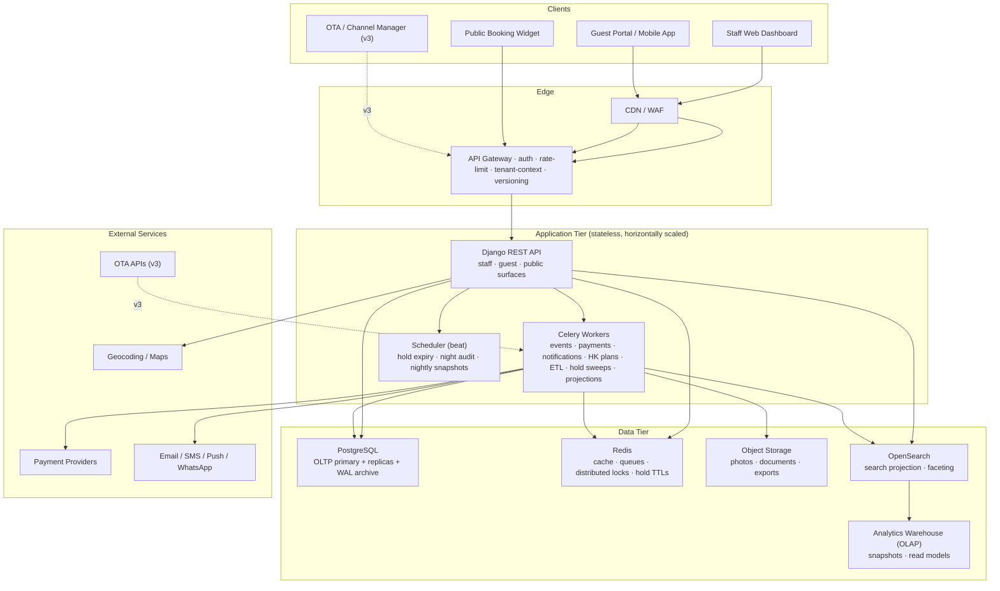

### 8.1 Tier responsibilities
- **Edge:** TLS, WAF, global rate limiting, API-key/session validation, version negotiation. Tenant context is first resolved and stamped here.
- **Application:** stateless Django replicas; session state in Redis. **All expensive work is dispatched to workers** — payments, notifications, housekeeping plan generation, event consumers, hold sweeps, **projection builds (search index, timeline)**, ETL, exports.
- **Data:** Postgres is the system of record — including the **availability truth** (DR-05 makes single-authoritative-copy non-negotiable). Redis: cache, queues, distributed locks, **hold TTLs**. OpenSearch is a **rebuildable projection** (DR-12). The warehouse is a denormalized reporting copy.

### 8.2 Eventing & reliability backbone (DR-08)
- Any state change that must cause side effects writes a **domain event to the outbox in the same DB transaction**; a relay publishes to the queue; consumers are async and **idempotent**.
- **Dead-letter queue per consumer** with alerting — silent failure of a payment capture or notification is the #1 trust killer in hospitality.
- **Idempotency keys** on all money and booking mutations.
- **Workflow transitions are the event producers** — every transition emits its event via the substrate (§9), so side effects are structurally tied to state changes, not scattered calls.
- **Projections** (search index, timeline, reporting) are built from these events — always rebuildable, never a source of truth.

#### 8.2.1 Sagas / process managers (forward-looking — not built now)
Today, cross-domain effects are event **fan-out**: each consumer handles its own failure with idempotency + DLQ. That covers most cases. When a business operation needs **coordinated compensation** — e.g., booking confirmation touches inventory, payment, notification, reporting, and guest profile, and a partial failure must undo the others — a **process manager (saga)** may emerge to orchestrate the sequence and issue compensating actions. We do **not** build one now; the outbox, idempotency, and named events (§12) are exactly the seam a process manager attaches to (it becomes one more consumer, with a completion/compensation table). First candidate when the time comes: **no-show processing** (deposit capture + inventory release + notifications + profile flag must all resolve or be reversed).

### 8.3 Deployment topology (multi-region, DR-04 pragmatic)
- v1: single **write-primary** region (one Postgres primary + synchronous replica), read replicas per region, API replicas in multiple regions behind a global LB.
- Tenant data **pinned to a region** (GDPR data residency, DR-02); cross-region reads served from that region's read replica.
- **Deliberate non-goal:** active-active multi-master Postgres — a known hard problem; revisit only with a real region-scale driver.

---

## 9. Workflow Model — the Backbone

### 9.1 Principle: workflow-first modeling (DR-07)

Every business process — booking, payment, check-in, housekeeping, maintenance, review — is modeled **as a workflow**: an explicit set of *states*, *transitions*, *guards*, *events*, and *permissions*. Nothing in the codebase decides "what state can become what" inside a view or serializer; the workflow defines it.

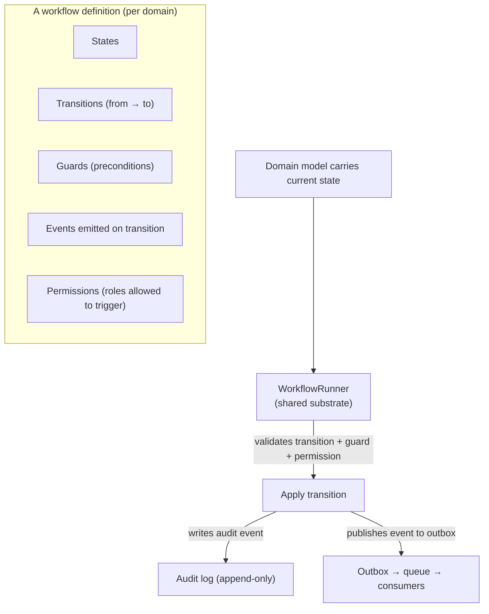

#### 9.1.1 Why this beats scattered if/else
- **Safety:** a room cannot skip `Cleaning → Inspected` — the workflow *enforces* it, everywhere.
- **Auditability:** every transition is an audited, logged event with who/when/why (§5).
- **Permission policy in one place:** "who may cancel a booking" is a property of the workflow, not duplicated in views.
- **Observability:** workflow state per entity is queryable; stuck workflows surface in ops dashboards.

#### 9.1.2 Why not a generic BPMN engine
We are deliberately **not** building a general-purpose workflow/BPMN engine as the "backbone of the application." Reasons:
- A generic engine becomes a product of its own (a "framework trap"), consuming team time that should ship features.
- Most hospitality processes are *state machines*, not free-form BPMN orchestrations; a full engine is overkill and hard to debug.
- Debuggability: a transition failing in a declarative per-domain state machine is trivial to trace; a failure deep inside a generic engine is not.

**What we do instead (the substrate):** a thin, shared state-machine capability in `shared/` (`WorkflowRunner`), plus a per-domain `workflows/` module where each workflow is declared with states, transitions, guards, events, and permissions. We wrap a battle-tested library (e.g., `django-fsm` class) to get the state persistence and enforcement, and our substrate adds guard/permission/event/audit behavior on top. When a domain genuinely needs multi-step orchestration (e.g., no-show processing), that orchestration lives in a **domain service**, not in the engine.

> **Workflow vs. Policy (don't conflate):** the *workflow* is a state machine — "may this booking go from `Confirmed` to `Cancelled`?" The *policy* is data consulted during that transition — "if so, what penalty?" A cancellation transition **consults** the Policy Engine for the penalty (§11.7). Workflow = shape; policy = rules.

### 9.2 Workflow substrate contract
A workflow definition declares, for each transition:
- `from` / `to` states
- `guard` — predicate over the entity (and its context); may consult the Policy Engine
- `permissions` — roles allowed to trigger
- `events` — domain events emitted on transition (DR-08)
- `audit` — always on

### 9.3 State machine catalog

#### Room (physical) — Vacant/Occupied × Clean/Dirty + OOO/OOS
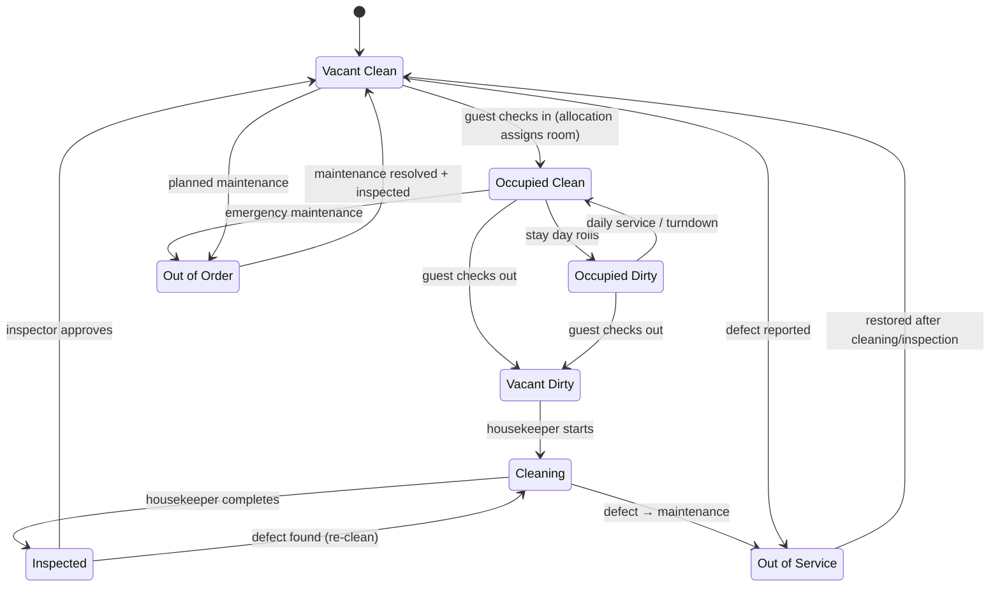
> **Refinement vs. the review's room machine:** "Available → Reserved" do **not** appear here, deliberately. We sell **room-types**, not physical rooms (DR-05, §11.2), so at booking time no physical room is "reserved" — capacity is. `Reserved` lives on the **Reservation** (below). At check-in, the **Allocation Engine** assigns a physical room and it becomes `Occupied`. Conflating them would reintroduce the exact coupling point #3 removes.

#### Reservation — reserve → hold → convert → expire
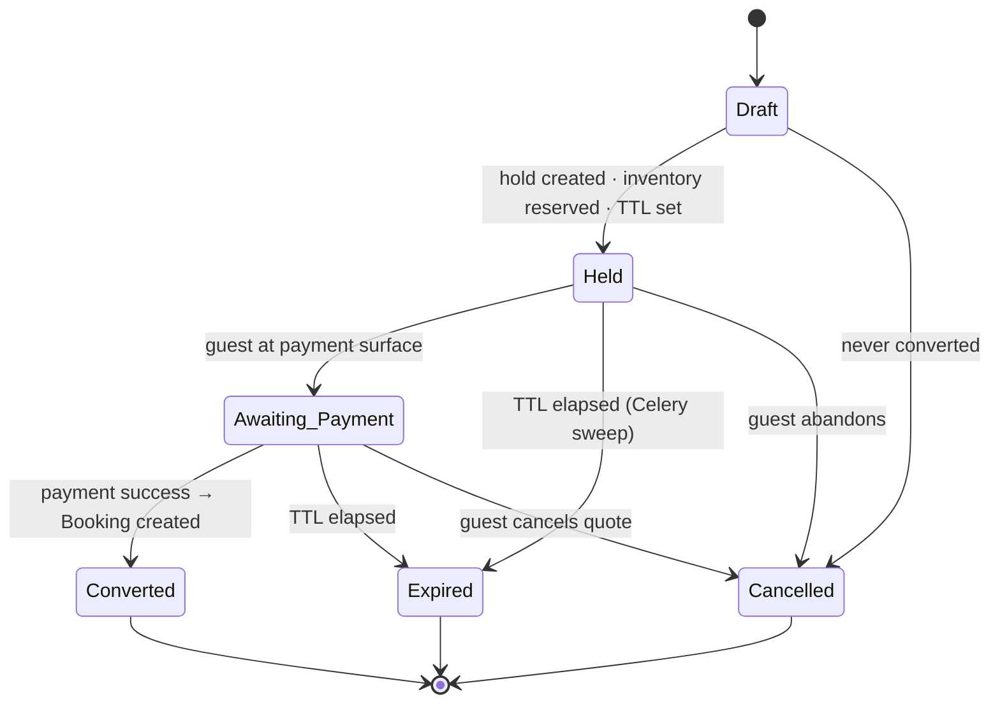

#### Booking (per room-line)
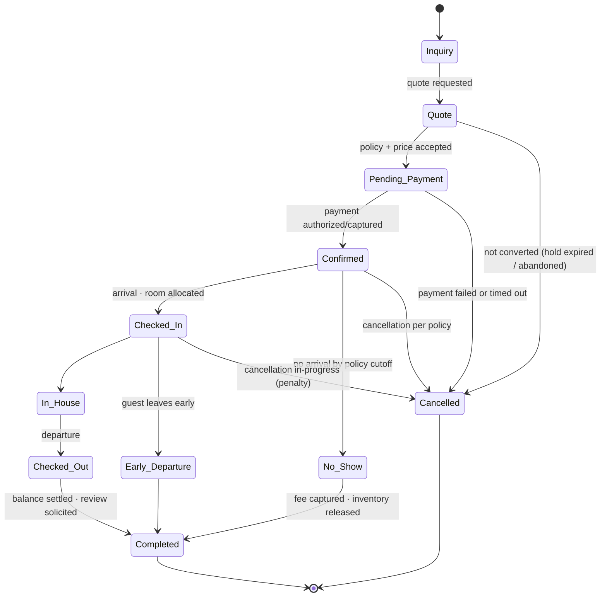

#### Payment
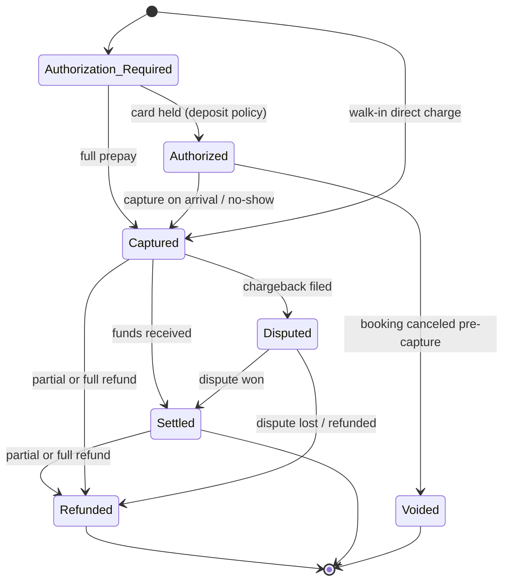

#### Housekeeping task
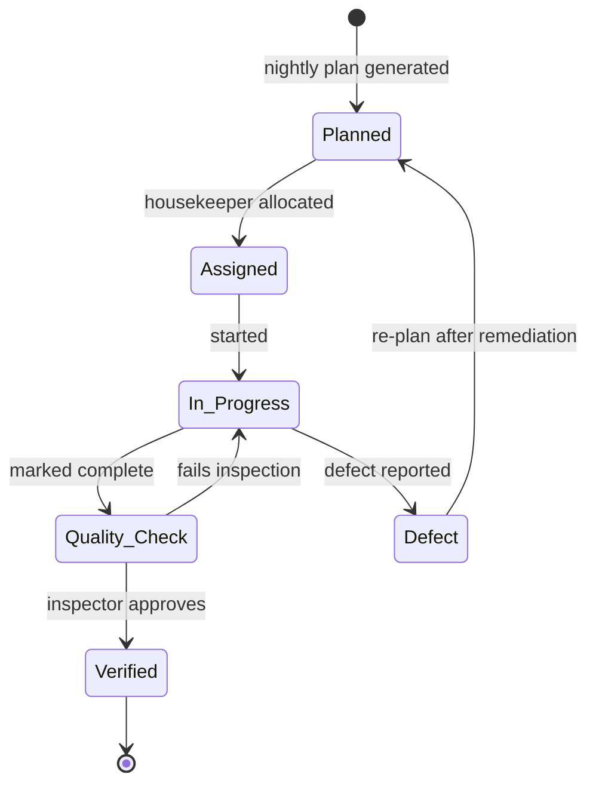

#### Work order (maintenance)
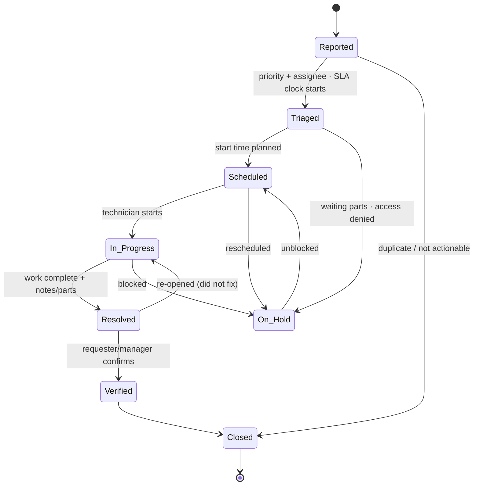

#### Service request (guest services)
`Submitted → Acknowledged → In_Progress → Resolved → Closed` (with `Escalated` → `Acknowledged` when SLA breached).

#### Notification delivery
`Pending → Delivering → Delivered | Failed → Dead_Lettered` (retries with backoff; DLQ at max attempts).

> **Granularity rule:** the booking machine runs **per room-line** — a booking with 3 rooms can be partially checked in/out; the booking's aggregate state is *derived*. This is how real PMSes avoid the all-or-nothing trap.

---

## 10. Business Workflows

### 10.1 Reservation → Booking (the reservation engine flow)

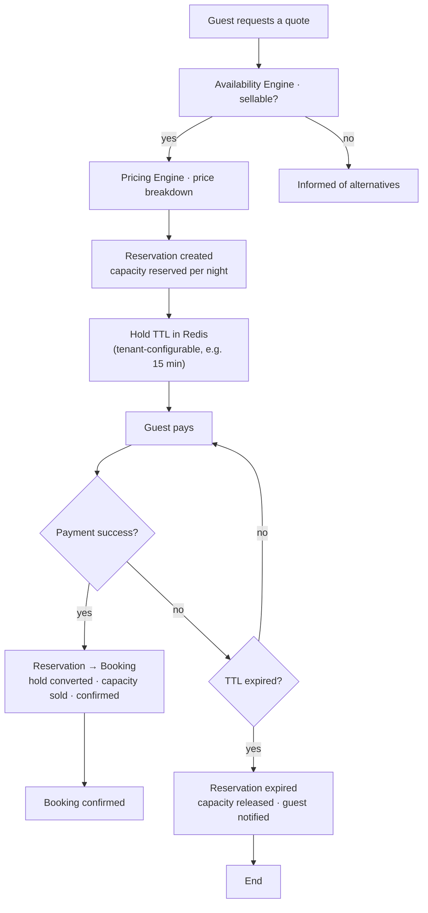

**Machinery (this is where Redis + Celery earn their place):**
- The hold's TTL is a Redis key (`hold:{tenant}:{reservation_id}`) — sub-second expiry checks, no DB polling.
- A **Celery beat** task sweeps expired holds, emits `reservation.expired`, releases capacity via the Inventory Engine, and notifies the guest.
- Conversion (`reservation.converted`) is the atomic handoff: payment success → create booking → consume capacity → mark hold converted. All in one transaction.

### 10.2 Booking lifecycle semantics
| Transition | Rule / effect |
|---|---|
| **Quote → hold** | Capacity reserved for a time-box; deposit requirement answered by the **Policy Engine** (FR-PLC-02); prevents "shown available but sold out at payment." |
| **Pending → Confirmed** | **One atomic transaction:** insert booking → consume capacity (Inventory Engine) → create payment intent. All-or-nothing (§8.2, DR-05). |
| **Confirmed → Checked-in** | **Allocation Engine** assigns the best physical room (§11.6); room → Occupied; housekeeping plan adjusts; guest services activated; timeline records it. |
| **Night rollover** | In-house rooms flip to "today" automatically (night audit); new-day housekeeping tasks generated. |
| **No-show** | At policy cutoff (asked via Policy Engine): deposit captured, remaining inventory released, guest notified, profile flagged. First candidate for a **process manager** (§8.2.1). |
| **Cancel** | Cancellation policy consulted via **Policy Engine** → penalty computed there; inventory released only for nights after cancellation; idempotent refund path if prepaid. |
| **Completed** | Ledger closed; review solicitation triggered; profile updated with the stay; timeline closed. |

### 10.3 Housekeeping workflow
1. Night audit computes departures → **Vacant Dirty** set; in-house → **Occupied Dirty** (daily service) unless opted out.
2. Manager reviews plan, assigns housekeepers (rooms, sequence, standards per room type — cleaning standard from **Policy Engine**).
3. Housekeeper marks complete → **Quality Check**.
4. Inspector approves → room released to inventory (**Vacant Clean**) → availability and front desk see it immediately; **Allocation Engine** can now offer the room.
5. Any defect raises a work order (§10.4); if the room can't be sold, it goes **OOS** → removed from availability.

**Rule:** a room may not reach `Vacant Clean` from `Vacant Dirty` without passing through `Cleaning → Inspected` — the workflow enforces it (FR-ROOM-02, §9.3). This is what eliminates "rooms not ready at check-in."

### 10.4 Maintenance workflow
- **Priority & SLA:** P1 Emergency ≤15 min (fire/water/electrical, locked-in guest) · P2 Urgent ≤4 h (bathroom unusable → OOO, broken AC in occupied room) · P3 Normal ≤24 h (flickering light, dripping faucet) · P4 Scheduled (preventive/seasonal).
- **OOO linkage:** a P1/P2 on a sellable room flips it **OOO** ⇒ removed from availability automatically (FR-MNT-03). `OOO` = maintenance; `OOS` = housekeeping/quality — both unsellable, distinct for reporting. The **Allocation Engine** never offers an OOO/OOS room.
- **Reversal is gated:** `OOO → Vacant Clean` requires work order **Verified** **and** a housekeeping inspection (the room is dirty again after techs work in it).

### 10.5 Payment workflow
See state machine (§9.3). Key rules:
- **PCI scope reduction (SAQ-A):** card data never reaches our servers; hosted surface + tokenization (FR-PAY-02).
- **Money:** integer minor units or `Decimal` — never floats (Shared Kernel, DR-09); original currency kept in the ledger; FX only for reporting (v3, FR-PAY-07).
- **Idempotency:** capture/refund accept an `Idempotency-Key`; retries return the same result — what makes worker retry-after-crash safe.
- **Booking-payment coupling is configurable:** policy decides deposit vs. prepay vs. pay-at-stay (**asked via Policy Engine**); the booking machine *waits on* the payment machine; events bridge them.
- **Reconciliation:** nightly snapshot compares PSP-reported settlements vs. local ledger; mismatches surface in a queue for `finance`. No silent drift.
- **Degraded mode:** front desk can create a booking with `payment_pending` and capture later — `Confirmed` requires authorized/captured payment *per policy*, never a hard-coded "must capture."

### 10.6 Notification workflow (outbox — reliability is the point)

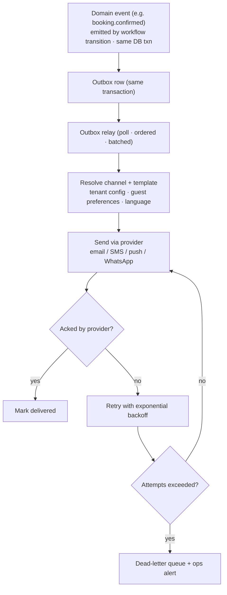

| Notification type | Triggers | Channels |
|---|---|---|
| Transactional (v1) | Booking confirmed, reminder (T-1), check-in info, invoice, cancellation | email + SMS |
| In-stay (v2) | Service request status, housekeeping confirmation | push + SMS |
| Operational (v1) | New booking, P1/P2 work order, OOO room, task assigned | push / in-app |
| Review solicitation (v1) | T+24h after checkout (configurable) | email |
| Marketing / retention (v2) | Rebooking offers (opt-in only, FR-NOT-03) | email |

- Guest channel preference + suppression are first-class. Marketing requires explicit consent (GDPR); transactional doesn't but must remain suppressible where required by law.
- Timing is **timezone-aware** — "remind me the day before check-in" means the guest's morning.

---

## 11. The Engines, Policy & Projections

The engines, policy service, and timeline are **domain services** (§6.3) — cohesion boundaries inside the modular monolith, not microservices.

### 11.1 Availability Engine
The answer to "is it sellable, and how many units remain?" — the atomic truth that booking reads.

```
AvailabilitySlot (conceptual)
  tenant_id · property_id · room_type_id
  business_date (property tz) · channel (direct | ota | group)
  total_units · sold · reserved (holds) · blocked (group/close-out)
  out_of_service (from room state: OOO + OOS)
  ─────────────────────────────────────
  remaining = total - sold - reserved - blocked - out_of_service
```

- **Reads** (search, quote, widget) hit a cache keyed `tenant:property:room_type:date:channel`; **writes** go to Postgres rows with row-level locking (FR-INV-01).
- **Channel dimension** is present from day one (DR-03) — v1 uses `direct` only; v3 allocations per channel re-use the same rows.
- Room state feeds `out_of_service`: a room flipped OOO/OOS decrements sellable units automatically (FR-ROOM-03, §10.4).

### 11.2 Inventory Engine — "bookings never touch rooms"

This is the rule that keeps sales logic honest (DR-05).

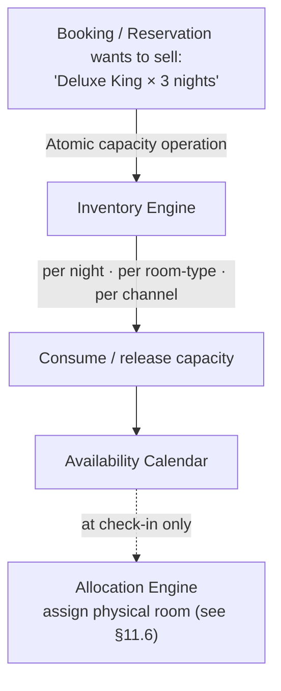

- **Sales sell room-types, not rooms.** A booking of "Deluxe King for Aug 10–12" consumes 3 room-nights of *Deluxe King capacity*; it does not know which physical room it will be.
- **Example:** Room 101 is booked Aug 10–12 ⇒ the Availability Engine records `Deluxe King: 3 units sold` for those nights. Which physical room becomes 101's occupant is decided **at check-in** by the **Allocation Engine**, which picks from the room-type's available physical rooms, respecting housekeeping state (never assign a `Vacant Dirty` room that hasn't been cleaned).
- Consequence: physical room assignment is an **Operations/Room** concern, not a Booking concern — the coupling point your review flagged is eliminated by construction.

### 11.3 Pricing Engine — "how much, and why?"

Bookings never compute price (DR-06). They ask.

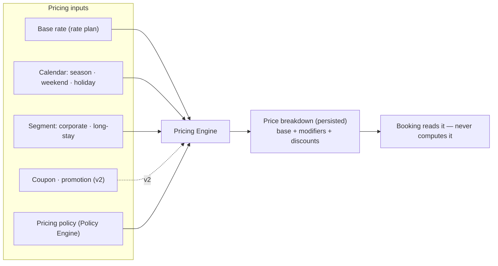

- A `PriceBreakdown` is **persisted** on the quote/reservation/booking — so "what was the price and why" is auditable and disputes are answerable.
- v1 factors: base rate + calendar modifiers (season, weekend, holiday) + segment modifiers (long-stay, corporate) + pricing policy from the Policy Engine. v2 adds coupons/promotions (FR-PRC-02) and rule-based dynamic pricing (FR-PRC-03); ML pricing stays v3+.
- **Rate plans + overrides (FR-INV-02) feed the pricing engine**; the engine owns modifiers — not the booking, not a view.

### 11.4 Reservation Engine — reserve, hold, convert, expire

Already specified in §10.1 and the reservation state machine (§9.3). Summary:
- `ReservationService.reserve()` → creates reservation + capacity hold + Redis TTL; deposit requirement asked via Policy Engine.
- `ReservationService.convert()` → atomic handoff to Booking (one transaction, DR-08).
- Celery beat sweep → `ReservationService.expire()` for TTL-timed-out holds → capacity released + guest notified.
- The Reservation is the **pre-payment** entity; the Booking is the **confirmed** entity. Booking does not do the work of reserving; it inherits a converted reservation.

### 11.5 Search Engine — "which properties/rooms match?"

Search is **not** availability (DR-12). It answers *"which candidates fit the guest's intent?"* — location, amenities (pool, breakfast, pet-friendly, sea view), proximity (near airport), price band. Availability and Pricing finalize.

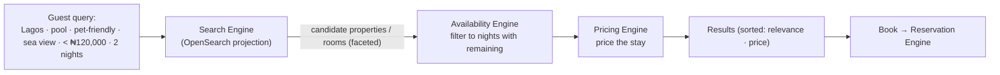

- **Facets are indexed from property/room data** (FR-PROP-04, FR-ROOM-04) via events — the index is a **projection**, rebuildable at any time, and may lag a moment behind the OLTP (eventual consistency is acceptable for *discovery* only; availability truth never comes from the index).
- **Search → filter → price → sort** is the standard pipeline (Booking.com-style). The search index narrows the candidate set cheaply; the Availability Engine guarantees correctness; the Pricing Engine attaches the price; relevance/price ranking orders the results.
- v2 personalization: re-rank candidates by guest history/preferences (FR-SCH-03).

### 11.6 Allocation Engine — "which physical room?"

At check-in, a confirmed room-line (room-type + dates + guest) becomes a **physical room** (DR-11). The Allocation Engine picks the best one.

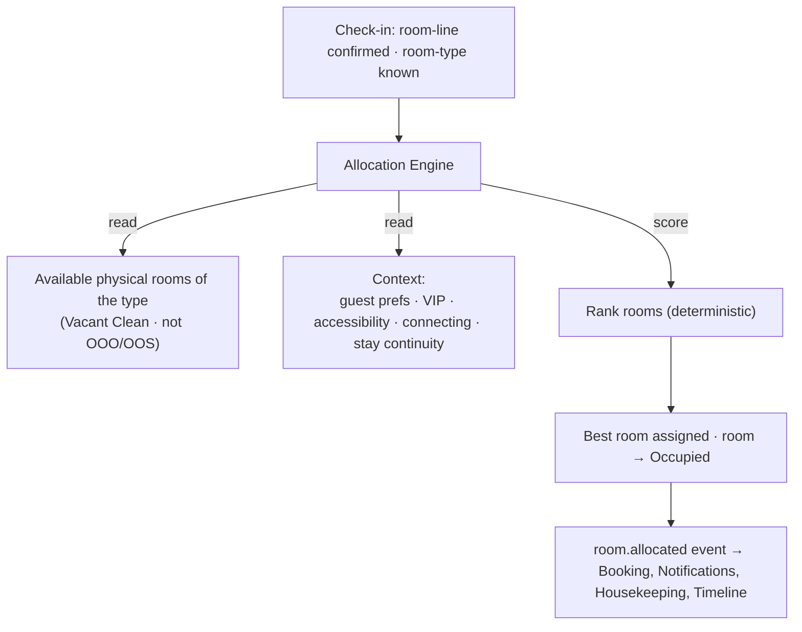

- **Scoring criteria:** room-type match · housekeeping state (must be `Vacant Clean`) · maintenance (never OOO/OOS) · guest preference (high floor, quiet) · accessibility needs · VIP · connecting-room requests · **stay continuity** (keep a guest in the same room across nights, and ideally the same room as a previous stay).
- **Deterministic + audited (FR-ALL-02):** the ranking inputs and the assigned room are recorded; the choice is replayable and answerable ("why this room?"). No silent randomness — a front desk agent can override, and the override is audited.
- Runs as part of the `Checked_In` transition (§9.3); the workflow guard ensures only sellable, clean, non-OOO rooms are candidates.
- v3: AI-assisted allocation learning from guest outcomes (FR-ALL-03) — scored determinism stays as the fallback and the audit baseline.

### 11.7 Policy Engine — "what does the policy say?"

Business rules are data, not code scattered across domains (DR-10). Booking doesn't know cancellation rules; Payments doesn't know refund rules; they **ask**.

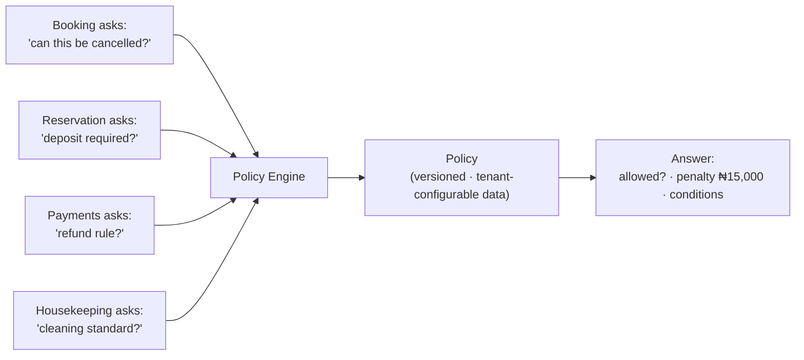

| Policy type | Questions it answers | Consulted by |
|---|---|---|
| **Cancellation** | Can this booking be cancelled? Penalty (amount, by nights-until-arrival)? Last free-cancel date? | Booking (FR-BOOK-03) |
| **Refund** | What is the refund rule for this payment state? Partial/full? | Payments (FR-PAY-03) |
| **Deposit** | Is a deposit required for this rate plan/dates? Amount? Capture timing? | Reservation, Payments |
| **Check-in / Check-out** | Earliest/latest check-in? Late-checkout fee? | Front desk, Booking |
| **Cleaning** | What cleaning standard applies to this room type? Checklist items? | Housekeeping (FR-HK-05) |
| **Pricing** | Floor/ceiling on rates? Commission caps? Min-stay default? | Pricing (FR-PRC-01) |

- **Versioning (FR-PLC-03):** a policy change **never rewrites existing bookings** — each booking references the policy version in force at creation, so a mid-season policy edit can't retroactively change a confirmed stay's terms or penalty. Policy versions are audited (who changed what, when).
- **Answers are persisted where they matter** (penalty on the booking, deposit on the reservation) so later questions — disputes, reconciliation — read the recorded decision, not a re-evaluation.
- **Explicitly not a general business-rules engine** (no Drools-style DSL/runtime): policies are declarative, per-tenant data + a small versioned evaluator. Same reasoning as the workflow substrate (§9.1.2) — a rules engine is a product of its own. If a tenant needs genuinely novel rule shapes, that's a **per-tenant policy extension** mechanism, not a general engine.

### 11.8 Guest Timeline — a projection, not an engine

Hotels are event-heavy, and receptionists live on "what has happened with this stay?". The Timeline is a **read model** built from the domain-event catalog (§12) — it owns no logic and is always rebuildable.

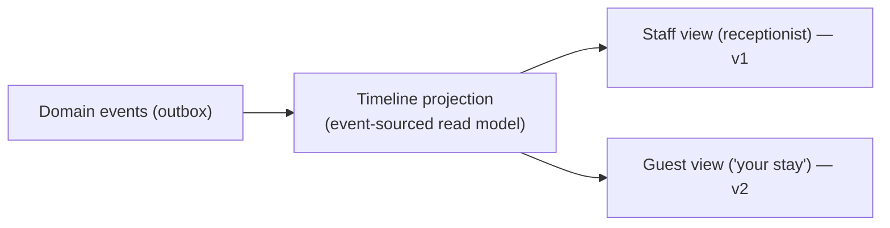

- **Per stay and per guest:** a stay timeline (`reservation.created → payment.captured → booking.checked_in → service.requested → complaint → booking.checked_out → review.received`) and a cross-stay guest history (repeat visits, preferences observed).
- Why it's nearly free: the events already exist (§12); the projection is a consumer. It never becomes a source of truth — if events change, rebuild the timeline (FR-TIM-01, FR-TIM-02).

### 11.9 Guest identity (the lifecycle hub)
- A guest profile exists **before** any booking, resolved by email/phone at booking time; merges are human-reviewed (never auto-merged without consent review).
- The profile is cross-property within a tenant (Maria's 3 properties share guest history); loyalty is a v2 consumer of the profile; the Timeline (v2 guest-facing) reuses it.
- Consent records are tied to the profile (GDPR, §14).

---

## 12. Event Architecture — the concrete catalog

Events are the language of cross-domain collaboration (DR-08). Named events, produced by a workflow transition or a domain service, published via the outbox. **Projections** (search index, timeline, reporting) are consumers of this catalog.

| Event | Producer | Consumers | Purpose |
|---|---|---|---|
| `reservation.created` | Reservation | Inventory (hold capacity), Notifications | hold applied; quote ack |
| `reservation.expired` | Reservation (Celery sweep) | Inventory (release), Notifications | TTL timeout |
| `reservation.converted` | Reservation | Inventory (hold→sold), Notifications | reservation became booking |
| `booking.confirmed` | Booking | Notifications, Guests, Reporting, **Timeline** | confirmation; profile attach |
| `booking.cancelled` | Booking | Inventory (release), Payments (refund), Notifications, Reporting, **Timeline** | cancellation handling |
| `booking.checked_in` | Booking | Rooms (occupied), Housekeeping (plan), GuestServices, **Timeline** | arrival |
| `booking.checked_out` | Booking | Rooms (vacant dirty), Housekeeping (task), Payments (settle), Reviews, Notifications, **Timeline** | departure |
| `booking.no_show` | Booking | Payments (capture fee), Inventory (release), Notifications, Reporting, **Timeline** | no-show policy |
| `room.allocated` | Allocation | Booking (room assigned), Notifications (room number), Housekeeping (confirm clean), **Timeline** | check-in room assignment |
| `room.state_changed` | Room | Availability (out-of-service units), Reporting, **Search index (reindex)** | OOO/OOS/clean feed |
| `hk.task_completed` | Housekeeping | Room (→ inspected path), Reporting | progress |
| `hk.defect_reported` | Housekeeping | Maintenance (create work order), Room (→ OOS) | defect loop |
| `workorder.raised` | Maintenance | Room (→ OOO), Notifications (staff) | P1/P2 linkage |
| `workorder.resolved` | Maintenance | Room (OOO → available, gated by inspection) | restore |
| `payment.captured` | Payments | Ledger, Booking (awaiting → confirmed), Notifications, **Timeline** | funds in |
| `payment.refunded` | Payments | Ledger, Booking (cancel), Notifications, **Timeline** | funds out |
| `payment.settled` | Payments | Ledger, Reconciliation, Reporting | PSP settlement |
| `review.received` | Reviews | Guests (profile), Reporting, **Timeline** | reputation |
| `guest.identified` | Guests | (producers of future stays) | profile resolution |
| `notification.delivered` | Notifications | Reporting (deliverability) | channel health |

**Consumer rules:** every consumer is idempotent (a retried event is a no-op if already applied); dead-letter per consumer; a consumer never calls back into the producer's tables. **Projections (search, timeline, reporting) rebuild from this catalog** — that is their contract.

---

## 13. Multi-Tenant Architecture Strategy

### 13.1 Strategy (DR-01): row-level isolation
Shared DB, shared schema, `tenant_id` on every tenant-scoped row. Tenant context resolved by the gateway/middleware from the authenticated principal (or the tenant public key for the booking widget) and threaded through every query. **Policies (§11.7) are tenant-scoped data** like everything else.

### 13.2 Enforcement layers (defense in depth)

| Layer | Mechanism | Catches |
|---|---|---|
| 1. Principal-derived tenant | `tenant_id` from session/token, **never** from request body | Client-side tenant spoofing |
| 2. Queryset scoping | Repository/selector filters by effective `tenant_id` + property | Developer forgot a filter |
| 3. Postgres RLS | Tenant policies applied at DB level | App-level leak; one-off SQL joins |
| 4. Composite uniqueness | Unique constraints include `tenant_id` (room codes unique *within* a tenant) | Cross-tenant key collisions |

**Honest trade-off:** RLS is **defense-in-depth, not the primary mechanism.** Django ORM + enforcement layer is primary; RLS is the backstop (per-query cost, and RLS can silently surprise upserts/counts). Revisit schema-per-tenant only if one tenant's data exceeds practical RLS row-counts or a tenant contractually requires stronger isolation.

### 13.3 Platform vs. tenant data
Platform data (tenant billing, platform admins, SaaS identity) lives in a **separate, non-tenant-scoped context** — never inside a tenant's namespace.

### 13.4 Tenant lifecycle
| Phase | Work |
|---|---|
| **Provision** | Automated, idempotent workflow (FR-TEN-01): tenant, settings, owner, defaults |
| **Configure** | Currency, timezone, **policies (version 1 of each)**, rate plans, HK standards, branding, PSP connection |
| **Operate** | Per-tenant feature flags; tenant-scoped rate limits; usage metering (future billing); policy updates create new versions |
| **Decommission** | GDPR export + deletion with retention policy; audit trail of the deletion itself |

### 13.5 Cross-tenant analytics
Reports never run against the OLTP. A nightly/job ETL copies to the warehouse keyed by `tenant_id`/`property_id`, with row filters at query time. One tenant's report load can never degrade another tenant's booking path.

---

## 14. Security Considerations

### 14.1 Authentication
- Passwords: **Argon2id**. Staff web: HttpOnly/Secure/SameSite cookies; APIs: short-lived access tokens + refresh rotation.
- **MFA (TOTP/WebAuthn) required** for `tenant_owner`, `platform_admin`, `finance`; available for all staff.
- SSO (OIDC/SAML) — v3 (FR-AUTH-04). Guests: optional account; guest tokens scoped to their own bookings only.

### 14.2 Authorization
- RBAC (§7) enforced in the service layer. **Every endpoint asserts: authenticated → tenant membership → role → property scope → object ownership.**
- **Workflow permissions** are part of the substrate (§9.2) — transitions declare allowed roles.
- Sensitive operations (large refunds, cancellation overrides, **policy edits**, role changes) need second approval or a break-glass audit event.

### 14.3 Application security checklist
| Area | Control |
|---|---|
| Input validation | Schema validation at every API boundary; never trust external data (webhooks, OTA payloads) |
| Injection | ORM parameterization; RLS backstop; **no string-concatenated SQL** |
| SSRF | Integrations: allow-listed outbound hosts; no user-supplied URLs fetched server-side |
| CSRF | Enforced on cookie-authenticated surfaces |
| Rate limiting | Per-API-key/user/IP at the gateway; stricter on auth + payment endpoints (brute force, card testing) |
| Headers/CORS | Strict CORS allow-list per surface; security headers; HSTS |
| Secrets | Secrets manager; never in source control; startup validation of required secrets |
| Dependency risk | SBOM, SAST/DAST in CI, pinned/reviewed deps, CVE monitoring |
| Audit | Append-only audit from workflow transitions + policy decisions (§9, §11.7); cannot be edited by the audited actor |

### 14.4 Payment & compliance
- **PCI:** hosted surface + tokenization ⇒ target **SAQ-A** (FR-PAY-02, DR-02).
- **GDPR:** lawful-basis tracking, consent records on `guest_profile`, export + erasure jobs, region pinning, retention policy on logs & PII, DPA with tenants.
- **Regional residency:** tenant pinned to a region; that region's stores serve it; cross-region transfer only where lawful.

---

## 15. Scalability Considerations

| Concern | Approach |
|---|---|
| **API tier** | Stateless Django replicas; horizontal scale behind LB; session state in Redis |
| **DB connections** | PgBouncer (transaction mode); pool sized per region |
| **Read scaling** | Read replicas for hot reads; availability writes go only to the primary |
| **Hot-table partitioning** | Partition by range/date up front: availability slots, ledger, audit log, outbox/events |
| **Caching** | Read-through cache keyed `tenant:property:room_type:date:channel`; invalidated on change. **Cache is performance only — availability truth is Postgres** (atomicity, DR-05) |
| **Async decoupling** | Celery workers for events, payments, notifications, HK plans, ETL, exports, **hold sweeps**, **projection builds**; queue backlog is a monitored SLI; DLQ per consumer |
| **Distributed locking** | Redis lock only for per-property serialized operations (e.g., bulk rate upload); **not** for per-night capacity (that's DB row locking, §11.2) |
| **Reservation holds** | Redis TTL keys for sub-second expiry (`hold:{tenant}:{id}`); Celery sweep as the authoritative releaser |
| **Search** | OpenSearch projection rebuilt from events; **candidate discovery only** — never availability truth (DR-12); tolerate eventual consistency |
| **Timeline** | Projection from events; per-stay and per-guest; cold-storage archiving of old timelines |
| **Reporting** | OLAP copy + nightly snapshots; never touches the booking OLTP path |
| **Multi-region** | Single write-primary; read replicas per region; tenant pinning (DR-02, DR-04). **Non-goal:** active-active multi-master |
| **Idempotency** | `Idempotency-Key` on money + booking mutations; safe retries |
| **Data growth** | OLTP holds the operational window; cold-storage archive for old stays/ledger/timelines; warehouse keeps the long tail |

---

## 16. API-First Architecture

### 16.1 Principles
- **API is the product surface** — dashboard, portal, and widget are all clients of the same API; nothing reaches the DB except through it.
- **Versioning** from day one (`/v1/...`); breaking changes in a new major version with a deprecation window.
- **Contract-first:** OpenAPI generated and published; SDKs generated from it.
- **Consistent envelope:** status, data, error object, pagination metadata; stable machine-readable error codes.

### 16.2 API surfaces
| Surface | Audience | Auth | Notes |
|---|---|---|---|
| **Public booking** | Anyone (widget/guest) | Guest/anonymous + tenant public key | Search, availability, quotes, book, pay, confirm |
| **Guest** | Authenticated guest | Guest token scoped to own bookings | Profile, bookings, requests, reviews, receipts, own timeline (v2) |
| **Staff/ops** | Staff & owners | Staff session + RBAC | Everything operational incl. allocation + timeline |
| **Tenant-admin** | Owner, platform admin | RBAC | Tenant settings, **policy versions**, roles, PSP config |
| **Platform-admin** | SaaS operator | MFA + RBAC | Provisioning, billing, feature flags |
| **Outbound webhooks** | Tenant subscribers | Signed HMAC | Event stream (§12) |
| **Inbound integrations** | PSP, future OTA | Provider signature verification | Idempotent handlers |

### 16.3 Conventions
- **Pagination:** cursor-based for lists; limit/offset for small sets.
- **Filtering/fields:** whitelisted params; sparse fieldsets.
- **Errors:** typed codes (`AVAILABILITY_UNAVAILABLE`, `INSUFFICIENT_FUNDS`, `IDEMPOTENCY_REPLAY`, `POLICY_VIOLATION`…) + human message + details; never leak stack traces.
- **Idempotency:** `Idempotency-Key` on all mutations; replay returns the original result.
- **Rate limits:** per-surface, per-tenant, per-user; `429` with retry-after.
- **Timezone:** ISO-8601 with explicit `tz`; property business dates always in property timezone, documented per endpoint.
- **Money:** integer minor units + currency code; never floats.
- **Workflow awareness:** mutations that cross workflow states return the resulting state + emitted events, so clients can render the next actions.
- **Search:** search endpoints return candidates narrowed by availability and priced by the Pricing Engine (§11.5); relevance is a search concern, availability is not.
- **Policy:** question-style endpoints (`can_cancel`, `refund_rule`, `deposit_required`) return evaluated policy for UI confirmation; policy changes are versioned and never rewrite existing bookings (FR-PLC-03).

---

## 17. Django App Boundaries & Internal Structure

### 17.1 Apps = deployment of domains

| Django app | Domain | Depends on |
|---|---|---|
| `shared` | **Shared Kernel**: value objects (Money, Address, PhoneNumber, Email, GeoLocation, DateRange, Audit, Exceptions, Pagination, Timezone, Currency, IDs) + workflow substrate | — |
| `tenants` | Tenancy | `shared` |
| `accounts` | Identity & Access | `tenants` |
| `properties` | Property | `tenants`, `accounts` |
| `rooms` | Room (Physical) | `properties` |
| `pricing` | Pricing | `rooms`, `tenants`, `policies` |
| `availability` | Availability Engine | `rooms`, `properties` |
| `inventory` | Inventory Engine | `availability`, `rooms` |
| `search` | Search Engine (projection) | `shared`, `properties`, `availability`, `pricing` |
| `reservations` | Reservation Engine | `inventory`, `pricing`, `policies` |
| `bookings` | Booking | `reservations`, `inventory`, `guests`, `policies` |
| `policies` | Policy Engine | `shared`, `tenants` |
| `allocation` | Allocation Engine | `rooms`, `housekeeping`, `guests` |
| `payments` | Financial | `bookings` (events only), `tenants`, `policies` |
| `housekeeping` | Housekeeping | `rooms`, `bookings` (events), `policies` |
| `maintenance` | Maintenance | `rooms`, `housekeeping` (events) |
| `guestservices` | Guest Services | `bookings`, `guests` |
| `guests` | Guest Profile | `accounts` |
| `timeline` | Timeline (projection) | `shared` (consumes events) |
| `reviews` | Reviews | `guests`, `bookings` (events) |
| `notifications` | Notifications | `shared` (outbox) |
| `reporting` | Reporting | `shared` |
| `integrations` | Integrations | `shared`, `tenants` |

*Notes:* `pricing`, `availability`, `inventory`, `reservations`, `policies`, `allocation`, `search`, and `timeline` are first-class apps mirroring the engines (§11). `search` and `timeline` are **projection-heavy** — if team size demands, they may consolidate under `reporting` in v1 (they are all read-model consumers of the event catalog); the domain boundaries stay the same.

### 17.2 Coupling rules (prevents the big-ball-of-mud)
1. Apps may only import `shared`, `tenants`, `accounts`, and their own layer.
2. Cross-context behavior goes through **domain events** (outbox, §12), consumed idempotently. `housekeeping` reacts to `booking.checked_out`; it never queries booking tables.
3. Shared reads come from the reporting read model or a documented read replica; `search`/`timeline` are read-only projections.
4. `payments`, `housekeeping`, `maintenance`, `guestservices`, `reviews`, `notifications`, `reporting` are **consumers** of booking/guest events; `bookings` doesn't know they exist.
5. **The engines are services, not god-objects:** `inventory` exposes `InventoryService.consume/release`; `pricing` exposes `PricingService.price`; callers use the service, never the tables.
6. **Policy rules are consulted, never embedded** — callers use `PolicyService`; rule definitions live in `policies` (DR-10).
7. **Projections are read-only consumers** — `search`, `timeline`, `reporting` rebuild from events; never a source of truth (DR-12).

### 17.3 Internal structure of each app (business logic out of views & serializers)

```text
bookings/                        # same skeleton for every app
├── api/                         # views, urls, serializers (thin — presentational only)
├── services/                    # application/domain services: BookingService, CancellationService
├── repositories/                # persistence abstraction: find/save (own ORM access)
├── selectors/                   # read-model queries for API presentation
├── models/                      # domain models (package; split by entity, not one models.py blob)
├── permissions/                 # object-level permission rules
├── workflows/                   # state-machine definitions for this domain (DR-07)
├── events/                      # domain events + handlers (registered consumers)
├── tasks/                       # Celery tasks (timeouts, async side effects)
├── signals/                     # only for genuinely local concerns; prefer events
└── tests/                       # unit · integration · factories
```

**Layer rules:**
- `views`/`serializers` call `services`/`selectors` only — no ORM, no workflow transitions inline.
- `services` implement use cases (e.g., "confirm booking" = orchestrate reservation → policy → payment → inventory → emit events).
- `repositories` own the ORM for writes; `selectors` own ORM for reads.
- `workflows` declare states/transitions/guards/events/permissions (consumed by the `WorkflowRunner` in `shared`).
- `events` register the domain's consumers; `tasks` hold the Celery work.
- This is what keeps each app under control as the domain grows — services scale; views stay thin.

---

## 18. Risks and Engineering Challenges

| # | Risk / challenge | Severity | Mitigation |
|---|---|---|---|
| R1 | **Overselling under concurrency** — two bookings race for one room-night | Critical | Capacity consumed **in the same transaction** as confirmation (DR-05, FR-INV-03); DB row locking on availability; load-test the race |
| R2 | **Timezone & date correctness** — "night of Aug 5" vs. arrival datetime | High | Property timezone is a first-class concept; business dates date-only in property tz; storage UTC; invariant tests for date math |
| R3 | **Pricing-engine complexity creep** — modifiers multiply | High | Price breakdown persisted & auditable (DR-06); modifiers as data, versioned; coupons/dynamic pricing gated to v2 |
| R4 | **Workflow substrate over-engineering** — the "engine" becomes a product | High | Deliberate scope: declarative state machines per domain only (§9.1.2); no generic BPMN; orchestration stays in domain services |
| R5 | **Reservation hold correctness** — TTL vs. payment race | High | Redis TTL + Celery sweep (authoritative releaser); conversion is atomic; idempotent consumers |
| R6 | **Payment reconciliation drift** | High | Nightly reconciliation; ledger is source of truth; mismatches surface as a queue; idempotency everywhere |
| R7 | **Multi-currency & tax complexity** | High | Integer minor units (Shared Kernel); original currency kept; FX only for reporting (v3); tax rules tenant-configurable |
| R8 | **GDPR across tenants** — consent, export, erasure | High | Consent on profile; export/erasure jobs; region pinning; retention policy; DPAs |
| R9 | **Guest identity resolution** — same guest, many stays/properties | Medium | Profile-first resolution by email/phone; human-reviewed merges only |
| R10 | **Notification reliability at scale** | Medium | Outbox + DLQ + retries; provider abstraction; per-channel rate limiting; deliverability monitoring |
| R11 | **Reporting load on OLTP** | Medium | Warehouse + nightly snapshots; reporting never touches the booking path |
| R12 | **Onboarding friction** | Medium | Automated provisioning + bulk import + wizard; import dry-runs with validation reports |
| R13 | **Scope creep across 11 modules** | High | **Versioned roadmap (§1.3)** — v1 is launchable alone; phase-tagged requirements; bounded contexts make phases independent |
| R14 | **Front-desk resilience** — PSP outage at the worst moment | Medium | Degraded mode: `payment_pending` booking, capture later; booking path must not hard-depend on external calls |
| R15 | **Legacy/spreadsheet migration** | Medium | Import spec + mapping templates + dry-run validation; first-class onboarding feature |
| R16 | **Partitioning retrofit pain** | Medium | Partitioning decided up front for hot tables (§15) |
| R17 | **Multi-region data residency** — compliance vs. cost | Medium | Tenant pinning; single write-primary + regional read replicas; revisit active-active only with a real driver |
| R18 | **Policy versioning** — a policy change rewrites existing bookings | High | Each booking references the policy version at creation (FR-PLC-03); changes create new versions, never edits; audited |
| R19 | **Projection lag** — search/timeline drift behind the OLTP | Medium | Eventual consistency for **discovery/read-model only**; never availability truth (DR-12); monitor projection lag as an SLI; rebuildable |
| R20 | **Allocation determinism & fairness** — "why this room?" | Medium | Deterministic scoring + audited assignment (FR-ALL-02); stay continuity; front-desk override is audited; AI (v3) keeps deterministic fallback |

---

## Appendix A — Delivery Roadmap (v1 / v2 / v3)

| Phase | Theme | Modules / engines | Exit criteria |
|---|---|---|---|
| **v1** | Run the guest lifecycle end-to-end | Tenancy, Identity, Property, Room, **Search/Availability/Pricing/Reservation/Inventory engines**, **Policy Engine**, **Allocation Engine**, Booking, Payments, Housekeeping, **Staff Timeline**, Notifications (transactional), Reviews, Reporting (core KPIs), Outbox/events + workflow substrate + shared kernel | A 60-room hotel onboards, guests search + book direct, rooms allocated at check-in, housekeeping runs, payments settle under policy, receptionist sees a guest timeline, management sees KPIs — with no other tool |
| **v2** | Operate like a professional | Maintenance (+ OOO linkage), Guest Services, AI concierge, Coupons/promotions, Loyalty, Multi-property dashboard, Digital keys, Group/blocks, Dynamic pricing (rule-based), Marketing notifications, Guest analytics, **Guest-facing timeline**, 2nd locale | The property team can run operations and retention end-to-end from the platform |
| **v3** | Distribute everywhere | OTA integration (Booking.com/Expedia/Airbnb), Channel Manager (availability + rate sync, allocations), Revenue management & forecasting, Rate parity, Virtual credit cards, **AI-assisted allocation**, Enterprise SSO, hardened regional residency | Properties can manage all channels from the platform with rate parity intact |

## Appendix B — Key Decisions & Trade-offs (ADR-lite)

| Decision | Chosen | Rejected because |
|---|---|---|
| Tenancy | Row-level isolation + RLS | Schema/DB-per-tenant cost & complexity for thousands of small/medium tenants (DR-01) |
| Shared Kernel | `shared/` value objects + workflow substrate | Each domain forking its own `Money`/`DateRange` duplicates and drifts (DR-09) |
| Sales path | **Engines, not room manipulation** | Bookings touching rooms couples sales to operations and reopens overselling (DR-05) |
| Pricing | Pricing Engine + persisted breakdown | Price math in booking logic is unauditable and unmaintainable (DR-06) |
| Allocation | Scored, deterministic allocation at check-in | Assigning physical rooms at booking time is premature and leaks Operations concerns into Sales (DR-11) |
| Policy | Versioned, tenant-configurable data via `PolicyService` | Hardcoded rules scatter across domains; a general rules engine becomes a product of its own (DR-10) |
| Search | Candidate discovery projection; availability + pricing finalize | Search as truth reopens overselling; search as the only path misses availability (DR-12) |
| Timeline | Projection from the event catalog | A timeline engine owning its own logic duplicates event history (DR-08) |
| Workflows | Per-domain declarative state machines on a shared substrate | A generic BPMN engine becomes a product of its own; hard to debug (DR-07, §9.1.2) |
| Sagas | Forward-looking note; event fan-out + idempotency today | Building a process-manager framework now is premature; the seam is designed (§8.2.1) |
| Side effects | Outbox + DLQ + idempotency | Fire-and-forget notifications/payments lose trust and can't be reconciled (DR-08) |
| Distribution | Direct-first, OTA-ready data model | A channel manager in v1 is a separate project; the availability model stays channel-aware (DR-03) |
| Scale posture | Modular monolith, event-driven | Microservices tax a single team without the scale that needs them |
| Availability truth | Postgres, atomic with booking | Cache-first availability risks overselling; cache is performance only |
| Reporting | OLAP copy + snapshots | Live aggregation degrades the booking path |
| Payment scope | PCI SAQ-A hosted surface | Storing PANs invites full PCI-DSS — wrong for multi-tenant SaaS |
| Multi-region | Single write-primary + replicas | Active-active Postgres is a known hard problem; no current driver |

## Appendix C — Assumptions & Open Questions

1. **Volume:** assume ≤ ~10k bookings/day platform-wide in year one; availability slots are the scaling unit, not bookings.
2. **Channel manager timing** is v3 (DR-03); the availability model is ready now.
3. **Property size range** TBD — small/medium (10–200 rooms) vs. large resorts (>500) affects housekeeping plan generation and bulk import tooling.
4. **Loyalty:** points engine out of v1; `guest_profile` is the future consumer.
5. **SaaS billing model** (per-property vs. per-booking) TBD — metering hooks designed in, pricing undecided.
6. **Digital keys/lock integrations** (FR-BOOK-07): integration hooks only; no vendor committed.
7. **UI locales:** v1 English + one more locale to prove i18n; which locale TBD.
8. **Dynamic pricing:** v2 ships rule-based only; ML pricing is a v3+ experiment.
9. **AI concierge (v2):** intent routing + answer from property config + escalation to human; LLM is an integration, not the platform's core.
10. **Allocation AI (v3):** scoring stays deterministic in v1/v2; ML ranking is additive with a deterministic fallback and audit baseline (FR-ALL-03).
11. **Policy scope:** v1 policy types are the six in §11.7; a per-tenant "custom rule" extension is a future mechanism, not a general rules engine.

## Appendix D — Glossary

| Term | Meaning |
|---|---|
| **Domain** | A bounded context with its own data and domain services (DDD, §6) |
| **Shared Kernel** | Cross-domain value objects + workflow substrate in `shared/` — owned by no domain (DR-09) |
| **Value object** | An immutable, comparable concept with no identity — `Money`, `DateRange`, `Address` |
| **Engine** | A domain service that owns a hard problem — Search, Availability, Inventory, Pricing, Reservation, Allocation (§11) |
| **Workflow** | A declared state machine: states, transitions, guards, events, permissions (DR-07, §9) |
| **Workflow substrate** | The `shared/` capability that executes declared workflows — not a generic BPMN engine |
| **Policy** | Versioned, tenant-configurable business rules evaluated by the Policy Engine (DR-10, §11.7) |
| **Projection** | A read model rebuilt from events — search index, timeline, reporting snapshots; never a source of truth |
| **Saga / process manager** | A future orchestrator for cross-domain operations needing coordinated compensation (§8.2.1) |
| **ADR** | Average daily rate — revenue ÷ rooms sold |
| **RevPAR** | Revenue per available room — ADR × occupancy |
| **Room-night** | One room occupied one night; the atomic capacity unit |
| **Room-line** | One room's stay within a multi-room booking (state machine runs per line) |
| **Hold / Reservation** | Pre-payment inventory reservation with a time-boxed TTL (§11.4) |
| **OOO / OOS** | Out of Order (maintenance) / Out of Service (housekeeping/quality) — both unsellable |
| **Channel** | A distribution source: direct, OTA, group (dimension on availability) |
| **Rate plan** | A sellable product: room type + rate + policy |
| **PMS** | Property Management System |
| **PSP** | Payment Service Provider |
| **RPO / RTO** | Recovery point / recovery time objective |
| **RLS** | Postgres Row-Level Security |
| **Outbox** | Outgoing-event table written in the same transaction as the state change |
| **DLQ** | Dead-letter queue |
| **OLTP / OLAP** | Transactional / analytical processing |
